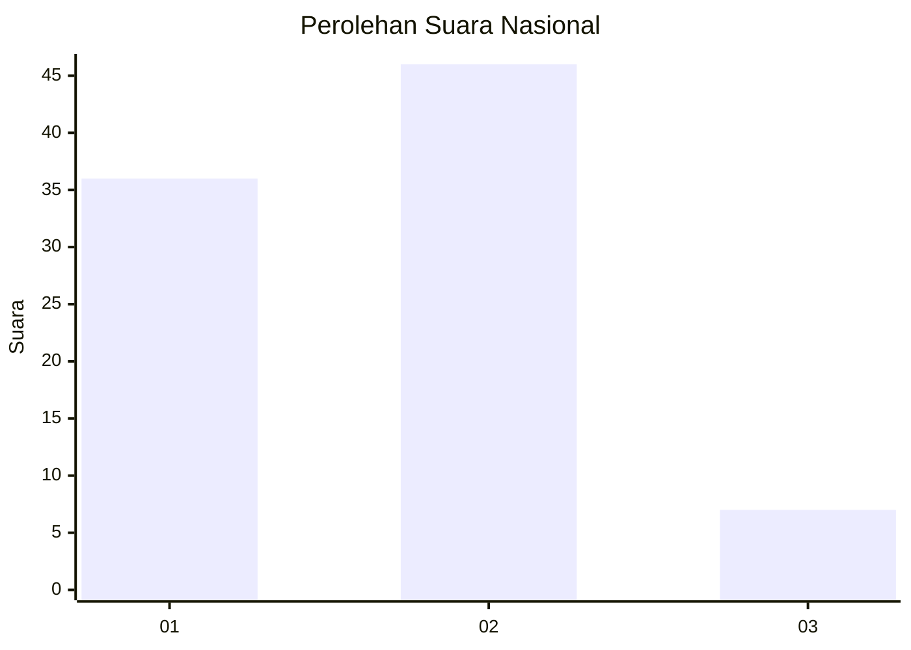

# Hasil

## Grafik

## Tabel

| No. | Nama Paslon    | Suara | Suara (raw) | Persentase |
|:--- |:-------------- | -----:| -----------:| ----------:|
| 1   | ANIES MUHAIMIN | 36    | [36][p-1]   | 40,45      |
| 2   | PRABOWO GIBRAN | 46    | [46][p-2]   | 51,69      |
| 3   | GANJAR MAHFUD  | 7     | [7][p-3]    | 7,87       |

[p-1]: https://github.com/gigit-pemilu/pemilu-2024/blob/main/pilpres/hitung-suara/sub/61-kalimantan-barat/sub/03-sanggau/sub/21-entikong/sub/2003-entikong/sub/023-tps/sub/paslon-1.txt
[p-2]: https://github.com/gigit-pemilu/pemilu-2024/blob/main/pilpres/hitung-suara/sub/61-kalimantan-barat/sub/03-sanggau/sub/21-entikong/sub/2003-entikong/sub/023-tps/sub/paslon-2.txt
[p-3]: https://github.com/gigit-pemilu/pemilu-2024/blob/main/pilpres/hitung-suara/sub/61-kalimantan-barat/sub/03-sanggau/sub/21-entikong/sub/2003-entikong/sub/023-tps/sub/paslon-3.txt

## Foto C Plano

https://sirekap-obj-formc.kpu.go.id/30ed/pemilu/ppwp/61/03/21/20/03/6103212003023-20240214-233532--68a4d3d1-443e-440d-823a-57c0b7dfa68c.jpg

https://sirekap-obj-formc.kpu.go.id/30ed/pemilu/ppwp/61/03/21/20/03/6103212003023-20240214-233701--37ec1ee9-a1de-42f0-b614-ed6dd46b24ab.jpg

https://sirekap-obj-formc.kpu.go.id/30ed/pemilu/ppwp/61/03/21/20/03/6103212003023-20240214-233801--ae6f446d-1f3e-43ed-8ae3-331738076e48.jpg

## Metadata

| Key        | Value               |
| ---------- | ------------------- |
| Time Stamp | 2024-02-25 18:00:00 |

