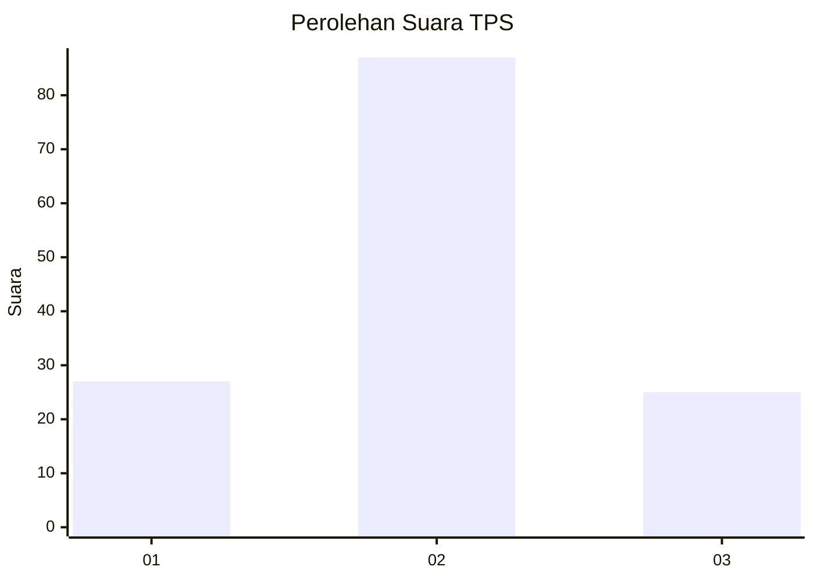
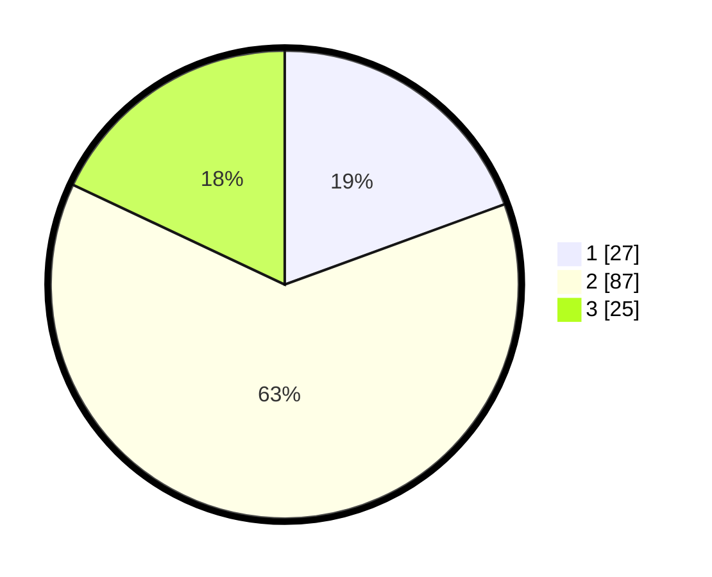

# Hasil

## Grafik

## Tabel

| No. | Nama Paslon    | Suara | Suara (raw) | Persentase |
|:--- |:-------------- | -----:| -----------:| ----------:|
| 1   | ANIES MUHAIMIN | 27    | [27][p-1]   | 19,42      |
| 2   | PRABOWO GIBRAN | 87    | [87][p-2]   | 62,59      |
| 3   | GANJAR MAHFUD  | 25    | [25][p-3]   | 17,99      |

[p-1]: https://github.com/gigit-pemilu/pemilu-2024-61-kalimantan-barat/blob/main/pilpres/hitung-suara/sub/61-kalimantan-barat/sub/04-ketapang/sub/02-marau/sub/2001-sukakarya/sub/005-tps/sub/paslon-1.txt
[p-2]: https://github.com/gigit-pemilu/pemilu-2024-61-kalimantan-barat/blob/main/pilpres/hitung-suara/sub/61-kalimantan-barat/sub/04-ketapang/sub/02-marau/sub/2001-sukakarya/sub/005-tps/sub/paslon-2.txt
[p-3]: https://github.com/gigit-pemilu/pemilu-2024-61-kalimantan-barat/blob/main/pilpres/hitung-suara/sub/61-kalimantan-barat/sub/04-ketapang/sub/02-marau/sub/2001-sukakarya/sub/005-tps/sub/paslon-3.txt

## Foto C Plano

https://sirekap-obj-formc.kpu.go.id/0e36/pemilu/ppwp/61/04/02/20/01/6104022001005-20240215-005917--3aa4b7a8-4134-4f00-9bb0-8c6294a2f283.jpg

https://sirekap-obj-formc.kpu.go.id/0e36/pemilu/ppwp/61/04/02/20/01/6104022001005-20240215-010052--32966a32-59d4-472f-bce1-216f802e3a9a.jpg

https://sirekap-obj-formc.kpu.go.id/0e36/pemilu/ppwp/61/04/02/20/01/6104022001005-20240215-010150--92a7e49c-3e70-490e-bde2-25f0035fb496.jpg

## Metadata

| Key        | Value               |
| ---------- | ------------------- |
| Time Stamp | 2024-02-22 13:00:00 |

