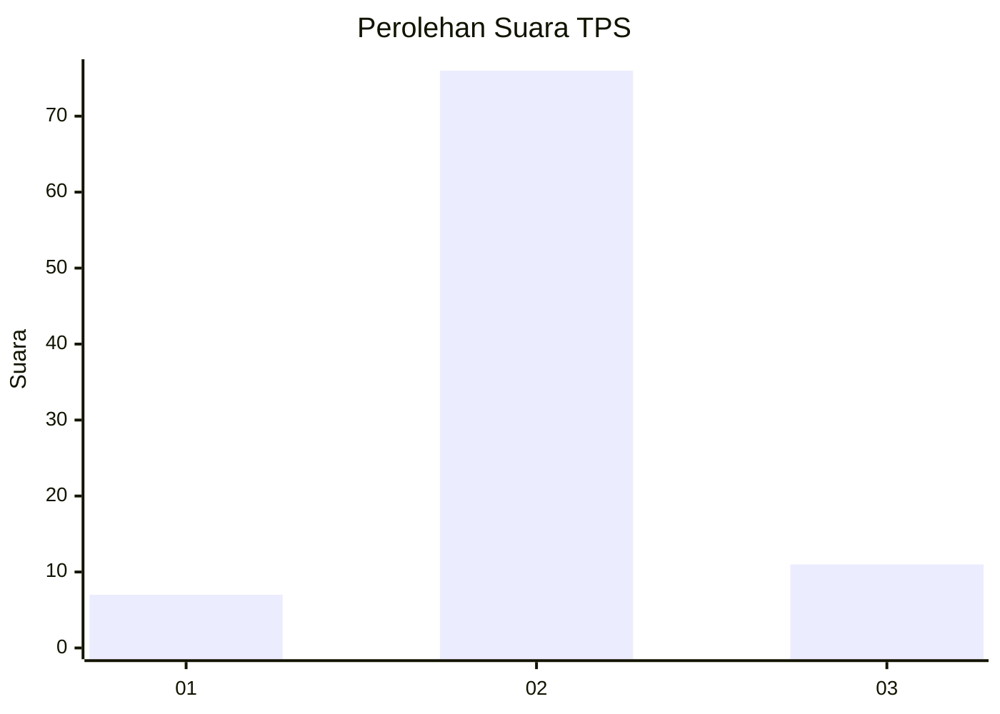
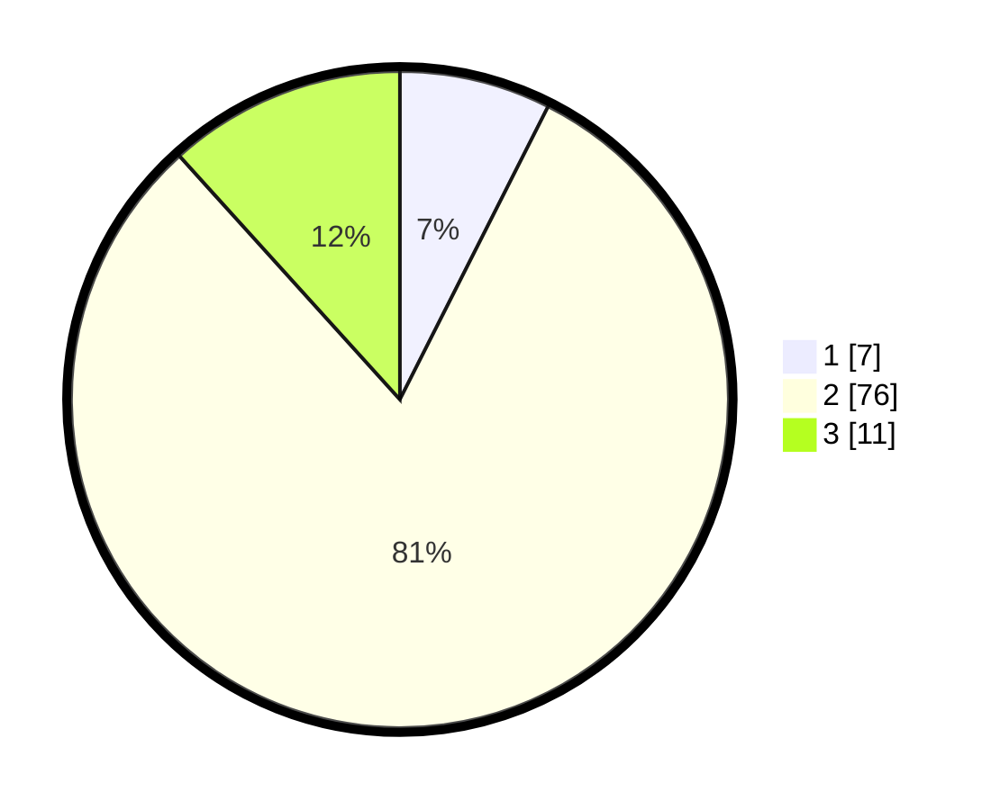

# Hasil

## Grafik

## Tabel

| No. | Nama Paslon    | Suara | Suara (raw) | Persentase |
|:--- |:-------------- | -----:| -----------:| ----------:|
| 1   | ANIES MUHAIMIN | 7     | [7][p-1]    | 7,45       |
| 2   | PRABOWO GIBRAN | 76    | [76][p-2]   | 80,85      |
| 3   | GANJAR MAHFUD  | 11    | [11][p-3]   | 11,70      |

[p-1]: https://github.com/gigit-pemilu/pemilu-2024-61-kalimantan-barat/blob/main/pilpres/hitung-suara/sub/61-kalimantan-barat/sub/04-ketapang/sub/02-marau/sub/2021-batu-payung-dua/sub/005-tps/sub/paslon-1.txt
[p-2]: https://github.com/gigit-pemilu/pemilu-2024-61-kalimantan-barat/blob/main/pilpres/hitung-suara/sub/61-kalimantan-barat/sub/04-ketapang/sub/02-marau/sub/2021-batu-payung-dua/sub/005-tps/sub/paslon-2.txt
[p-3]: https://github.com/gigit-pemilu/pemilu-2024-61-kalimantan-barat/blob/main/pilpres/hitung-suara/sub/61-kalimantan-barat/sub/04-ketapang/sub/02-marau/sub/2021-batu-payung-dua/sub/005-tps/sub/paslon-3.txt

## Foto C Plano

https://sirekap-obj-formc.kpu.go.id/cffb/pemilu/ppwp/61/04/02/20/21/6104022021005-20240215-083206--ce54f906-b602-416a-92be-1cab7728ec87.jpg

https://sirekap-obj-formc.kpu.go.id/cffb/pemilu/ppwp/61/04/02/20/21/6104022021005-20240215-083354--b6ccad67-3cec-4270-96e6-e6b58cd5cea6.jpg

https://sirekap-obj-formc.kpu.go.id/cffb/pemilu/ppwp/61/04/02/20/21/6104022021005-20240215-083534--7158c9b2-6681-4a23-a509-c36edaba7474.jpg

## Metadata

| Key        | Value               |
| ---------- | ------------------- |
| Time Stamp | 2024-02-22 13:00:00 |

