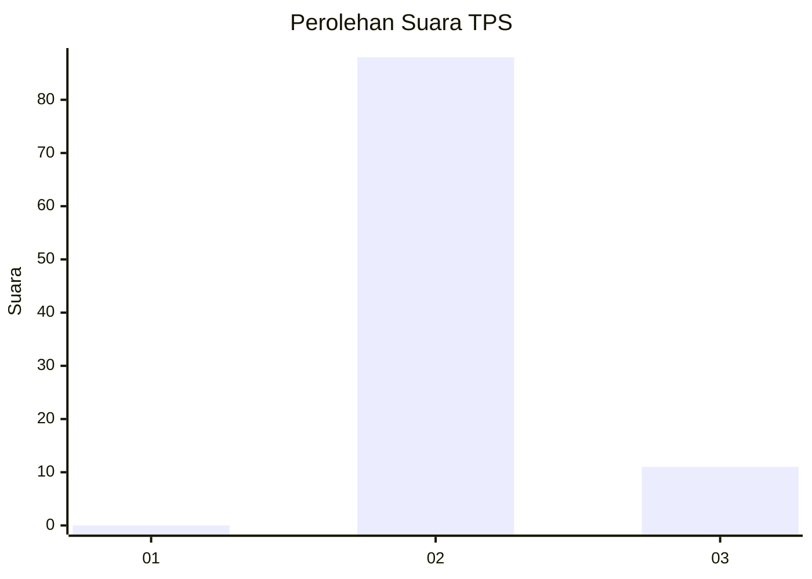
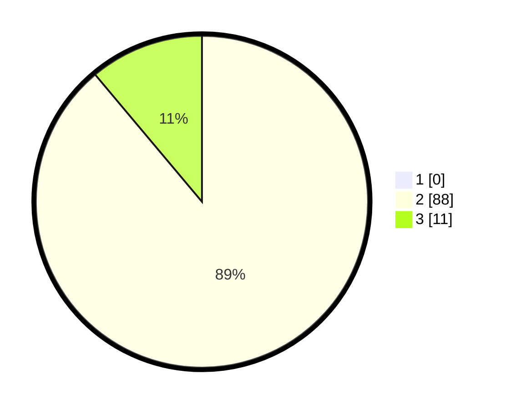

# Hasil

## Grafik

## Tabel

| No. | Nama Paslon    | Suara | Suara (raw) | Persentase |
|:--- |:-------------- | -----:| -----------:| ----------:|
| 1   | ANIES MUHAIMIN | 0     | [0][p-1]    | 0,00       |
| 2   | PRABOWO GIBRAN | 88    | [88][p-2]   | 88,89      |
| 3   | GANJAR MAHFUD  | 11    | [11][p-3]   | 11,11      |

[p-1]: https://github.com/gigit-pemilu/pemilu-2024-61-kalimantan-barat/blob/main/pilpres/hitung-suara/sub/61-kalimantan-barat/sub/04-ketapang/sub/02-marau/sub/2022-bantan-sari/sub/002-tps/sub/paslon-1.txt
[p-2]: https://github.com/gigit-pemilu/pemilu-2024-61-kalimantan-barat/blob/main/pilpres/hitung-suara/sub/61-kalimantan-barat/sub/04-ketapang/sub/02-marau/sub/2022-bantan-sari/sub/002-tps/sub/paslon-2.txt
[p-3]: https://github.com/gigit-pemilu/pemilu-2024-61-kalimantan-barat/blob/main/pilpres/hitung-suara/sub/61-kalimantan-barat/sub/04-ketapang/sub/02-marau/sub/2022-bantan-sari/sub/002-tps/sub/paslon-3.txt

## Foto C Plano

https://sirekap-obj-formc.kpu.go.id/ef21/pemilu/ppwp/61/04/02/20/22/6104022022002-20240215-070223--65e713c8-86c7-417b-b783-d0d8a68b6c12.jpg

https://sirekap-obj-formc.kpu.go.id/ef21/pemilu/ppwp/61/04/02/20/22/6104022022002-20240215-071605--7bec2e4f-02cb-46ea-b46e-0ecfaab1e312.jpg

https://sirekap-obj-formc.kpu.go.id/ef21/pemilu/ppwp/61/04/02/20/22/6104022022002-20240215-072613--37dd2b0d-b41a-4e22-84f1-89e207004a14.jpg

## Metadata

| Key        | Value               |
| ---------- | ------------------- |
| Time Stamp | 2024-02-22 13:00:00 |

