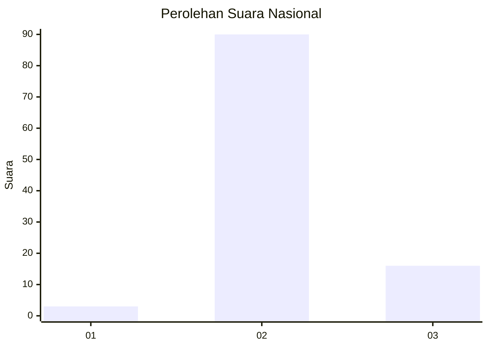
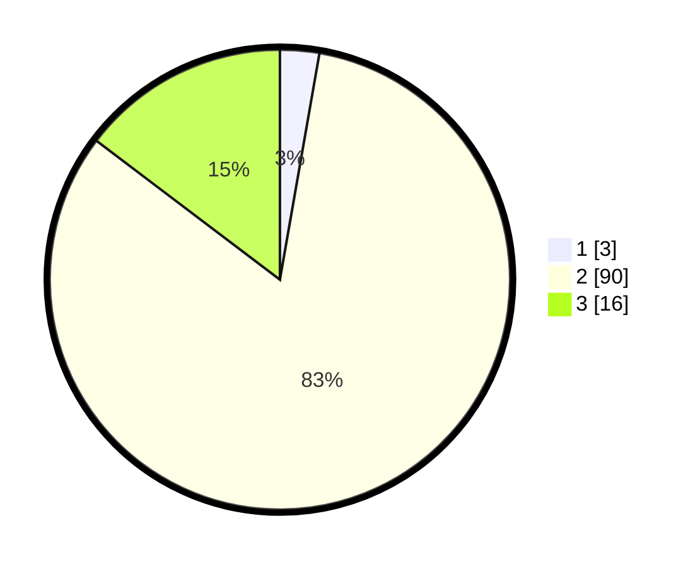

# Hasil

## Grafik

## Tabel

| No. | Nama Paslon    | Suara | Suara (raw) | Persentase |
|:--- |:-------------- | -----:| -----------:| ----------:|
| 1   | ANIES MUHAIMIN | 3     | [3][p-1]    | 2,75       |
| 2   | PRABOWO GIBRAN | 90    | [90][p-2]   | 82,57      |
| 3   | GANJAR MAHFUD  | 16    | [16][p-3]   | 14,68      |

[p-1]: https://github.com/gigit-pemilu/pemilu-2024/blob/main/pilpres/hitung-suara/sub/61-kalimantan-barat/sub/04-ketapang/sub/02-marau/sub/2022-bantan-sari/sub/003-tps/sub/paslon-1.txt
[p-2]: https://github.com/gigit-pemilu/pemilu-2024/blob/main/pilpres/hitung-suara/sub/61-kalimantan-barat/sub/04-ketapang/sub/02-marau/sub/2022-bantan-sari/sub/003-tps/sub/paslon-2.txt
[p-3]: https://github.com/gigit-pemilu/pemilu-2024/blob/main/pilpres/hitung-suara/sub/61-kalimantan-barat/sub/04-ketapang/sub/02-marau/sub/2022-bantan-sari/sub/003-tps/sub/paslon-3.txt

## Foto C Plano

https://sirekap-obj-formc.kpu.go.id/19cf/pemilu/ppwp/61/04/02/20/22/6104022022003-20240215-080503--7bfcb655-f634-43df-9d6b-73cc46632e02.jpg

https://sirekap-obj-formc.kpu.go.id/19cf/pemilu/ppwp/61/04/02/20/22/6104022022003-20240215-080726--3147841c-13d1-489d-a9ed-bbd71cfbe2c3.jpg

https://sirekap-obj-formc.kpu.go.id/19cf/pemilu/ppwp/61/04/02/20/22/6104022022003-20240215-080853--2cd1f6f5-0774-4a34-b113-586104f9bc31.jpg

## Metadata

| Key        | Value               |
| ---------- | ------------------- |
| Time Stamp | 2024-02-22 13:00:00 |

