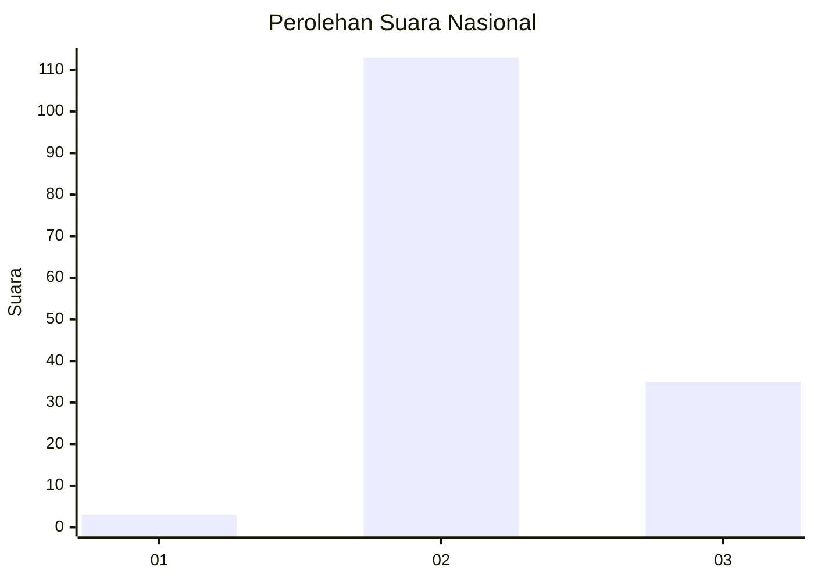
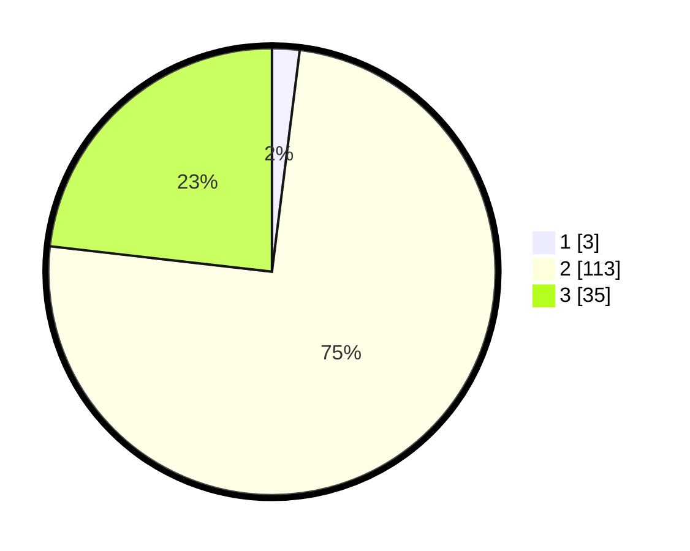

# Hasil

## Grafik

## Tabel

| No. | Nama Paslon    | Suara | Suara (raw) | Persentase |
|:--- |:-------------- | -----:| -----------:| ----------:|
| 1   | ANIES MUHAIMIN | 3     | [3][p-1]    | 1,99       |
| 2   | PRABOWO GIBRAN | 113   | [113][p-2]  | 74,83      |
| 3   | GANJAR MAHFUD  | 35    | [35][p-3]   | 23,18      |

[p-1]: https://github.com/gigit-pemilu/pemilu-2024/blob/main/pilpres/hitung-suara/sub/61-kalimantan-barat/sub/04-ketapang/sub/02-marau/sub/2022-bantan-sari/sub/004-tps/sub/paslon-1.txt
[p-2]: https://github.com/gigit-pemilu/pemilu-2024/blob/main/pilpres/hitung-suara/sub/61-kalimantan-barat/sub/04-ketapang/sub/02-marau/sub/2022-bantan-sari/sub/004-tps/sub/paslon-2.txt
[p-3]: https://github.com/gigit-pemilu/pemilu-2024/blob/main/pilpres/hitung-suara/sub/61-kalimantan-barat/sub/04-ketapang/sub/02-marau/sub/2022-bantan-sari/sub/004-tps/sub/paslon-3.txt

## Foto C Plano

https://sirekap-obj-formc.kpu.go.id/6e03/pemilu/ppwp/61/04/02/20/22/6104022022004-20240215-050644--36e0b8e7-73c9-4bb1-9358-ea6e2dcf0763.jpg

https://sirekap-obj-formc.kpu.go.id/6e03/pemilu/ppwp/61/04/02/20/22/6104022022004-20240215-050649--6801ce3e-08e1-42c1-b0f2-2f2c407849e4.jpg

https://sirekap-obj-formc.kpu.go.id/6e03/pemilu/ppwp/61/04/02/20/22/6104022022004-20240215-050653--c3e5f753-74bb-4cc8-bb58-dcf1e7fdbec8.jpg

## Metadata

| Key        | Value               |
| ---------- | ------------------- |
| Time Stamp | 2024-02-22 13:00:00 |

