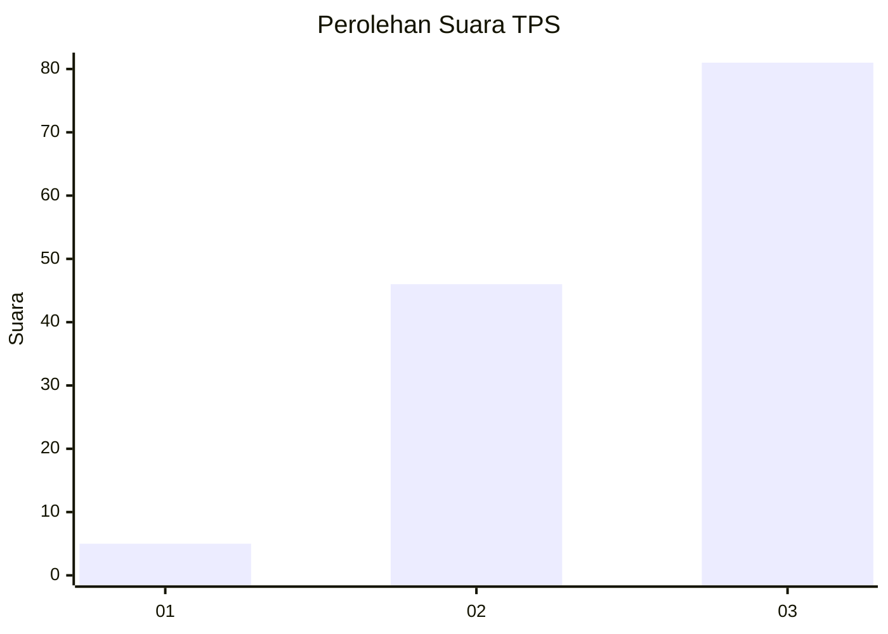
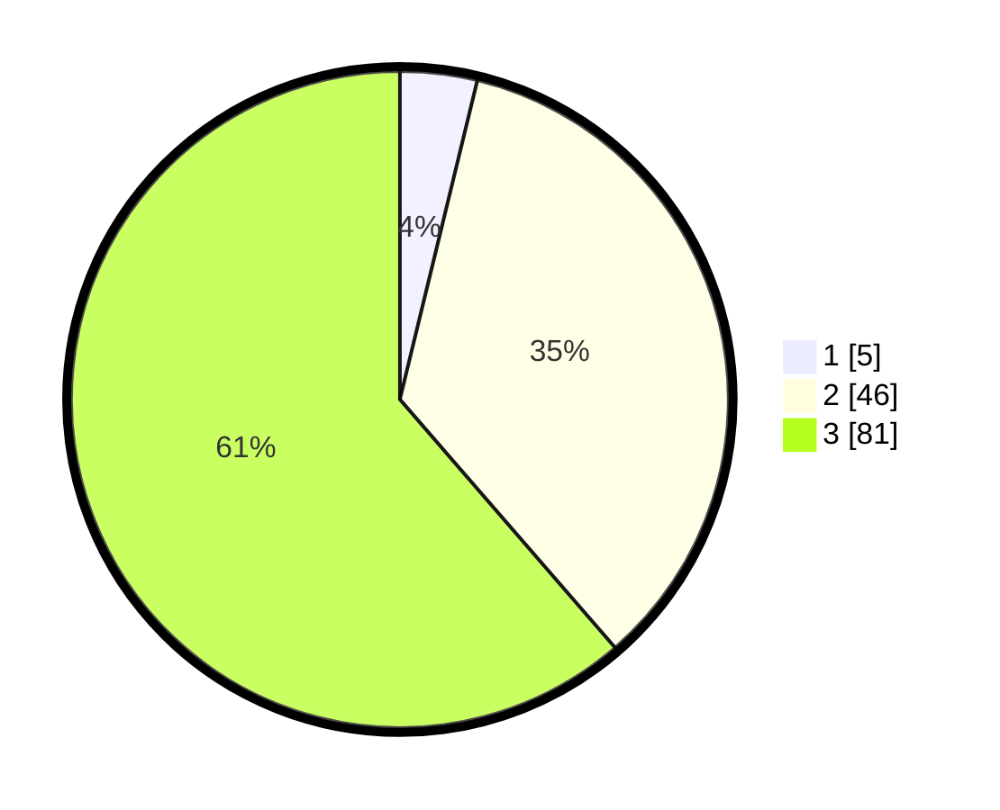

# Hasil

## Grafik

## Tabel

| No. | Nama Paslon    | Suara | Suara (raw) | Persentase |
|:--- |:-------------- | -----:| -----------:| ----------:|
| 1   | ANIES MUHAIMIN | 5     | [5][p-1]    | 3,79       |
| 2   | PRABOWO GIBRAN | 46    | [46][p-2]   | 34,85      |
| 3   | GANJAR MAHFUD  | 81    | [81][p-3]   | 61,36      |

[p-1]: https://github.com/gigit-pemilu/pemilu-2024-61-kalimantan-barat/blob/main/pilpres/hitung-suara/sub/61-kalimantan-barat/sub/04-ketapang/sub/02-marau/sub/2022-bantan-sari/sub/005-tps/sub/paslon-1.txt
[p-2]: https://github.com/gigit-pemilu/pemilu-2024-61-kalimantan-barat/blob/main/pilpres/hitung-suara/sub/61-kalimantan-barat/sub/04-ketapang/sub/02-marau/sub/2022-bantan-sari/sub/005-tps/sub/paslon-2.txt
[p-3]: https://github.com/gigit-pemilu/pemilu-2024-61-kalimantan-barat/blob/main/pilpres/hitung-suara/sub/61-kalimantan-barat/sub/04-ketapang/sub/02-marau/sub/2022-bantan-sari/sub/005-tps/sub/paslon-3.txt

## Foto C Plano

https://sirekap-obj-formc.kpu.go.id/5f7b/pemilu/ppwp/61/04/02/20/22/6104022022005-20240215-013954--5cb5810b-3913-4b25-a837-141740ce580a.jpg

https://sirekap-obj-formc.kpu.go.id/5f7b/pemilu/ppwp/61/04/02/20/22/6104022022005-20240215-014316--7729b650-5a0d-4899-b6d2-2aca59c4c77c.jpg

https://sirekap-obj-formc.kpu.go.id/5f7b/pemilu/ppwp/61/04/02/20/22/6104022022005-20240215-015614--1587ef24-d027-42fa-891c-b6abd49029b8.jpg

## Metadata

| Key        | Value               |
| ---------- | ------------------- |
| Time Stamp | 2024-02-22 13:00:00 |

