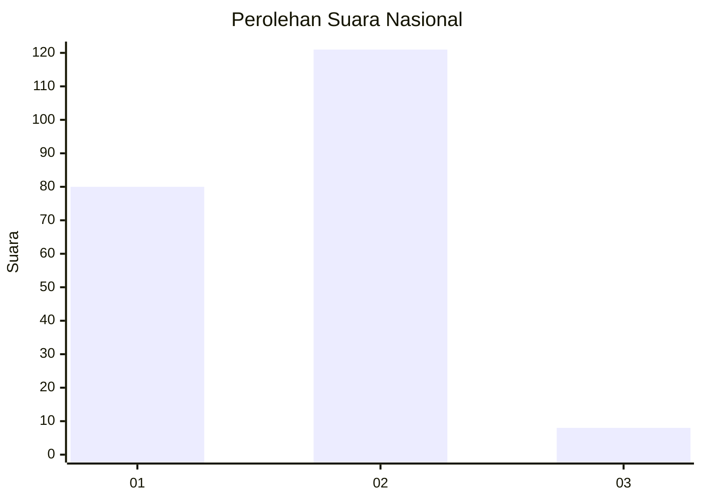
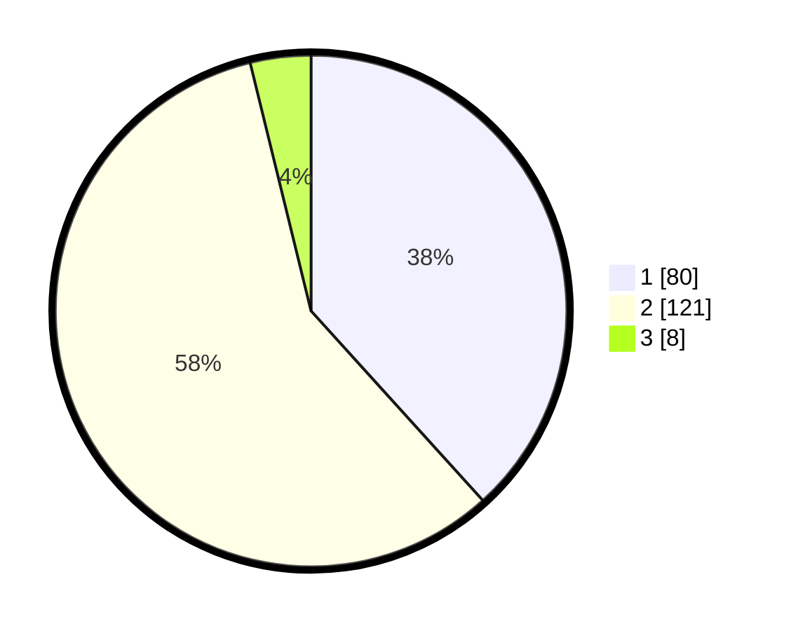

# Hasil

## Grafik

## Tabel

| No. | Nama Paslon    | Suara | Suara (raw) | Persentase |
|:--- |:-------------- | -----:| -----------:| ----------:|
| 1   | ANIES MUHAIMIN | 80    | [80][p-1]   | 38,28      |
| 2   | PRABOWO GIBRAN | 121   | [121][p-2]  | 57,89      |
| 3   | GANJAR MAHFUD  | 8     | [8][p-3]    | 3,83       |

[p-1]: https://github.com/gigit-pemilu/pemilu-2024/blob/main/pilpres/hitung-suara/sub/61-kalimantan-barat/sub/04-ketapang/sub/03-manis-mata/sub/2001-manis-mata/sub/003-tps/sub/paslon-1.txt
[p-2]: https://github.com/gigit-pemilu/pemilu-2024/blob/main/pilpres/hitung-suara/sub/61-kalimantan-barat/sub/04-ketapang/sub/03-manis-mata/sub/2001-manis-mata/sub/003-tps/sub/paslon-2.txt
[p-3]: https://github.com/gigit-pemilu/pemilu-2024/blob/main/pilpres/hitung-suara/sub/61-kalimantan-barat/sub/04-ketapang/sub/03-manis-mata/sub/2001-manis-mata/sub/003-tps/sub/paslon-3.txt

## Foto C Plano

https://sirekap-obj-formc.kpu.go.id/4720/pemilu/ppwp/61/04/03/20/01/6104032001003-20240218-150926--7655c827-ceae-4c09-b33a-705e2f8a2099.jpg

https://sirekap-obj-formc.kpu.go.id/4720/pemilu/ppwp/61/04/03/20/01/6104032001003-20240218-151018--a1eb8570-0b93-4c77-8dec-2b093cfc5058.jpg

https://sirekap-obj-formc.kpu.go.id/4720/pemilu/ppwp/61/04/03/20/01/6104032001003-20240218-151111--d9387914-45d9-4152-97c3-3605d290754f.jpg

## Metadata

| Key        | Value               |
| ---------- | ------------------- |
| Time Stamp | 2024-02-22 13:00:00 |

