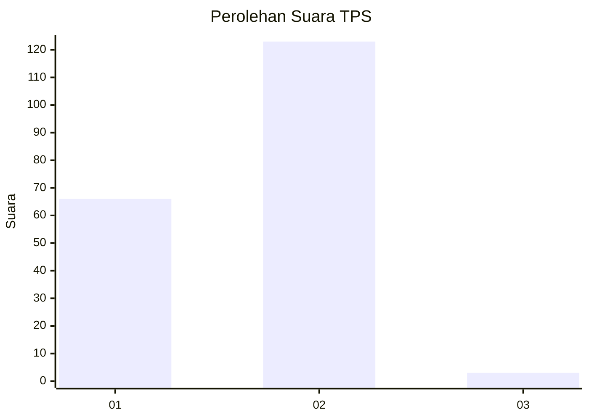
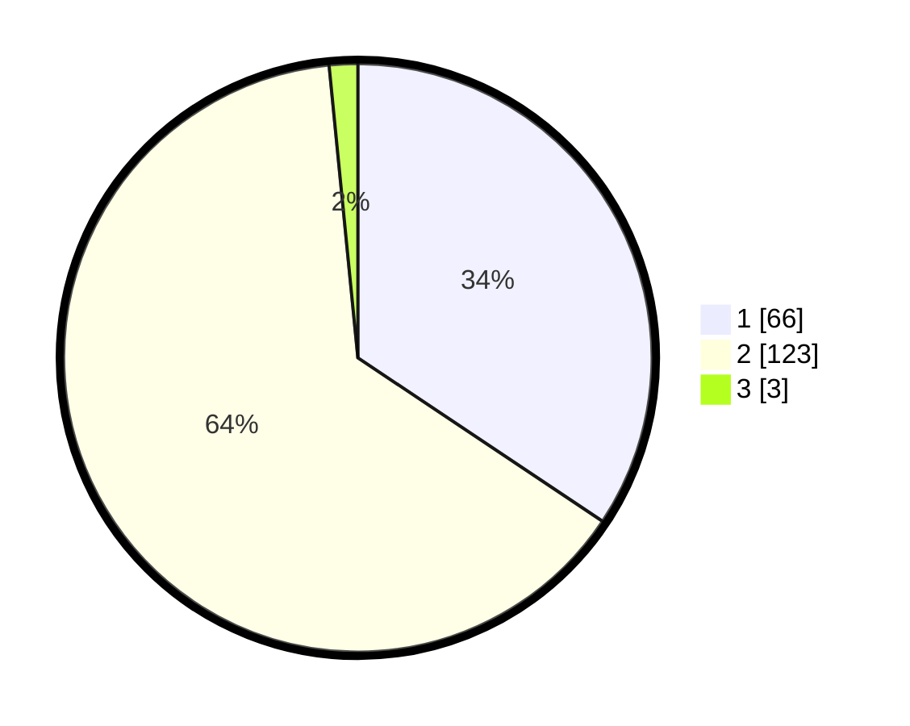

# Hasil

## Grafik

## Tabel

| No. | Nama Paslon    | Suara | Suara (raw) | Persentase |
|:--- |:-------------- | -----:| -----------:| ----------:|
| 1   | ANIES MUHAIMIN | 66    | [66][p-1]   | 34,38      |
| 2   | PRABOWO GIBRAN | 123   | [123][p-2]  | 64,06      |
| 3   | GANJAR MAHFUD  | 3     | [3][p-3]    | 1,56       |

[p-1]: https://github.com/gigit-pemilu/pemilu-2024-61-kalimantan-barat/blob/main/pilpres/hitung-suara/sub/61-kalimantan-barat/sub/04-ketapang/sub/03-manis-mata/sub/2001-manis-mata/sub/004-tps/sub/paslon-1.txt
[p-2]: https://github.com/gigit-pemilu/pemilu-2024-61-kalimantan-barat/blob/main/pilpres/hitung-suara/sub/61-kalimantan-barat/sub/04-ketapang/sub/03-manis-mata/sub/2001-manis-mata/sub/004-tps/sub/paslon-2.txt
[p-3]: https://github.com/gigit-pemilu/pemilu-2024-61-kalimantan-barat/blob/main/pilpres/hitung-suara/sub/61-kalimantan-barat/sub/04-ketapang/sub/03-manis-mata/sub/2001-manis-mata/sub/004-tps/sub/paslon-3.txt

## Foto C Plano

https://sirekap-obj-formc.kpu.go.id/bdc2/pemilu/ppwp/61/04/03/20/01/6104032001004-20240218-151333--d6a75740-80c6-40cf-bb6f-37d4ef468d80.jpg

https://sirekap-obj-formc.kpu.go.id/bdc2/pemilu/ppwp/61/04/03/20/01/6104032001004-20240218-151426--0d55e298-af87-44d1-82c4-7bab6cd71035.jpg

https://sirekap-obj-formc.kpu.go.id/bdc2/pemilu/ppwp/61/04/03/20/01/6104032001004-20240218-155500--6ebd8efa-a630-4c4f-b1a4-e6e5a3f836ba.jpg

## Metadata

| Key        | Value               |
| ---------- | ------------------- |
| Time Stamp | 2024-02-22 13:00:00 |

