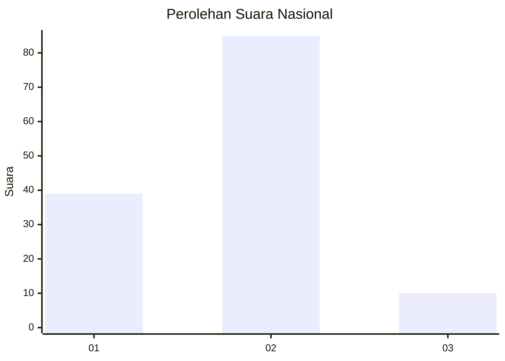
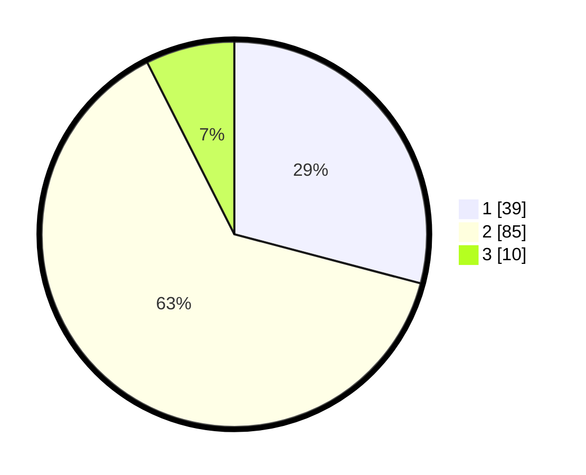

# Hasil

## Grafik

## Tabel

| No. | Nama Paslon    | Suara | Suara (raw) | Persentase |
|:--- |:-------------- | -----:| -----------:| ----------:|
| 1   | ANIES MUHAIMIN | 39    | [39][p-1]   | 29,10      |
| 2   | PRABOWO GIBRAN | 85    | [85][p-2]   | 63,43      |
| 3   | GANJAR MAHFUD  | 10    | [10][p-3]   | 7,46       |

[p-1]: https://github.com/gigit-pemilu/pemilu-2024/blob/main/pilpres/hitung-suara/sub/61-kalimantan-barat/sub/04-ketapang/sub/03-manis-mata/sub/2001-manis-mata/sub/005-tps/sub/paslon-1.txt
[p-2]: https://github.com/gigit-pemilu/pemilu-2024/blob/main/pilpres/hitung-suara/sub/61-kalimantan-barat/sub/04-ketapang/sub/03-manis-mata/sub/2001-manis-mata/sub/005-tps/sub/paslon-2.txt
[p-3]: https://github.com/gigit-pemilu/pemilu-2024/blob/main/pilpres/hitung-suara/sub/61-kalimantan-barat/sub/04-ketapang/sub/03-manis-mata/sub/2001-manis-mata/sub/005-tps/sub/paslon-3.txt

## Foto C Plano

https://sirekap-obj-formc.kpu.go.id/7466/pemilu/ppwp/61/04/03/20/01/6104032001005-20240218-152447--1002fbd4-1d3d-41bf-891c-3d983f13ad2f.jpg

https://sirekap-obj-formc.kpu.go.id/7466/pemilu/ppwp/61/04/03/20/01/6104032001005-20240218-152921--ba544341-08c5-4db0-96b1-64c52b647c30.jpg

https://sirekap-obj-formc.kpu.go.id/7466/pemilu/ppwp/61/04/03/20/01/6104032001005-20240218-153158--a1a8b86b-724f-4d7b-ac98-34eb775e41ac.jpg

## Metadata

| Key        | Value               |
| ---------- | ------------------- |
| Time Stamp | 2024-02-22 13:00:00 |

