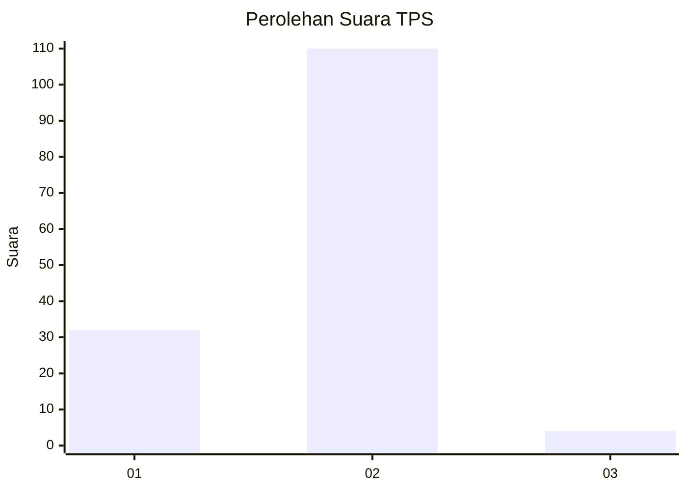

# Hasil

## Grafik

## Tabel

| No. | Nama Paslon    | Suara | Suara (raw) | Persentase |
|:--- |:-------------- | -----:| -----------:| ----------:|
| 1   | ANIES MUHAIMIN | 32    | [32][p-1]   | 21,92      |
| 2   | PRABOWO GIBRAN | 110   | [110][p-2]  | 75,34      |
| 3   | GANJAR MAHFUD  | 4     | [4][p-3]    | 2,74       |

[p-1]: https://github.com/gigit-pemilu/pemilu-2024-61-kalimantan-barat/blob/main/pilpres/hitung-suara/sub/61-kalimantan-barat/sub/04-ketapang/sub/03-manis-mata/sub/2001-manis-mata/sub/007-tps/sub/paslon-1.txt
[p-2]: https://github.com/gigit-pemilu/pemilu-2024-61-kalimantan-barat/blob/main/pilpres/hitung-suara/sub/61-kalimantan-barat/sub/04-ketapang/sub/03-manis-mata/sub/2001-manis-mata/sub/007-tps/sub/paslon-2.txt
[p-3]: https://github.com/gigit-pemilu/pemilu-2024-61-kalimantan-barat/blob/main/pilpres/hitung-suara/sub/61-kalimantan-barat/sub/04-ketapang/sub/03-manis-mata/sub/2001-manis-mata/sub/007-tps/sub/paslon-3.txt

## Foto C Plano

https://sirekap-obj-formc.kpu.go.id/35d1/pemilu/ppwp/61/04/03/20/01/6104032001007-20240218-162924--bcf58917-bf38-4643-9b08-095ab8a29dff.jpg

https://sirekap-obj-formc.kpu.go.id/35d1/pemilu/ppwp/61/04/03/20/01/6104032001007-20240218-163035--fd6ac09e-d9b3-4c83-9fc7-7d307cbeab7b.jpg

https://sirekap-obj-formc.kpu.go.id/35d1/pemilu/ppwp/61/04/03/20/01/6104032001007-20240218-163135--e42bd96b-5454-42df-be20-56ced08c4a47.jpg

## Metadata

| Key        | Value               |
| ---------- | ------------------- |
| Time Stamp | 2024-02-22 13:00:00 |

