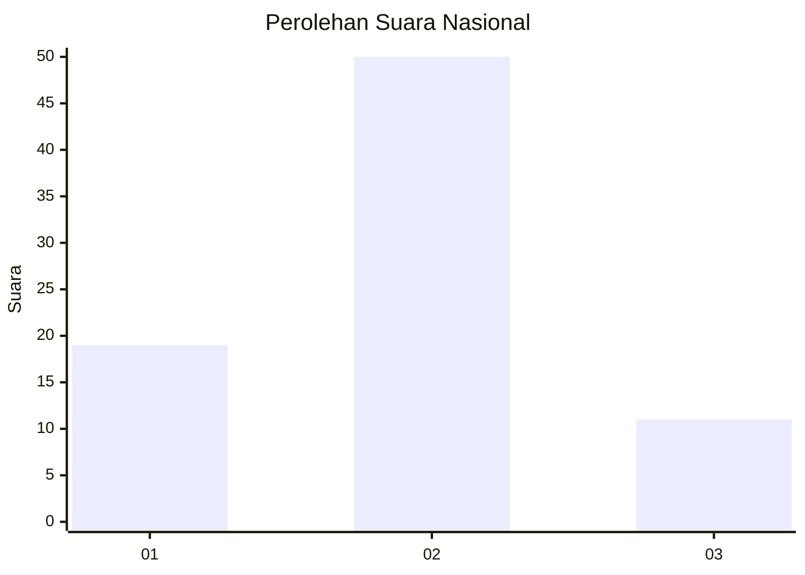
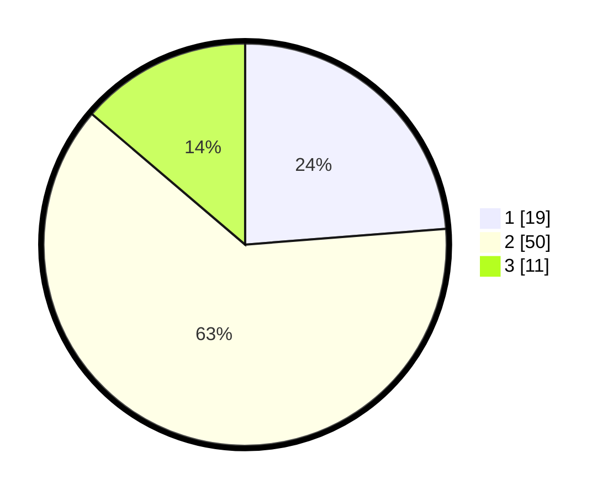

# Hasil

## Grafik

## Tabel

| No. | Nama Paslon    | Suara | Suara (raw) | Persentase |
|:--- |:-------------- | -----:| -----------:| ----------:|
| 1   | ANIES MUHAIMIN | 19    | [19][p-1]   | 23,75      |
| 2   | PRABOWO GIBRAN | 50    | [50][p-2]   | 62,50      |
| 3   | GANJAR MAHFUD  | 11    | [11][p-3]   | 13,75      |

[p-1]: https://github.com/gigit-pemilu/pemilu-2024/blob/main/pilpres/hitung-suara/sub/61-kalimantan-barat/sub/04-ketapang/sub/03-manis-mata/sub/2001-manis-mata/sub/008-tps/sub/paslon-1.txt
[p-2]: https://github.com/gigit-pemilu/pemilu-2024/blob/main/pilpres/hitung-suara/sub/61-kalimantan-barat/sub/04-ketapang/sub/03-manis-mata/sub/2001-manis-mata/sub/008-tps/sub/paslon-2.txt
[p-3]: https://github.com/gigit-pemilu/pemilu-2024/blob/main/pilpres/hitung-suara/sub/61-kalimantan-barat/sub/04-ketapang/sub/03-manis-mata/sub/2001-manis-mata/sub/008-tps/sub/paslon-3.txt

## Foto C Plano

https://sirekap-obj-formc.kpu.go.id/cbf7/pemilu/ppwp/61/04/03/20/01/6104032001008-20240218-162455--28bfdbf6-89ad-4f60-b098-7e2c8a8de790.jpg

https://sirekap-obj-formc.kpu.go.id/cbf7/pemilu/ppwp/61/04/03/20/01/6104032001008-20240218-162552--6b3db69c-b84b-4cc9-b42a-9db10c109a00.jpg

https://sirekap-obj-formc.kpu.go.id/cbf7/pemilu/ppwp/61/04/03/20/01/6104032001008-20240218-162653--33d1770b-57d3-441b-82d6-0a73470e0250.jpg

## Metadata

| Key        | Value               |
| ---------- | ------------------- |
| Time Stamp | 2024-02-22 13:00:00 |

