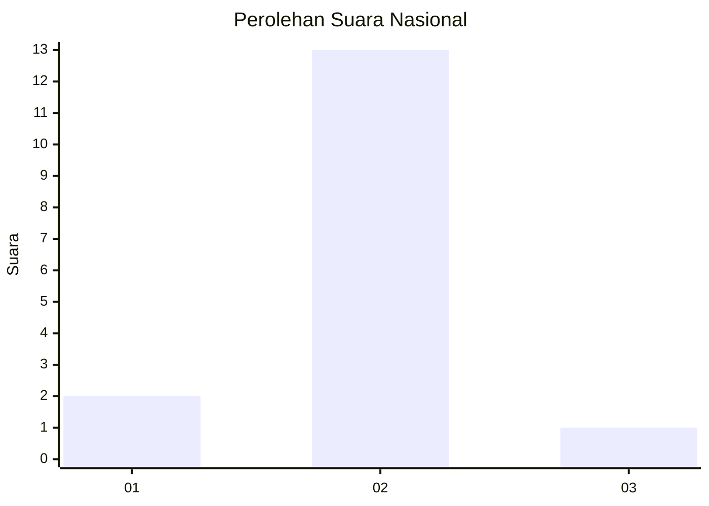
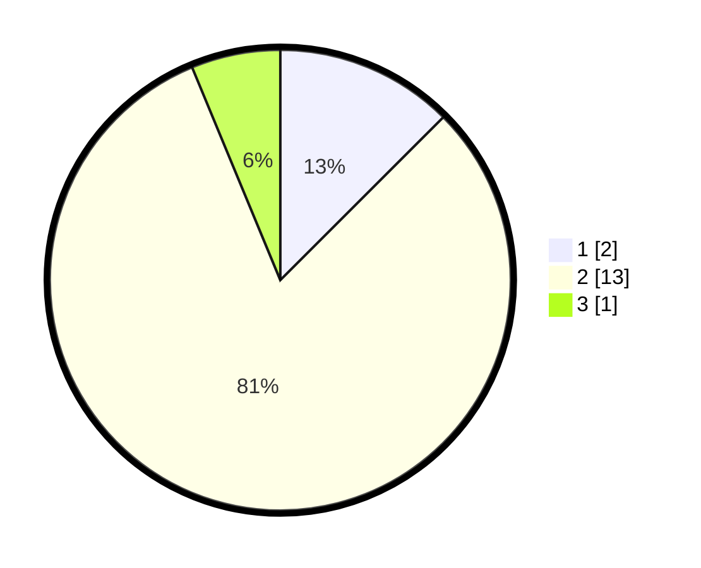

# Hasil

## Grafik

## Tabel

| No. | Nama Paslon    | Suara | Suara (raw) | Persentase |
|:--- |:-------------- | -----:| -----------:| ----------:|
| 1   | ANIES MUHAIMIN | 2     | [2][p-1]    | 12,50      |
| 2   | PRABOWO GIBRAN | 13    | [13][p-2]   | 81,25      |
| 3   | GANJAR MAHFUD  | 1     | [1][p-3]    | 6,25       |

[p-1]: https://github.com/gigit-pemilu/pemilu-2024/blob/main/pilpres/hitung-suara/sub/61-kalimantan-barat/sub/04-ketapang/sub/03-manis-mata/sub/2001-manis-mata/sub/012-tps/sub/paslon-1.txt
[p-2]: https://github.com/gigit-pemilu/pemilu-2024/blob/main/pilpres/hitung-suara/sub/61-kalimantan-barat/sub/04-ketapang/sub/03-manis-mata/sub/2001-manis-mata/sub/012-tps/sub/paslon-2.txt
[p-3]: https://github.com/gigit-pemilu/pemilu-2024/blob/main/pilpres/hitung-suara/sub/61-kalimantan-barat/sub/04-ketapang/sub/03-manis-mata/sub/2001-manis-mata/sub/012-tps/sub/paslon-3.txt

## Foto C Plano

https://sirekap-obj-formc.kpu.go.id/782b/pemilu/ppwp/61/04/03/20/01/6104032001012-20240218-171143--fee34ef0-f4dc-4352-ba72-828f22dcbf8e.jpg

https://sirekap-obj-formc.kpu.go.id/782b/pemilu/ppwp/61/04/03/20/01/6104032001012-20240218-170549--7014fcf0-7958-4f2b-9438-67ddbd25b596.jpg

https://sirekap-obj-formc.kpu.go.id/782b/pemilu/ppwp/61/04/03/20/01/6104032001012-20240218-170705--7bb1fdda-4d88-4ac2-bf69-57ffd6452a54.jpg

## Metadata

| Key        | Value               |
| ---------- | ------------------- |
| Time Stamp | 2024-02-22 13:00:00 |

