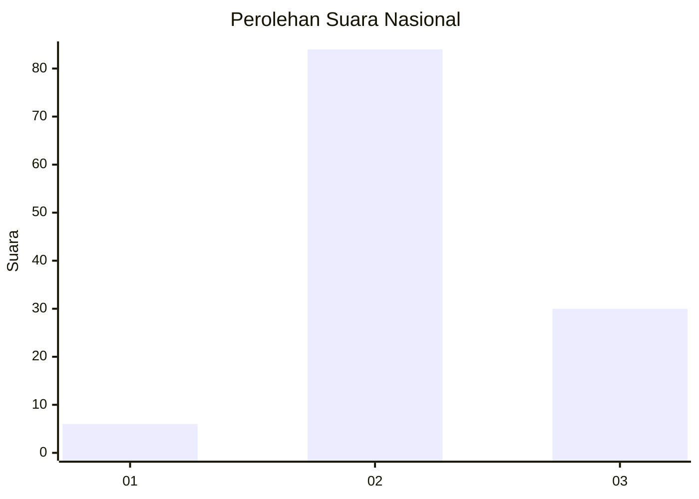
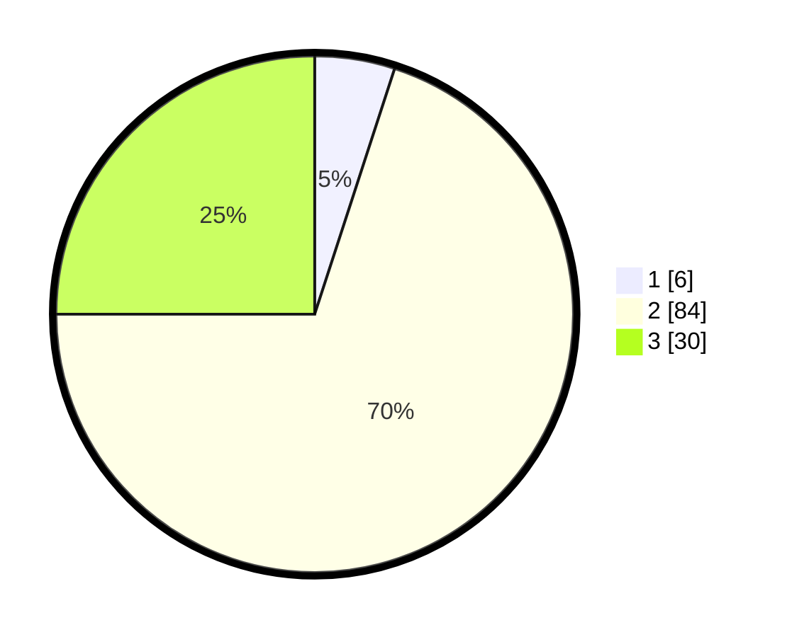

# Hasil

## Grafik

## Tabel

| No. | Nama Paslon    | Suara | Suara (raw) | Persentase |
|:--- |:-------------- | -----:| -----------:| ----------:|
| 1   | ANIES MUHAIMIN | 6     | [6][p-1]    | 5,00       |
| 2   | PRABOWO GIBRAN | 84    | [84][p-2]   | 70,00      |
| 3   | GANJAR MAHFUD  | 30    | [30][p-3]   | 25,00      |

[p-1]: https://github.com/gigit-pemilu/pemilu-2024/blob/main/pilpres/hitung-suara/sub/61-kalimantan-barat/sub/04-ketapang/sub/03-manis-mata/sub/2002-air-dekakah/sub/004-tps/sub/paslon-1.txt
[p-2]: https://github.com/gigit-pemilu/pemilu-2024/blob/main/pilpres/hitung-suara/sub/61-kalimantan-barat/sub/04-ketapang/sub/03-manis-mata/sub/2002-air-dekakah/sub/004-tps/sub/paslon-2.txt
[p-3]: https://github.com/gigit-pemilu/pemilu-2024/blob/main/pilpres/hitung-suara/sub/61-kalimantan-barat/sub/04-ketapang/sub/03-manis-mata/sub/2002-air-dekakah/sub/004-tps/sub/paslon-3.txt

## Foto C Plano

https://sirekap-obj-formc.kpu.go.id/70f0/pemilu/ppwp/61/04/03/20/02/6104032002004-20240218-205545--ad22ccfb-8f56-49b4-b9c7-36de10a39f0c.jpg

https://sirekap-obj-formc.kpu.go.id/70f0/pemilu/ppwp/61/04/03/20/02/6104032002004-20240218-205633--d71d27ba-df1d-4ce6-a2cf-766be3bce8e6.jpg

https://sirekap-obj-formc.kpu.go.id/70f0/pemilu/ppwp/61/04/03/20/02/6104032002004-20240218-205718--8aa8c996-9284-4e15-abb5-548366a7b0a5.jpg

## Metadata

| Key        | Value               |
| ---------- | ------------------- |
| Time Stamp | 2024-02-22 13:00:00 |

