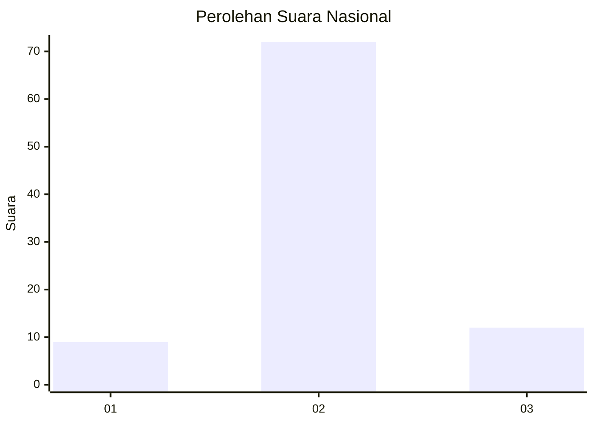
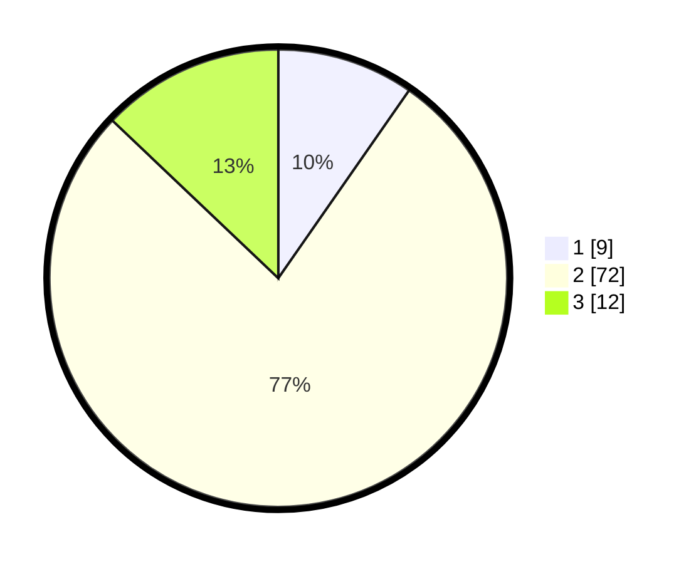

# Hasil

## Grafik

## Tabel

| No. | Nama Paslon    | Suara | Suara (raw) | Persentase |
|:--- |:-------------- | -----:| -----------:| ----------:|
| 1   | ANIES MUHAIMIN | 9     | [9][p-1]    | 9,68       |
| 2   | PRABOWO GIBRAN | 72    | [72][p-2]   | 77,42      |
| 3   | GANJAR MAHFUD  | 12    | [12][p-3]   | 12,90      |

[p-1]: https://github.com/gigit-pemilu/pemilu-2024/blob/main/pilpres/hitung-suara/sub/61-kalimantan-barat/sub/04-ketapang/sub/03-manis-mata/sub/2003-suka-ramai/sub/003-tps/sub/paslon-1.txt
[p-2]: https://github.com/gigit-pemilu/pemilu-2024/blob/main/pilpres/hitung-suara/sub/61-kalimantan-barat/sub/04-ketapang/sub/03-manis-mata/sub/2003-suka-ramai/sub/003-tps/sub/paslon-2.txt
[p-3]: https://github.com/gigit-pemilu/pemilu-2024/blob/main/pilpres/hitung-suara/sub/61-kalimantan-barat/sub/04-ketapang/sub/03-manis-mata/sub/2003-suka-ramai/sub/003-tps/sub/paslon-3.txt

## Foto C Plano

https://sirekap-obj-formc.kpu.go.id/10b2/pemilu/ppwp/61/04/03/20/03/6104032003003-20240218-173936--70e5f33a-11f5-4cd2-8a5a-479f0243e705.jpg

https://sirekap-obj-formc.kpu.go.id/10b2/pemilu/ppwp/61/04/03/20/03/6104032003003-20240218-174052--a96a4ad4-65be-4e81-a24d-139810fbdf1c.jpg

https://sirekap-obj-formc.kpu.go.id/10b2/pemilu/ppwp/61/04/03/20/03/6104032003003-20240218-174148--063eb725-2012-4321-b5b9-0830aae88eb0.jpg

## Metadata

| Key        | Value               |
| ---------- | ------------------- |
| Time Stamp | 2024-02-22 13:00:00 |

