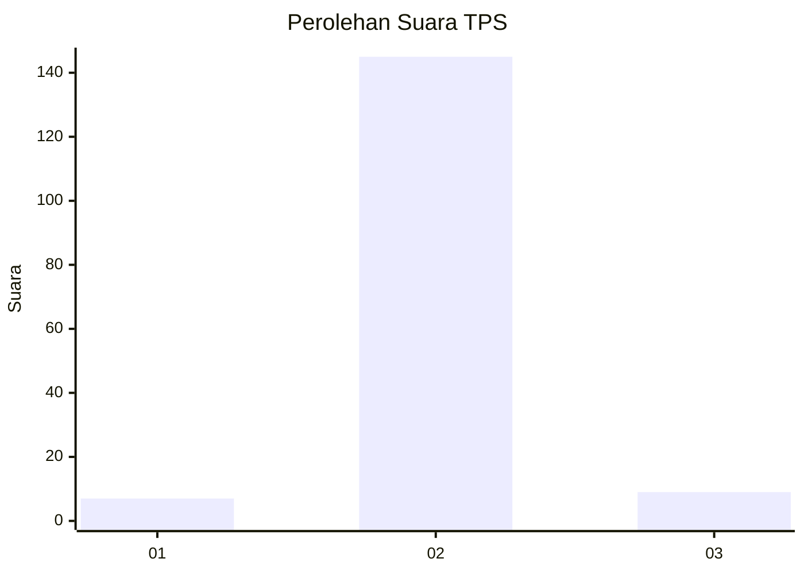
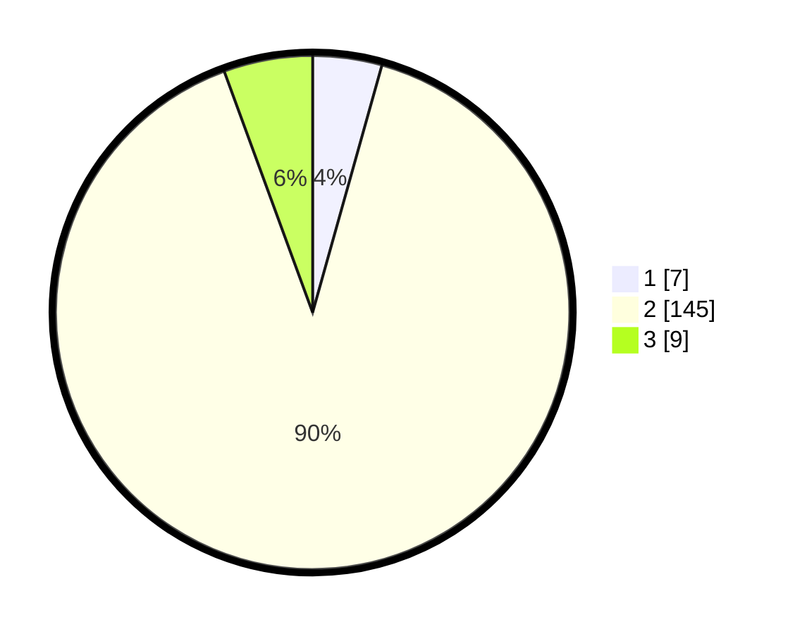

# Hasil

## Grafik

## Tabel

| No. | Nama Paslon    | Suara | Suara (raw) | Persentase |
|:--- |:-------------- | -----:| -----------:| ----------:|
| 1   | ANIES MUHAIMIN | 7     | [7][p-1]    | 4,35       |
| 2   | PRABOWO GIBRAN | 145   | [145][p-2]  | 90,06      |
| 3   | GANJAR MAHFUD  | 9     | [9][p-3]    | 5,59       |

[p-1]: https://github.com/gigit-pemilu/pemilu-2024-61-kalimantan-barat/blob/main/pilpres/hitung-suara/sub/61-kalimantan-barat/sub/04-ketapang/sub/03-manis-mata/sub/2003-suka-ramai/sub/004-tps/sub/paslon-1.txt
[p-2]: https://github.com/gigit-pemilu/pemilu-2024-61-kalimantan-barat/blob/main/pilpres/hitung-suara/sub/61-kalimantan-barat/sub/04-ketapang/sub/03-manis-mata/sub/2003-suka-ramai/sub/004-tps/sub/paslon-2.txt
[p-3]: https://github.com/gigit-pemilu/pemilu-2024-61-kalimantan-barat/blob/main/pilpres/hitung-suara/sub/61-kalimantan-barat/sub/04-ketapang/sub/03-manis-mata/sub/2003-suka-ramai/sub/004-tps/sub/paslon-3.txt

## Foto C Plano

https://sirekap-obj-formc.kpu.go.id/73ea/pemilu/ppwp/61/04/03/20/03/6104032003004-20240218-173602--aecdb91b-4e8a-456b-b973-6c0717925ac2.jpg

https://sirekap-obj-formc.kpu.go.id/73ea/pemilu/ppwp/61/04/03/20/03/6104032003004-20240218-173707--8951ef25-5640-4025-a361-ec5c3924c0c2.jpg

https://sirekap-obj-formc.kpu.go.id/73ea/pemilu/ppwp/61/04/03/20/03/6104032003004-20240218-173801--9074aed5-e681-4fa5-b2e6-3b575c849bbf.jpg

## Metadata

| Key        | Value               |
| ---------- | ------------------- |
| Time Stamp | 2024-02-22 13:00:00 |

