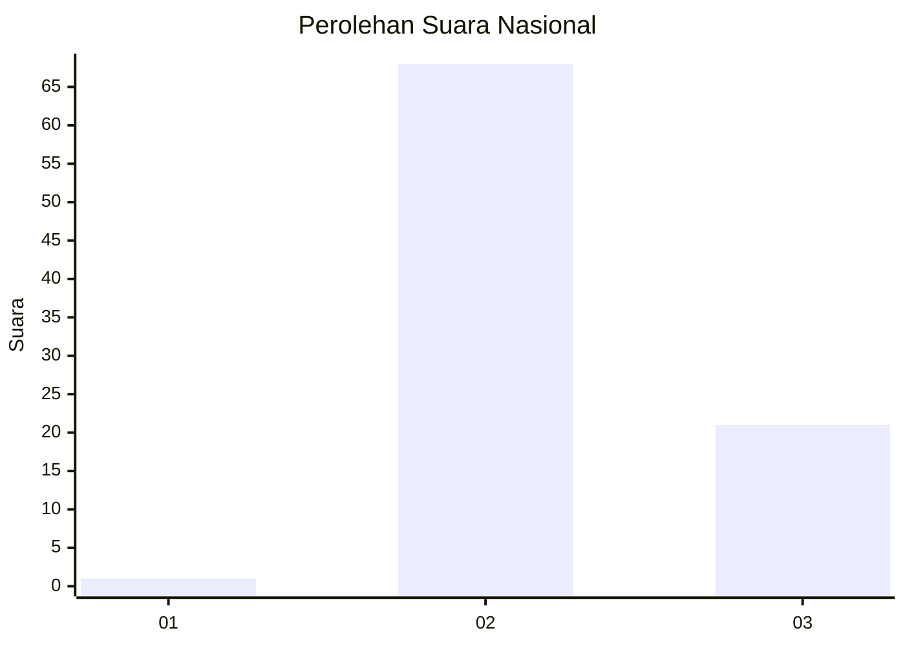
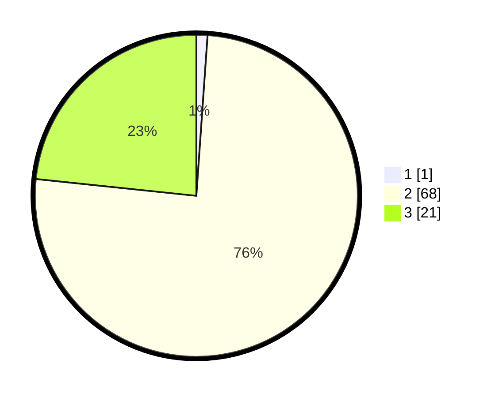

# Hasil

## Grafik

## Tabel

| No. | Nama Paslon    | Suara | Suara (raw) | Persentase |
|:--- |:-------------- | -----:| -----------:| ----------:|
| 1   | ANIES MUHAIMIN | 1     | [1][p-1]    | 1,11       |
| 2   | PRABOWO GIBRAN | 68    | [68][p-2]   | 75,56      |
| 3   | GANJAR MAHFUD  | 21    | [21][p-3]   | 23,33      |

[p-1]: https://github.com/gigit-pemilu/pemilu-2024/blob/main/pilpres/hitung-suara/sub/61-kalimantan-barat/sub/04-ketapang/sub/03-manis-mata/sub/2005-silat/sub/005-tps/sub/paslon-1.txt
[p-2]: https://github.com/gigit-pemilu/pemilu-2024/blob/main/pilpres/hitung-suara/sub/61-kalimantan-barat/sub/04-ketapang/sub/03-manis-mata/sub/2005-silat/sub/005-tps/sub/paslon-2.txt
[p-3]: https://github.com/gigit-pemilu/pemilu-2024/blob/main/pilpres/hitung-suara/sub/61-kalimantan-barat/sub/04-ketapang/sub/03-manis-mata/sub/2005-silat/sub/005-tps/sub/paslon-3.txt

## Foto C Plano

https://sirekap-obj-formc.kpu.go.id/fea3/pemilu/ppwp/61/04/03/20/05/6104032005005-20240215-095102--5269df86-f213-42b3-ace9-5063619670d4.jpg

https://sirekap-obj-formc.kpu.go.id/fea3/pemilu/ppwp/61/04/03/20/05/6104032005005-20240215-095225--c2dfdda5-9852-41fe-b7a8-1b5d15aaf4c8.jpg

https://sirekap-obj-formc.kpu.go.id/fea3/pemilu/ppwp/61/04/03/20/05/6104032005005-20240215-095515--253c92ef-d0a5-4511-b55a-21f149226078.jpg

## Metadata

| Key        | Value               |
| ---------- | ------------------- |
| Time Stamp | 2024-02-22 13:00:00 |

