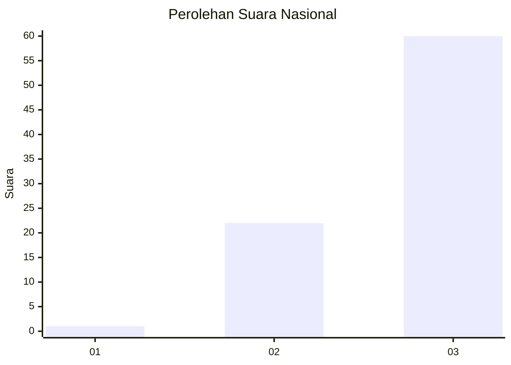
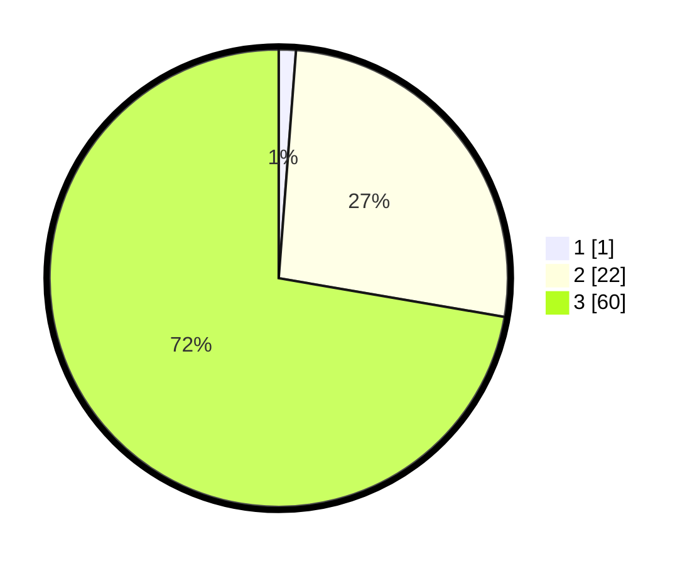

# Hasil

## Grafik

## Tabel

| No. | Nama Paslon    | Suara | Suara (raw) | Persentase |
|:--- |:-------------- | -----:| -----------:| ----------:|
| 1   | ANIES MUHAIMIN | 1     | [1][p-1]    | 1,20       |
| 2   | PRABOWO GIBRAN | 22    | [22][p-2]   | 26,51      |
| 3   | GANJAR MAHFUD  | 60    | [60][p-3]   | 72,29      |

[p-1]: https://github.com/gigit-pemilu/pemilu-2024/blob/main/pilpres/hitung-suara/sub/61-kalimantan-barat/sub/04-ketapang/sub/03-manis-mata/sub/2006-terusan/sub/003-tps/sub/paslon-1.txt
[p-2]: https://github.com/gigit-pemilu/pemilu-2024/blob/main/pilpres/hitung-suara/sub/61-kalimantan-barat/sub/04-ketapang/sub/03-manis-mata/sub/2006-terusan/sub/003-tps/sub/paslon-2.txt
[p-3]: https://github.com/gigit-pemilu/pemilu-2024/blob/main/pilpres/hitung-suara/sub/61-kalimantan-barat/sub/04-ketapang/sub/03-manis-mata/sub/2006-terusan/sub/003-tps/sub/paslon-3.txt

## Foto C Plano

https://sirekap-obj-formc.kpu.go.id/5114/pemilu/ppwp/61/04/03/20/06/6104032006003-20240218-170709--e3bf72ee-9533-4e19-a59e-8be3cad7c0fc.jpg

https://sirekap-obj-formc.kpu.go.id/5114/pemilu/ppwp/61/04/03/20/06/6104032006003-20240218-170943--22c4ce6b-39f9-4c27-8e24-4508cd710143.jpg

https://sirekap-obj-formc.kpu.go.id/5114/pemilu/ppwp/61/04/03/20/06/6104032006003-20240218-171147--d8bc8c36-18f0-4b53-b2c6-e0aedce650f6.jpg

## Metadata

| Key        | Value               |
| ---------- | ------------------- |
| Time Stamp | 2024-02-22 13:00:00 |

