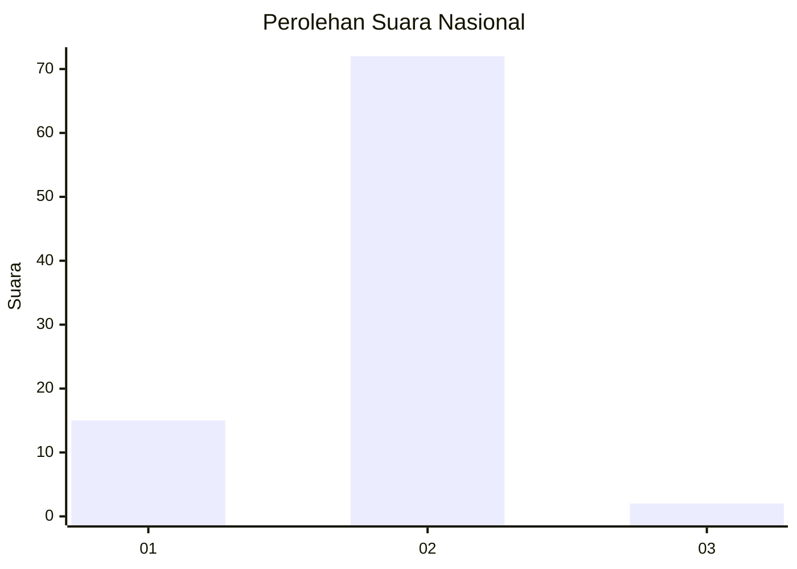
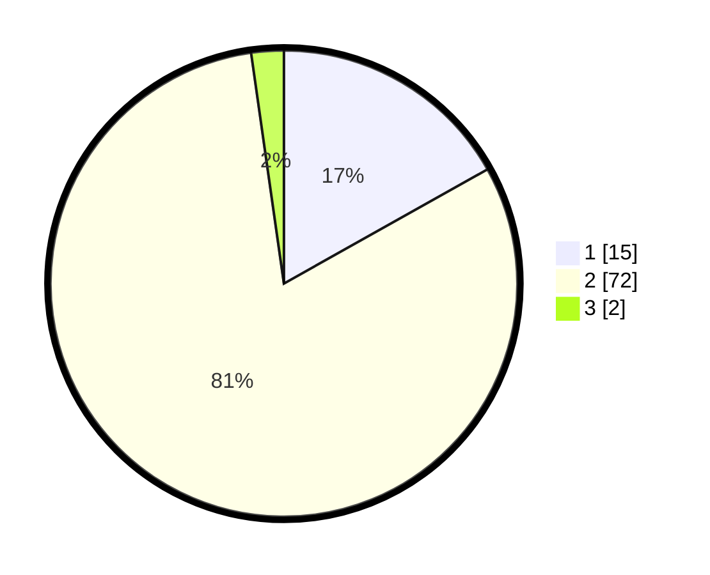

# Hasil

## Grafik

## Tabel

| No. | Nama Paslon    | Suara | Suara (raw) | Persentase |
|:--- |:-------------- | -----:| -----------:| ----------:|
| 1   | ANIES MUHAIMIN | 15    | [15][p-1]   | 16,85      |
| 2   | PRABOWO GIBRAN | 72    | [72][p-2]   | 80,90      |
| 3   | GANJAR MAHFUD  | 2     | [2][p-3]    | 2,25       |

[p-1]: https://github.com/gigit-pemilu/pemilu-2024/blob/main/pilpres/hitung-suara/sub/61-kalimantan-barat/sub/04-ketapang/sub/03-manis-mata/sub/2008-kelampai/sub/003-tps/sub/paslon-1.txt
[p-2]: https://github.com/gigit-pemilu/pemilu-2024/blob/main/pilpres/hitung-suara/sub/61-kalimantan-barat/sub/04-ketapang/sub/03-manis-mata/sub/2008-kelampai/sub/003-tps/sub/paslon-2.txt
[p-3]: https://github.com/gigit-pemilu/pemilu-2024/blob/main/pilpres/hitung-suara/sub/61-kalimantan-barat/sub/04-ketapang/sub/03-manis-mata/sub/2008-kelampai/sub/003-tps/sub/paslon-3.txt

## Foto C Plano

https://sirekap-obj-formc.kpu.go.id/f7f0/pemilu/ppwp/61/04/03/20/08/6104032008003-20240218-134416--63ea6036-585f-43a7-8ab5-04d6769e1809.jpg

https://sirekap-obj-formc.kpu.go.id/f7f0/pemilu/ppwp/61/04/03/20/08/6104032008003-20240218-134510--edcccab3-3057-40e7-95a7-a1930a991477.jpg

https://sirekap-obj-formc.kpu.go.id/f7f0/pemilu/ppwp/61/04/03/20/08/6104032008003-20240218-134611--6efd02d4-0f7c-4323-98ab-b882593a8857.jpg

## Metadata

| Key        | Value               |
| ---------- | ------------------- |
| Time Stamp | 2024-02-22 13:00:00 |

