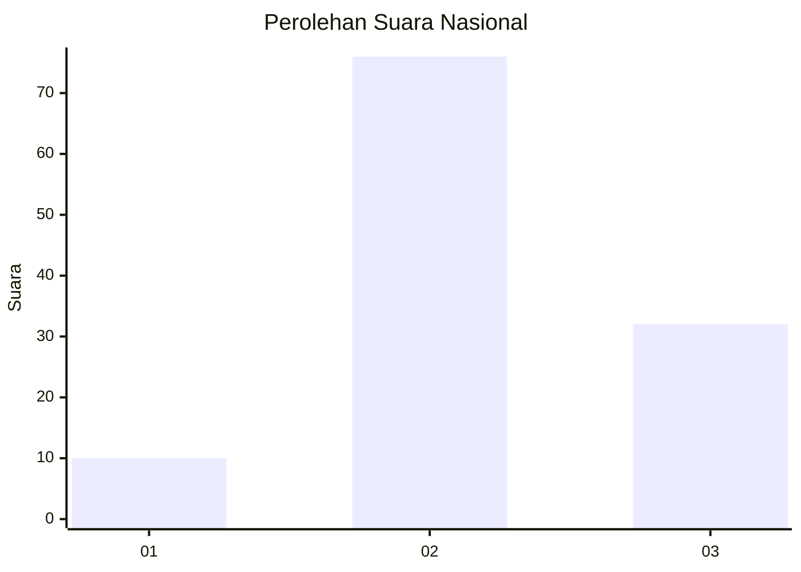
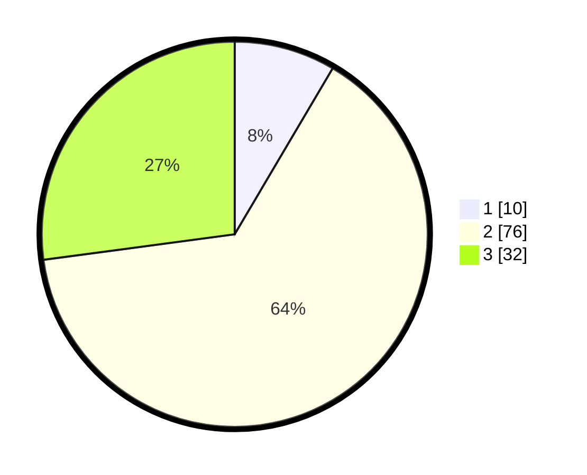

# Hasil

## Grafik

## Tabel

| No. | Nama Paslon    | Suara | Suara (raw) | Persentase |
|:--- |:-------------- | -----:| -----------:| ----------:|
| 1   | ANIES MUHAIMIN | 10    | [10][p-1]   | 8,47       |
| 2   | PRABOWO GIBRAN | 76    | [76][p-2]   | 64,41      |
| 3   | GANJAR MAHFUD  | 32    | [32][p-3]   | 27,12      |

[p-1]: https://github.com/gigit-pemilu/pemilu-2024/blob/main/pilpres/hitung-suara/sub/61-kalimantan-barat/sub/04-ketapang/sub/03-manis-mata/sub/2011-asam-besar/sub/007-tps/sub/paslon-1.txt
[p-2]: https://github.com/gigit-pemilu/pemilu-2024/blob/main/pilpres/hitung-suara/sub/61-kalimantan-barat/sub/04-ketapang/sub/03-manis-mata/sub/2011-asam-besar/sub/007-tps/sub/paslon-2.txt
[p-3]: https://github.com/gigit-pemilu/pemilu-2024/blob/main/pilpres/hitung-suara/sub/61-kalimantan-barat/sub/04-ketapang/sub/03-manis-mata/sub/2011-asam-besar/sub/007-tps/sub/paslon-3.txt

## Foto C Plano

https://sirekap-obj-formc.kpu.go.id/b0eb/pemilu/ppwp/61/04/03/20/11/6104032011007-20240218-222440--f535532d-0d6d-422f-a0c1-08f4d48f68ec.jpg

https://sirekap-obj-formc.kpu.go.id/b0eb/pemilu/ppwp/61/04/03/20/11/6104032011007-20240218-222641--1e648f4f-b21f-4da6-9ba9-663217fcd68a.jpg

https://sirekap-obj-formc.kpu.go.id/b0eb/pemilu/ppwp/61/04/03/20/11/6104032011007-20240218-222631--2819a408-79b8-4058-87d6-3e57b6498392.jpg

## Metadata

| Key        | Value               |
| ---------- | ------------------- |
| Time Stamp | 2024-02-22 13:00:00 |

