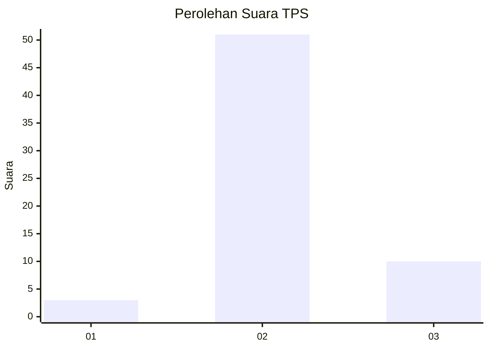
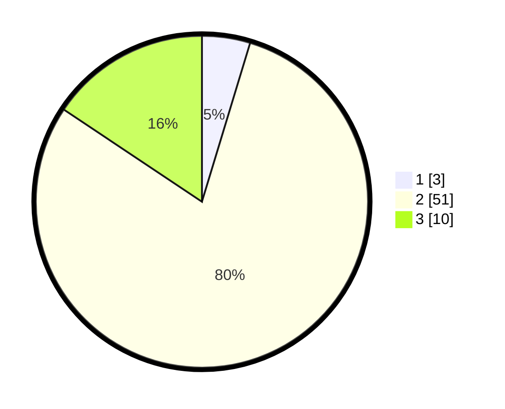

# Hasil

## Grafik

## Tabel

| No. | Nama Paslon    | Suara | Suara (raw) | Persentase |
|:--- |:-------------- | -----:| -----------:| ----------:|
| 1   | ANIES MUHAIMIN | 3     | [3][p-1]    | 4,69       |
| 2   | PRABOWO GIBRAN | 51    | [51][p-2]   | 79,69      |
| 3   | GANJAR MAHFUD  | 10    | [10][p-3]   | 15,63      |

[p-1]: https://github.com/gigit-pemilu/pemilu-2024-61-kalimantan-barat/blob/main/pilpres/hitung-suara/sub/61-kalimantan-barat/sub/04-ketapang/sub/03-manis-mata/sub/2011-asam-besar/sub/009-tps/sub/paslon-1.txt
[p-2]: https://github.com/gigit-pemilu/pemilu-2024-61-kalimantan-barat/blob/main/pilpres/hitung-suara/sub/61-kalimantan-barat/sub/04-ketapang/sub/03-manis-mata/sub/2011-asam-besar/sub/009-tps/sub/paslon-2.txt
[p-3]: https://github.com/gigit-pemilu/pemilu-2024-61-kalimantan-barat/blob/main/pilpres/hitung-suara/sub/61-kalimantan-barat/sub/04-ketapang/sub/03-manis-mata/sub/2011-asam-besar/sub/009-tps/sub/paslon-3.txt

## Foto C Plano

https://sirekap-obj-formc.kpu.go.id/59ac/pemilu/ppwp/61/04/03/20/11/6104032011009-20240218-224848--bbc8cd2b-b40b-4169-ab94-0053c5750fda.jpg

https://sirekap-obj-formc.kpu.go.id/59ac/pemilu/ppwp/61/04/03/20/11/6104032011009-20240218-224939--3e3de875-5ff8-4029-8e5b-203f27f7a463.jpg

https://sirekap-obj-formc.kpu.go.id/59ac/pemilu/ppwp/61/04/03/20/11/6104032011009-20240218-225018--8942a298-e60a-46a6-844f-bfa10649f1d5.jpg

## Metadata

| Key        | Value               |
| ---------- | ------------------- |
| Time Stamp | 2024-02-22 13:00:00 |

