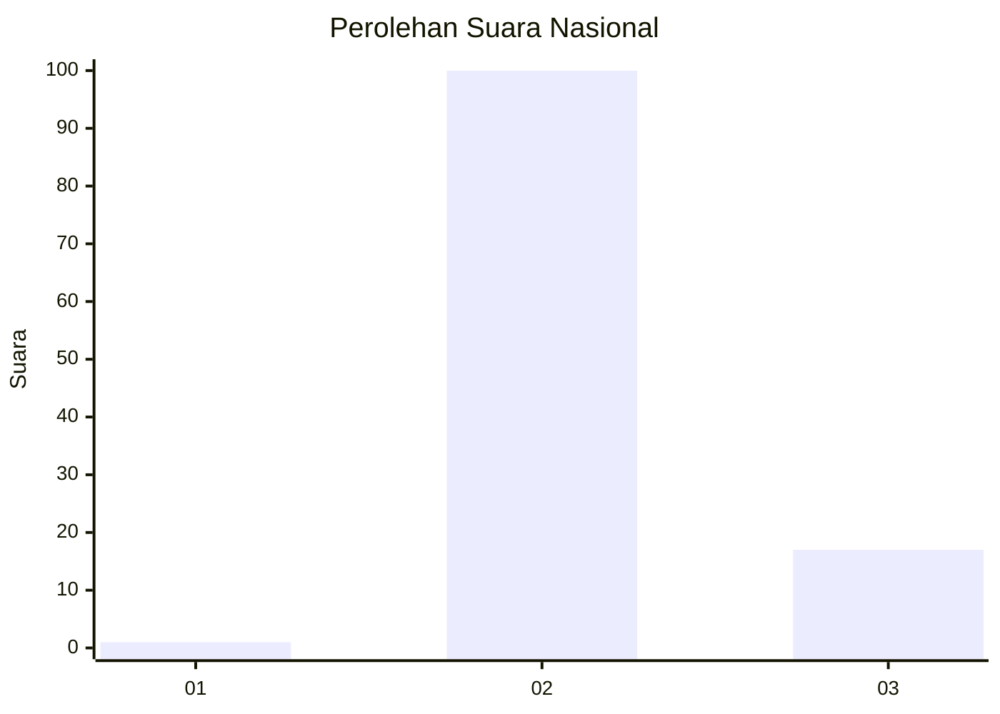
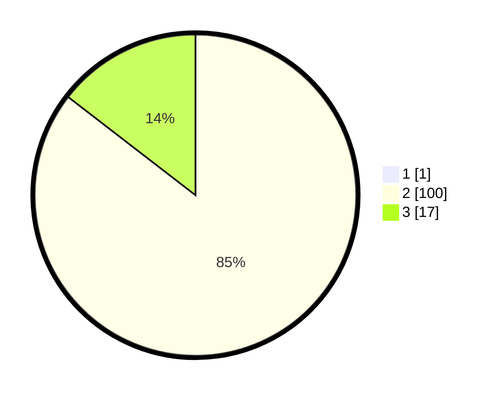

# Hasil

## Grafik

## Tabel

| No. | Nama Paslon    | Suara | Suara (raw) | Persentase |
|:--- |:-------------- | -----:| -----------:| ----------:|
| 1   | ANIES MUHAIMIN | 1     | [1][p-1]    | 0,85       |
| 2   | PRABOWO GIBRAN | 100   | [100][p-2]  | 84,75      |
| 3   | GANJAR MAHFUD  | 17    | [17][p-3]   | 14,41      |

[p-1]: https://github.com/gigit-pemilu/pemilu-2024/blob/main/pilpres/hitung-suara/sub/61-kalimantan-barat/sub/04-ketapang/sub/03-manis-mata/sub/2012-batu-sedau/sub/001-tps/sub/paslon-1.txt
[p-2]: https://github.com/gigit-pemilu/pemilu-2024/blob/main/pilpres/hitung-suara/sub/61-kalimantan-barat/sub/04-ketapang/sub/03-manis-mata/sub/2012-batu-sedau/sub/001-tps/sub/paslon-2.txt
[p-3]: https://github.com/gigit-pemilu/pemilu-2024/blob/main/pilpres/hitung-suara/sub/61-kalimantan-barat/sub/04-ketapang/sub/03-manis-mata/sub/2012-batu-sedau/sub/001-tps/sub/paslon-3.txt

## Foto C Plano

https://sirekap-obj-formc.kpu.go.id/0d7a/pemilu/ppwp/61/04/03/20/12/6104032012001-20240218-104826--7779c538-f5f6-4c42-967f-9c47af7630ce.jpg

https://sirekap-obj-formc.kpu.go.id/0d7a/pemilu/ppwp/61/04/03/20/12/6104032012001-20240218-110415--08f1750e-582e-4e9c-a02b-254011728692.jpg

https://sirekap-obj-formc.kpu.go.id/0d7a/pemilu/ppwp/61/04/03/20/12/6104032012001-20240218-110519--75c95ff2-4d6b-4cf7-a204-3dffa9ac52c5.jpg

## Metadata

| Key        | Value               |
| ---------- | ------------------- |
| Time Stamp | 2024-02-22 13:00:00 |

