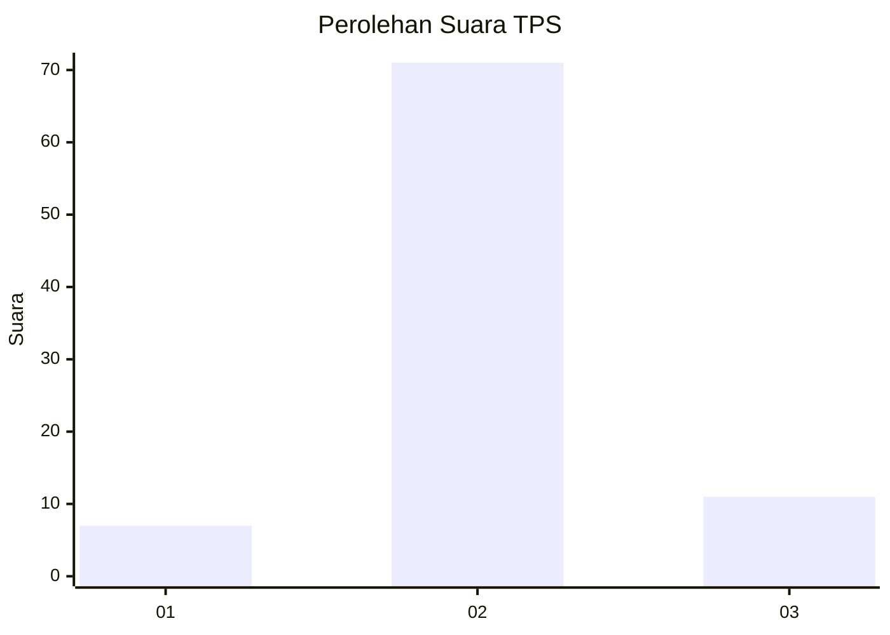
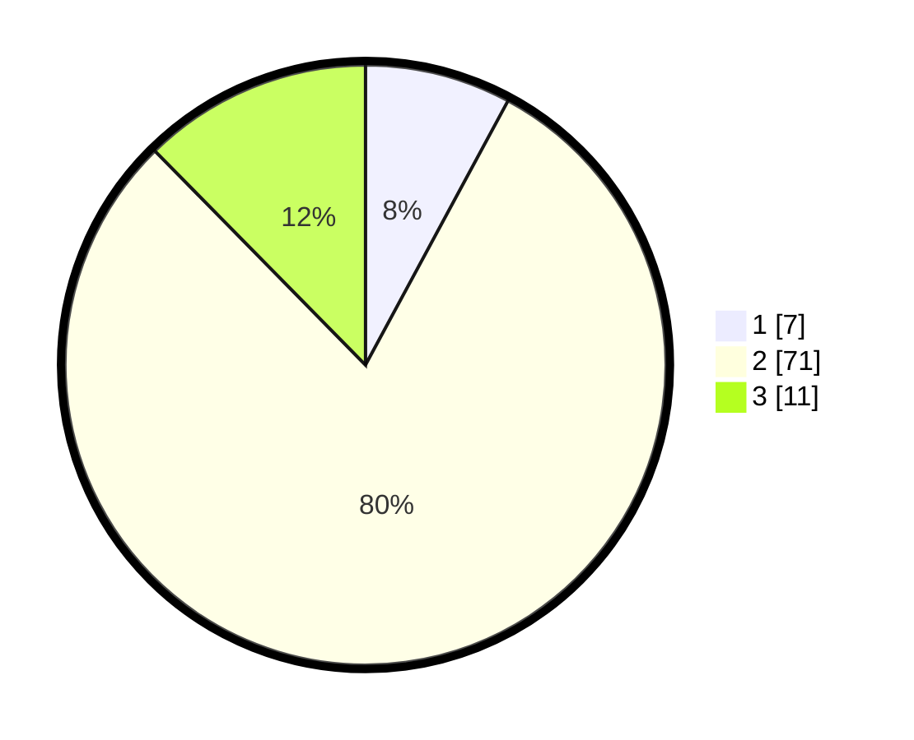

# Hasil

## Grafik

## Tabel

| No. | Nama Paslon    | Suara | Suara (raw) | Persentase |
|:--- |:-------------- | -----:| -----------:| ----------:|
| 1   | ANIES MUHAIMIN | 7     | [7][p-1]    | 7,87       |
| 2   | PRABOWO GIBRAN | 71    | [71][p-2]   | 79,78      |
| 3   | GANJAR MAHFUD  | 11    | [11][p-3]   | 12,36      |

[p-1]: https://github.com/gigit-pemilu/pemilu-2024-61-kalimantan-barat/blob/main/pilpres/hitung-suara/sub/61-kalimantan-barat/sub/04-ketapang/sub/03-manis-mata/sub/2014-seguling/sub/003-tps/sub/paslon-1.txt
[p-2]: https://github.com/gigit-pemilu/pemilu-2024-61-kalimantan-barat/blob/main/pilpres/hitung-suara/sub/61-kalimantan-barat/sub/04-ketapang/sub/03-manis-mata/sub/2014-seguling/sub/003-tps/sub/paslon-2.txt
[p-3]: https://github.com/gigit-pemilu/pemilu-2024-61-kalimantan-barat/blob/main/pilpres/hitung-suara/sub/61-kalimantan-barat/sub/04-ketapang/sub/03-manis-mata/sub/2014-seguling/sub/003-tps/sub/paslon-3.txt

## Foto C Plano

https://sirekap-obj-formc.kpu.go.id/5a77/pemilu/ppwp/61/04/03/20/14/6104032014003-20240215-103935--0fb4f766-4447-4bd4-9f18-4f7608b82a55.jpg

https://sirekap-obj-formc.kpu.go.id/5a77/pemilu/ppwp/61/04/03/20/14/6104032014003-20240215-104103--5ab8624b-b836-497c-9246-1c71c4db4a36.jpg

https://sirekap-obj-formc.kpu.go.id/5a77/pemilu/ppwp/61/04/03/20/14/6104032014003-20240215-104031--2b28fdf5-3324-4a5b-beaf-a90d9b3554f6.jpg

## Metadata

| Key        | Value               |
| ---------- | ------------------- |
| Time Stamp | 2024-02-22 13:00:00 |

