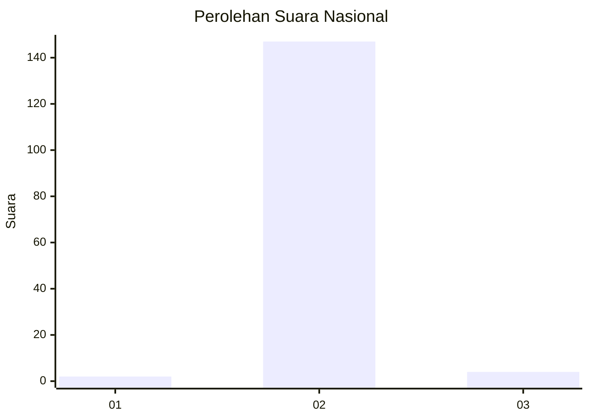
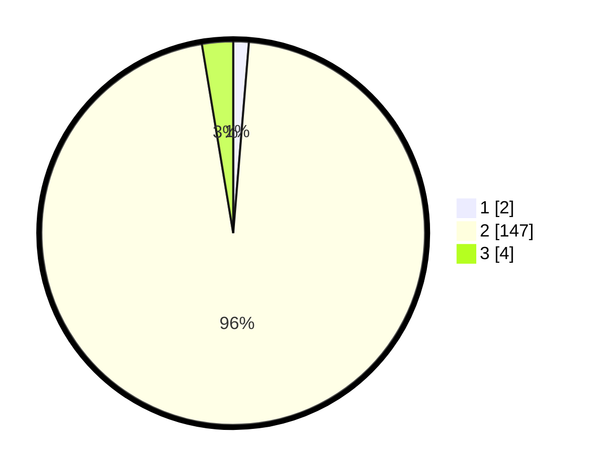

# Hasil

## Grafik

## Tabel

| No. | Nama Paslon    | Suara | Suara (raw) | Persentase |
|:--- |:-------------- | -----:| -----------:| ----------:|
| 1   | ANIES MUHAIMIN | 2     | [2][p-1]    | 1,31       |
| 2   | PRABOWO GIBRAN | 147   | [147][p-2]  | 96,08      |
| 3   | GANJAR MAHFUD  | 4     | [4][p-3]    | 2,61       |

[p-1]: https://github.com/gigit-pemilu/pemilu-2024/blob/main/pilpres/hitung-suara/sub/61-kalimantan-barat/sub/04-ketapang/sub/03-manis-mata/sub/2018-pakit-selaba/sub/002-tps/sub/paslon-1.txt
[p-2]: https://github.com/gigit-pemilu/pemilu-2024/blob/main/pilpres/hitung-suara/sub/61-kalimantan-barat/sub/04-ketapang/sub/03-manis-mata/sub/2018-pakit-selaba/sub/002-tps/sub/paslon-2.txt
[p-3]: https://github.com/gigit-pemilu/pemilu-2024/blob/main/pilpres/hitung-suara/sub/61-kalimantan-barat/sub/04-ketapang/sub/03-manis-mata/sub/2018-pakit-selaba/sub/002-tps/sub/paslon-3.txt

## Foto C Plano

https://sirekap-obj-formc.kpu.go.id/f015/pemilu/ppwp/61/04/03/20/18/6104032018002-20240218-200556--fff27fff-2a69-42f4-b8b7-384814e894fc.jpg

https://sirekap-obj-formc.kpu.go.id/f015/pemilu/ppwp/61/04/03/20/18/6104032018002-20240218-200645--ae38394f-08d9-4c65-a4dd-06742153ab45.jpg

https://sirekap-obj-formc.kpu.go.id/f015/pemilu/ppwp/61/04/03/20/18/6104032018002-20240218-200734--43fc4232-8d49-4e96-b405-c5cc105f2214.jpg

## Metadata

| Key        | Value               |
| ---------- | ------------------- |
| Time Stamp | 2024-02-22 13:00:00 |

