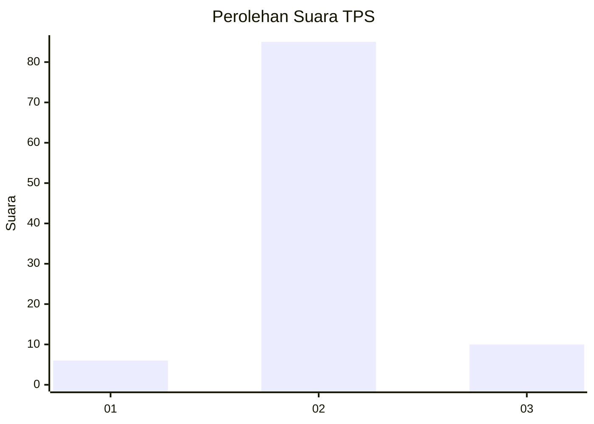
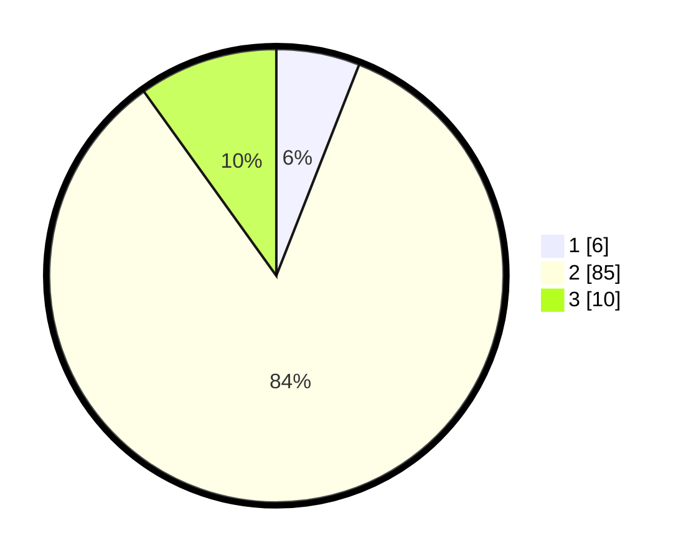

# Hasil

## Grafik

## Tabel

| No. | Nama Paslon    | Suara | Suara (raw) | Persentase |
|:--- |:-------------- | -----:| -----------:| ----------:|
| 1   | ANIES MUHAIMIN | 6     | [6][p-1]    | 5,94       |
| 2   | PRABOWO GIBRAN | 85    | [85][p-2]   | 84,16      |
| 3   | GANJAR MAHFUD  | 10    | [10][p-3]   | 9,90       |

[p-1]: https://github.com/gigit-pemilu/pemilu-2024-61-kalimantan-barat/blob/main/pilpres/hitung-suara/sub/61-kalimantan-barat/sub/04-ketapang/sub/03-manis-mata/sub/2018-pakit-selaba/sub/003-tps/sub/paslon-1.txt
[p-2]: https://github.com/gigit-pemilu/pemilu-2024-61-kalimantan-barat/blob/main/pilpres/hitung-suara/sub/61-kalimantan-barat/sub/04-ketapang/sub/03-manis-mata/sub/2018-pakit-selaba/sub/003-tps/sub/paslon-2.txt
[p-3]: https://github.com/gigit-pemilu/pemilu-2024-61-kalimantan-barat/blob/main/pilpres/hitung-suara/sub/61-kalimantan-barat/sub/04-ketapang/sub/03-manis-mata/sub/2018-pakit-selaba/sub/003-tps/sub/paslon-3.txt

## Foto C Plano

https://sirekap-obj-formc.kpu.go.id/8cbe/pemilu/ppwp/61/04/03/20/18/6104032018003-20240218-201454--5d578c0d-d3e1-497e-afdf-853083645c97.jpg

https://sirekap-obj-formc.kpu.go.id/8cbe/pemilu/ppwp/61/04/03/20/18/6104032018003-20240218-201543--ec7994a9-15a1-4416-8b22-ad709aa40d09.jpg

https://sirekap-obj-formc.kpu.go.id/8cbe/pemilu/ppwp/61/04/03/20/18/6104032018003-20240218-201635--bf7404f3-04f2-4027-8d34-de7e93ced004.jpg

## Metadata

| Key        | Value               |
| ---------- | ------------------- |
| Time Stamp | 2024-02-22 13:00:00 |

