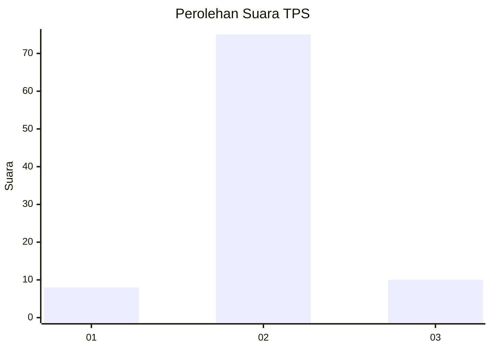
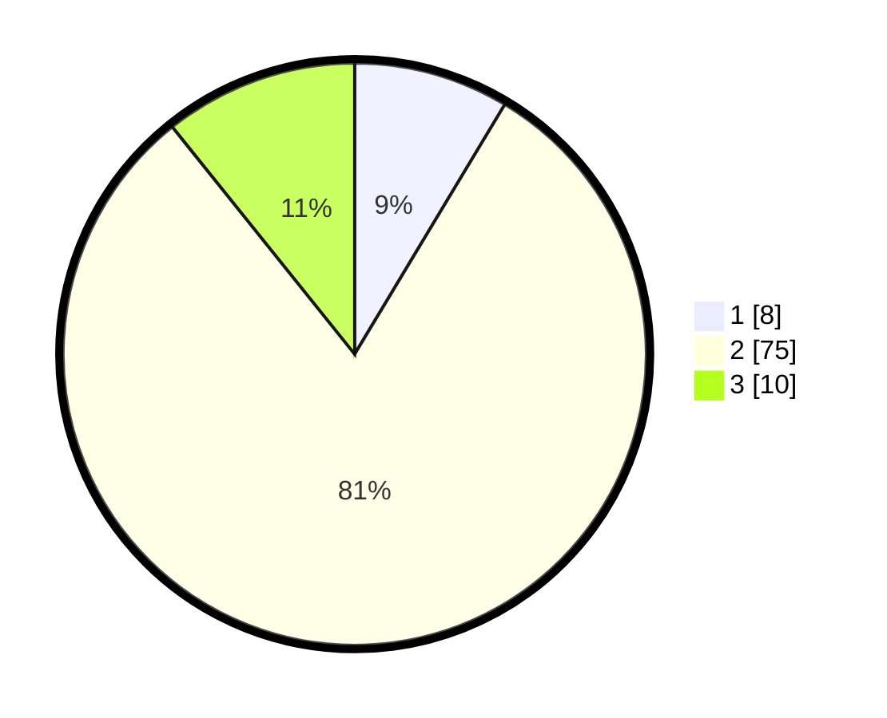

# Hasil

## Grafik

## Tabel

| No. | Nama Paslon    | Suara | Suara (raw) | Persentase |
|:--- |:-------------- | -----:| -----------:| ----------:|
| 1   | ANIES MUHAIMIN | 8     | [8][p-1]    | 8,60       |
| 2   | PRABOWO GIBRAN | 75    | [75][p-2]   | 80,65      |
| 3   | GANJAR MAHFUD  | 10    | [10][p-3]   | 10,75      |

[p-1]: https://github.com/gigit-pemilu/pemilu-2024-61-kalimantan-barat/blob/main/pilpres/hitung-suara/sub/61-kalimantan-barat/sub/04-ketapang/sub/03-manis-mata/sub/2019-sungai-buluh/sub/003-tps/sub/paslon-1.txt
[p-2]: https://github.com/gigit-pemilu/pemilu-2024-61-kalimantan-barat/blob/main/pilpres/hitung-suara/sub/61-kalimantan-barat/sub/04-ketapang/sub/03-manis-mata/sub/2019-sungai-buluh/sub/003-tps/sub/paslon-2.txt
[p-3]: https://github.com/gigit-pemilu/pemilu-2024-61-kalimantan-barat/blob/main/pilpres/hitung-suara/sub/61-kalimantan-barat/sub/04-ketapang/sub/03-manis-mata/sub/2019-sungai-buluh/sub/003-tps/sub/paslon-3.txt

## Foto C Plano

https://sirekap-obj-formc.kpu.go.id/961f/pemilu/ppwp/61/04/03/20/19/6104032019003-20240218-201946--dccbdbf2-c5a6-4214-ac6f-e4b75d378c30.jpg

https://sirekap-obj-formc.kpu.go.id/961f/pemilu/ppwp/61/04/03/20/19/6104032019003-20240218-202103--a243ef19-17df-4b61-939c-ea291a288d98.jpg

https://sirekap-obj-formc.kpu.go.id/961f/pemilu/ppwp/61/04/03/20/19/6104032019003-20240218-202230--b283ec22-138e-4b2f-bd29-02724b064480.jpg

## Metadata

| Key        | Value               |
| ---------- | ------------------- |
| Time Stamp | 2024-02-22 13:00:00 |

