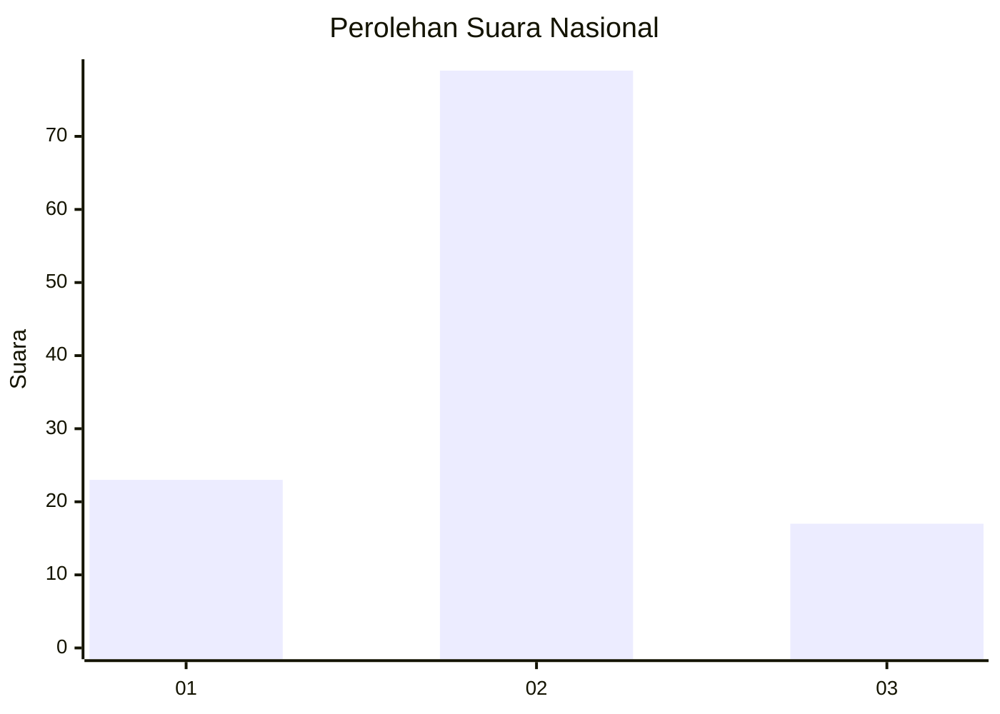
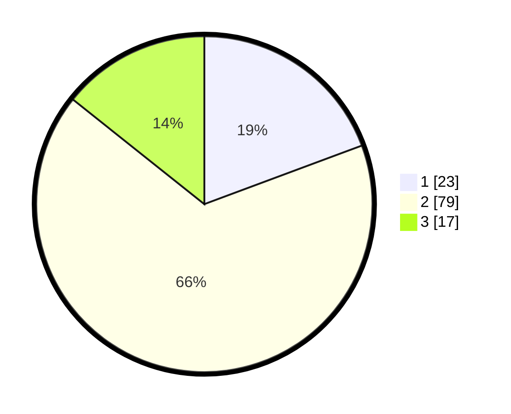

# Hasil

## Grafik

## Tabel

| No. | Nama Paslon    | Suara | Suara (raw) | Persentase |
|:--- |:-------------- | -----:| -----------:| ----------:|
| 1   | ANIES MUHAIMIN | 23    | [23][p-1]   | 19,33      |
| 2   | PRABOWO GIBRAN | 79    | [79][p-2]   | 66,39      |
| 3   | GANJAR MAHFUD  | 17    | [17][p-3]   | 14,29      |

[p-1]: https://github.com/gigit-pemilu/pemilu-2024/blob/main/pilpres/hitung-suara/sub/61-kalimantan-barat/sub/04-ketapang/sub/03-manis-mata/sub/2020-ratu-elok/sub/011-tps/sub/paslon-1.txt
[p-2]: https://github.com/gigit-pemilu/pemilu-2024/blob/main/pilpres/hitung-suara/sub/61-kalimantan-barat/sub/04-ketapang/sub/03-manis-mata/sub/2020-ratu-elok/sub/011-tps/sub/paslon-2.txt
[p-3]: https://github.com/gigit-pemilu/pemilu-2024/blob/main/pilpres/hitung-suara/sub/61-kalimantan-barat/sub/04-ketapang/sub/03-manis-mata/sub/2020-ratu-elok/sub/011-tps/sub/paslon-3.txt

## Foto C Plano

https://sirekap-obj-formc.kpu.go.id/6733/pemilu/ppwp/61/04/03/20/20/6104032020011-20240218-162553--b829efcd-2524-400a-8c8a-cb63ef7e72de.jpg

https://sirekap-obj-formc.kpu.go.id/6733/pemilu/ppwp/61/04/03/20/20/6104032020011-20240218-162944--1e61bd8e-07b3-4e3b-a927-1b488342703b.jpg

https://sirekap-obj-formc.kpu.go.id/6733/pemilu/ppwp/61/04/03/20/20/6104032020011-20240218-163042--f837e320-6ba9-4ecb-804c-e8d3eea196d2.jpg

## Metadata

| Key        | Value               |
| ---------- | ------------------- |
| Time Stamp | 2024-02-22 13:00:00 |

