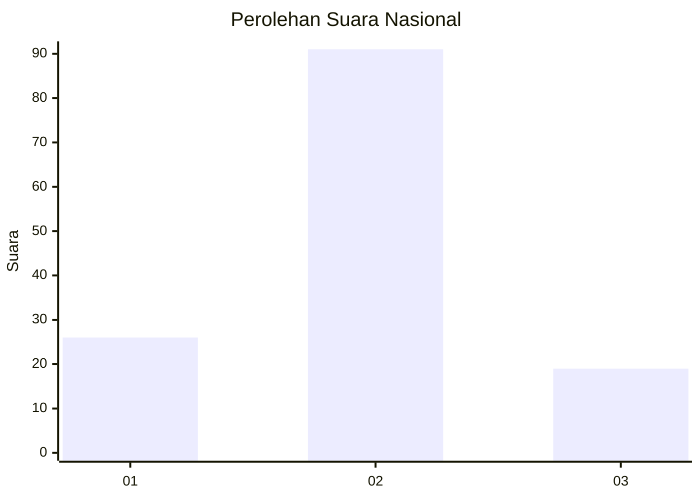
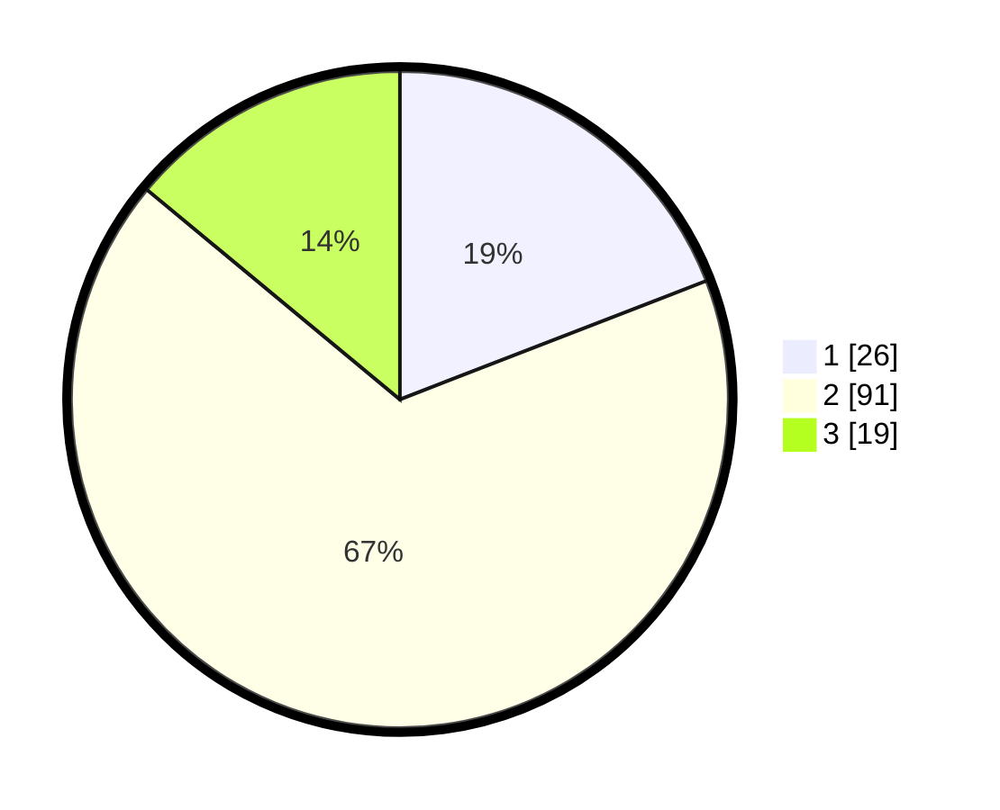

# Hasil

## Grafik

## Tabel

| No. | Nama Paslon    | Suara | Suara (raw) | Persentase |
|:--- |:-------------- | -----:| -----------:| ----------:|
| 1   | ANIES MUHAIMIN | 26    | [26][p-1]   | 19,12      |
| 2   | PRABOWO GIBRAN | 91    | [91][p-2]   | 66,91      |
| 3   | GANJAR MAHFUD  | 19    | [19][p-3]   | 13,97      |

[p-1]: https://github.com/gigit-pemilu/pemilu-2024/blob/main/pilpres/hitung-suara/sub/61-kalimantan-barat/sub/04-ketapang/sub/04-kendawangan/sub/2001-kendawangan-kiri/sub/002-tps/sub/paslon-1.txt
[p-2]: https://github.com/gigit-pemilu/pemilu-2024/blob/main/pilpres/hitung-suara/sub/61-kalimantan-barat/sub/04-ketapang/sub/04-kendawangan/sub/2001-kendawangan-kiri/sub/002-tps/sub/paslon-2.txt
[p-3]: https://github.com/gigit-pemilu/pemilu-2024/blob/main/pilpres/hitung-suara/sub/61-kalimantan-barat/sub/04-ketapang/sub/04-kendawangan/sub/2001-kendawangan-kiri/sub/002-tps/sub/paslon-3.txt

## Foto C Plano

https://sirekap-obj-formc.kpu.go.id/dad5/pemilu/ppwp/61/04/04/20/01/6104042001002-20240214-215817--6973e829-0c2c-44d2-b9d3-536754997e5b.jpg

https://sirekap-obj-formc.kpu.go.id/dad5/pemilu/ppwp/61/04/04/20/01/6104042001002-20240214-220219--7d65601c-ed0b-4a78-a4ac-f3212debe734.jpg

https://sirekap-obj-formc.kpu.go.id/dad5/pemilu/ppwp/61/04/04/20/01/6104042001002-20240214-220641--a65ce6f2-d3ef-41ab-be9e-c02e6cfd0a56.jpg

## Metadata

| Key        | Value               |
| ---------- | ------------------- |
| Time Stamp | 2024-02-22 13:00:00 |

