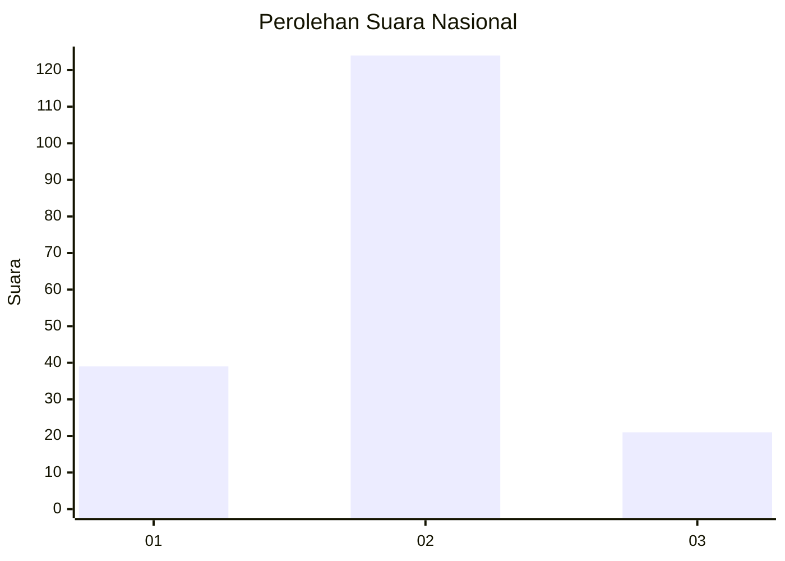
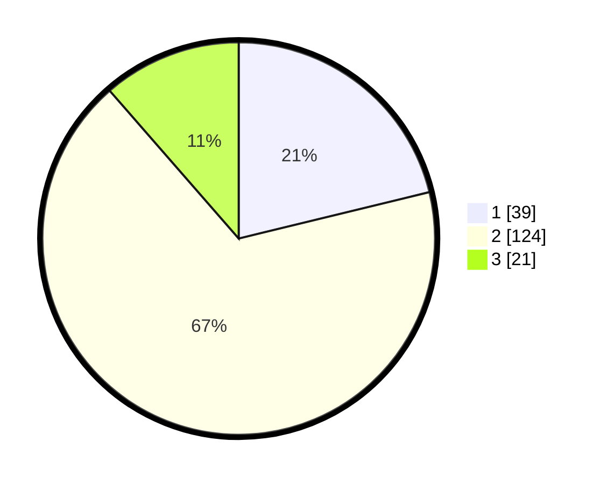

# Hasil

## Grafik

## Tabel

| No. | Nama Paslon    | Suara | Suara (raw) | Persentase |
|:--- |:-------------- | -----:| -----------:| ----------:|
| 1   | ANIES MUHAIMIN | 39    | [39][p-1]   | 21,20      |
| 2   | PRABOWO GIBRAN | 124   | [124][p-2]  | 67,39      |
| 3   | GANJAR MAHFUD  | 21    | [21][p-3]   | 11,41      |

[p-1]: https://github.com/gigit-pemilu/pemilu-2024/blob/main/pilpres/hitung-suara/sub/61-kalimantan-barat/sub/04-ketapang/sub/04-kendawangan/sub/2001-kendawangan-kiri/sub/004-tps/sub/paslon-1.txt
[p-2]: https://github.com/gigit-pemilu/pemilu-2024/blob/main/pilpres/hitung-suara/sub/61-kalimantan-barat/sub/04-ketapang/sub/04-kendawangan/sub/2001-kendawangan-kiri/sub/004-tps/sub/paslon-2.txt
[p-3]: https://github.com/gigit-pemilu/pemilu-2024/blob/main/pilpres/hitung-suara/sub/61-kalimantan-barat/sub/04-ketapang/sub/04-kendawangan/sub/2001-kendawangan-kiri/sub/004-tps/sub/paslon-3.txt

## Foto C Plano

https://sirekap-obj-formc.kpu.go.id/9b5a/pemilu/ppwp/61/04/04/20/01/6104042001004-20240214-222130--3f0ad09d-5d97-4ae4-a3d9-9e2acf5b1976.jpg

https://sirekap-obj-formc.kpu.go.id/9b5a/pemilu/ppwp/61/04/04/20/01/6104042001004-20240215-004432--70367682-1e67-43c1-b323-c44e1c9a5848.jpg

https://sirekap-obj-formc.kpu.go.id/9b5a/pemilu/ppwp/61/04/04/20/01/6104042001004-20240215-004813--f1ba9606-0638-45cc-a091-9bcf07e79609.jpg

## Metadata

| Key        | Value               |
| ---------- | ------------------- |
| Time Stamp | 2024-02-22 13:00:00 |

