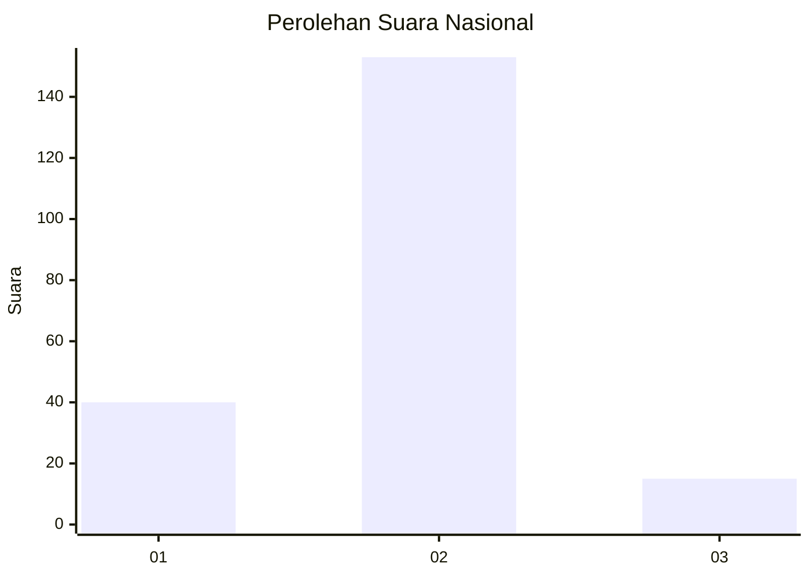
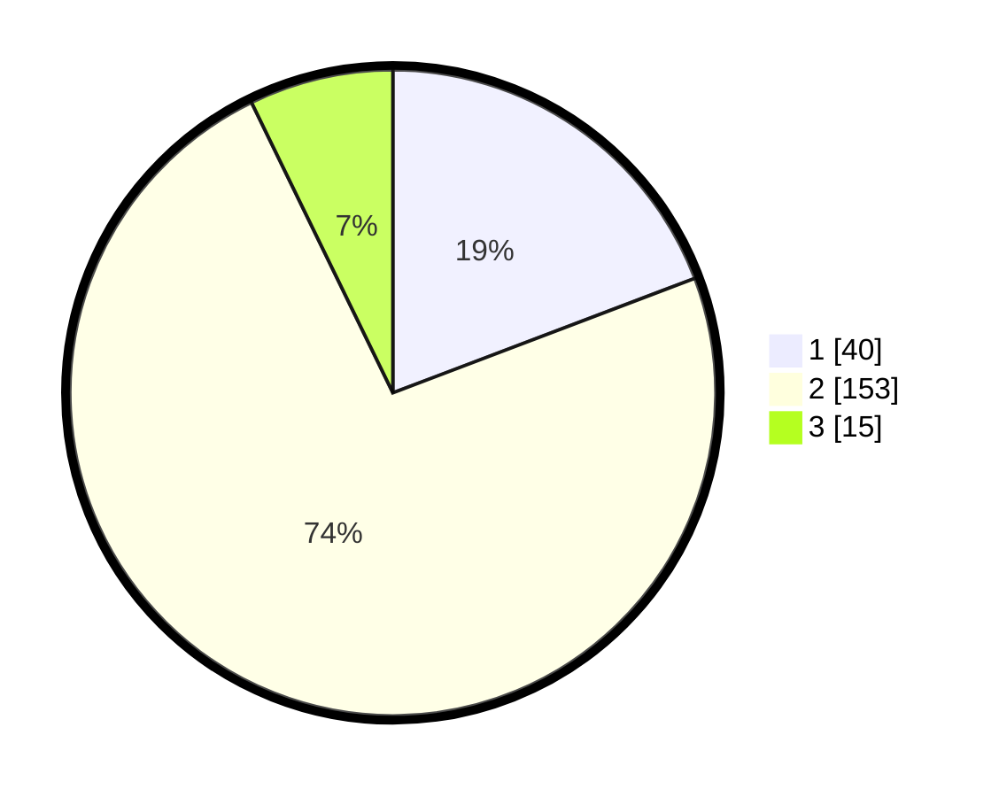

# Hasil

## Grafik

## Tabel

| No. | Nama Paslon    | Suara | Suara (raw) | Persentase |
|:--- |:-------------- | -----:| -----------:| ----------:|
| 1   | ANIES MUHAIMIN | 40    | [40][p-1]   | 19,23      |
| 2   | PRABOWO GIBRAN | 153   | [153][p-2]  | 73,56      |
| 3   | GANJAR MAHFUD  | 15    | [15][p-3]   | 7,21       |

[p-1]: https://github.com/gigit-pemilu/pemilu-2024/blob/main/pilpres/hitung-suara/sub/61-kalimantan-barat/sub/04-ketapang/sub/04-kendawangan/sub/2001-kendawangan-kiri/sub/005-tps/sub/paslon-1.txt
[p-2]: https://github.com/gigit-pemilu/pemilu-2024/blob/main/pilpres/hitung-suara/sub/61-kalimantan-barat/sub/04-ketapang/sub/04-kendawangan/sub/2001-kendawangan-kiri/sub/005-tps/sub/paslon-2.txt
[p-3]: https://github.com/gigit-pemilu/pemilu-2024/blob/main/pilpres/hitung-suara/sub/61-kalimantan-barat/sub/04-ketapang/sub/04-kendawangan/sub/2001-kendawangan-kiri/sub/005-tps/sub/paslon-3.txt

## Foto C Plano

https://sirekap-obj-formc.kpu.go.id/4b05/pemilu/ppwp/61/04/04/20/01/6104042001005-20240214-155649--360dc5c9-af84-470c-b20d-f370dc2a1430.jpg

https://sirekap-obj-formc.kpu.go.id/4b05/pemilu/ppwp/61/04/04/20/01/6104042001005-20240214-155739--108c95d0-822c-4c0c-8108-df59e256ab14.jpg

https://sirekap-obj-formc.kpu.go.id/4b05/pemilu/ppwp/61/04/04/20/01/6104042001005-20240214-155829--3b4ce948-05fd-4b97-8a0a-0a51e1e4f986.jpg

## Metadata

| Key        | Value               |
| ---------- | ------------------- |
| Time Stamp | 2024-02-22 13:00:00 |

