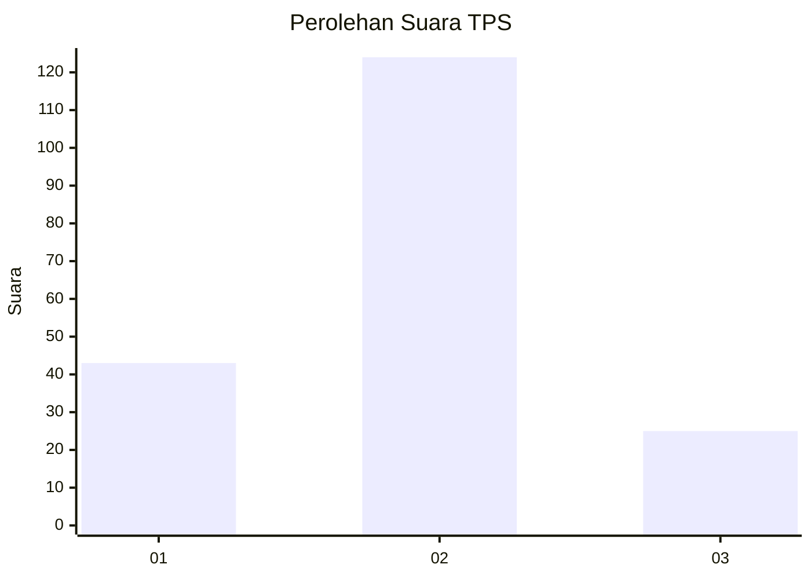
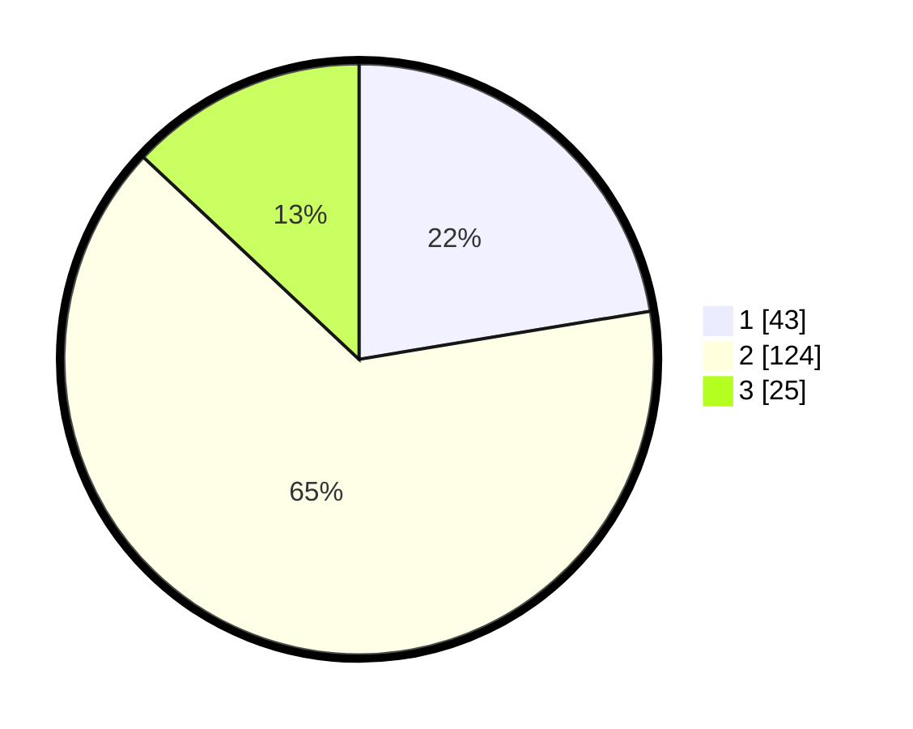

# Hasil

## Grafik

## Tabel

| No. | Nama Paslon    | Suara | Suara (raw) | Persentase |
|:--- |:-------------- | -----:| -----------:| ----------:|
| 1   | ANIES MUHAIMIN | 43    | [43][p-1]   | 22,40      |
| 2   | PRABOWO GIBRAN | 124   | [124][p-2]  | 64,58      |
| 3   | GANJAR MAHFUD  | 25    | [25][p-3]   | 13,02      |

[p-1]: https://github.com/gigit-pemilu/pemilu-2024-61-kalimantan-barat/blob/main/pilpres/hitung-suara/sub/61-kalimantan-barat/sub/04-ketapang/sub/04-kendawangan/sub/2001-kendawangan-kiri/sub/006-tps/sub/paslon-1.txt
[p-2]: https://github.com/gigit-pemilu/pemilu-2024-61-kalimantan-barat/blob/main/pilpres/hitung-suara/sub/61-kalimantan-barat/sub/04-ketapang/sub/04-kendawangan/sub/2001-kendawangan-kiri/sub/006-tps/sub/paslon-2.txt
[p-3]: https://github.com/gigit-pemilu/pemilu-2024-61-kalimantan-barat/blob/main/pilpres/hitung-suara/sub/61-kalimantan-barat/sub/04-ketapang/sub/04-kendawangan/sub/2001-kendawangan-kiri/sub/006-tps/sub/paslon-3.txt

## Foto C Plano

https://sirekap-obj-formc.kpu.go.id/4166/pemilu/ppwp/61/04/04/20/01/6104042001006-20240214-233444--e6e7cfe7-2984-412e-9ac2-5a4393c2ae44.jpg

https://sirekap-obj-formc.kpu.go.id/4166/pemilu/ppwp/61/04/04/20/01/6104042001006-20240214-233506--d3013914-245f-4415-8036-a1c52537d299.jpg

https://sirekap-obj-formc.kpu.go.id/4166/pemilu/ppwp/61/04/04/20/01/6104042001006-20240214-214740--18d614dc-5224-4378-9184-f709dbeb91df.jpg

## Metadata

| Key        | Value               |
| ---------- | ------------------- |
| Time Stamp | 2024-02-22 13:00:00 |

