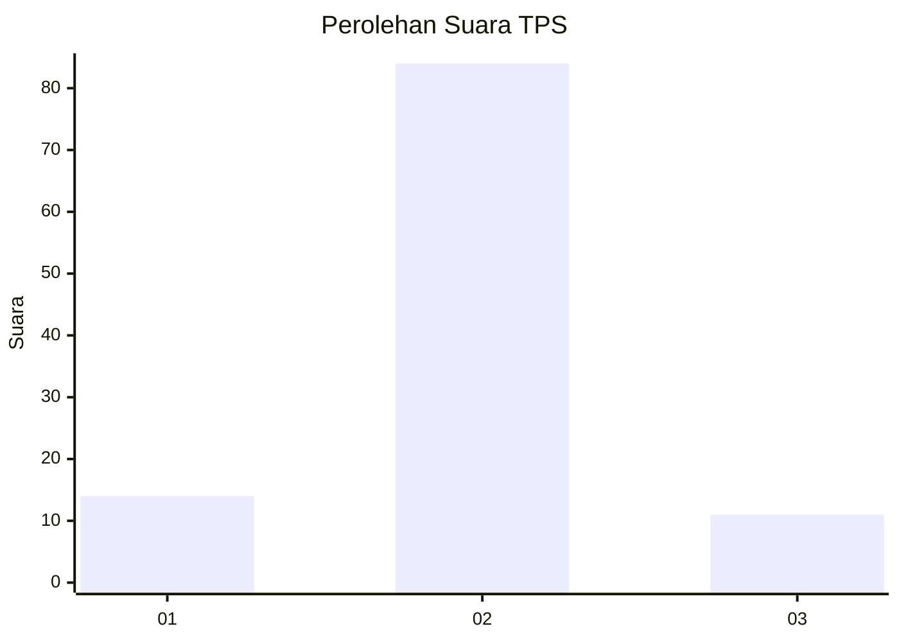
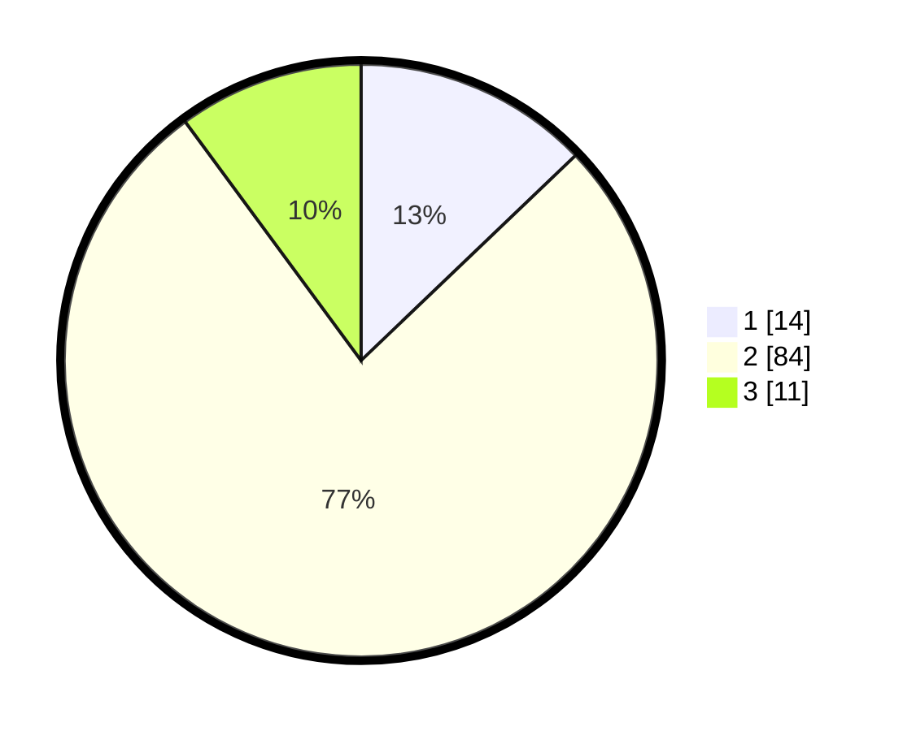

# Hasil

## Grafik

## Tabel

| No. | Nama Paslon    | Suara | Suara (raw) | Persentase |
|:--- |:-------------- | -----:| -----------:| ----------:|
| 1   | ANIES MUHAIMIN | 14    | [14][p-1]   | 12,84      |
| 2   | PRABOWO GIBRAN | 84    | [84][p-2]   | 77,06      |
| 3   | GANJAR MAHFUD  | 11    | [11][p-3]   | 10,09      |

[p-1]: https://github.com/gigit-pemilu/pemilu-2024-61-kalimantan-barat/blob/main/pilpres/hitung-suara/sub/61-kalimantan-barat/sub/04-ketapang/sub/04-kendawangan/sub/2006-air-hitam-besar/sub/005-tps/sub/paslon-1.txt
[p-2]: https://github.com/gigit-pemilu/pemilu-2024-61-kalimantan-barat/blob/main/pilpres/hitung-suara/sub/61-kalimantan-barat/sub/04-ketapang/sub/04-kendawangan/sub/2006-air-hitam-besar/sub/005-tps/sub/paslon-2.txt
[p-3]: https://github.com/gigit-pemilu/pemilu-2024-61-kalimantan-barat/blob/main/pilpres/hitung-suara/sub/61-kalimantan-barat/sub/04-ketapang/sub/04-kendawangan/sub/2006-air-hitam-besar/sub/005-tps/sub/paslon-3.txt

## Foto C Plano

https://sirekap-obj-formc.kpu.go.id/ca5b/pemilu/ppwp/61/04/04/20/06/6104042006005-20240218-105413--3bbc9ab1-71d7-4e6e-aa53-abce9a245d9a.jpg

https://sirekap-obj-formc.kpu.go.id/ca5b/pemilu/ppwp/61/04/04/20/06/6104042006005-20240218-105503--974e29ba-b9e0-4920-b3ef-94374a4501ce.jpg

https://sirekap-obj-formc.kpu.go.id/ca5b/pemilu/ppwp/61/04/04/20/06/6104042006005-20240218-110441--5884caac-0121-4cf2-a440-3f4c526af769.jpg

## Metadata

| Key        | Value               |
| ---------- | ------------------- |
| Time Stamp | 2024-02-25 14:00:00 |

