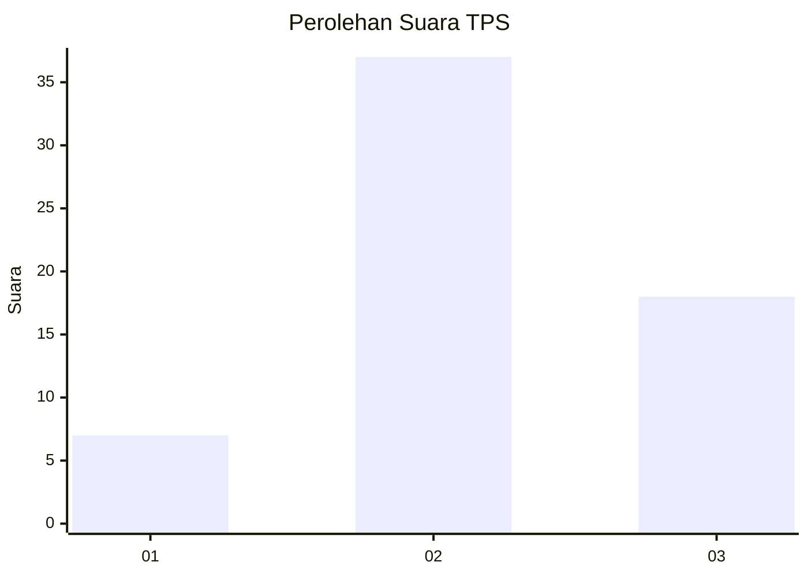
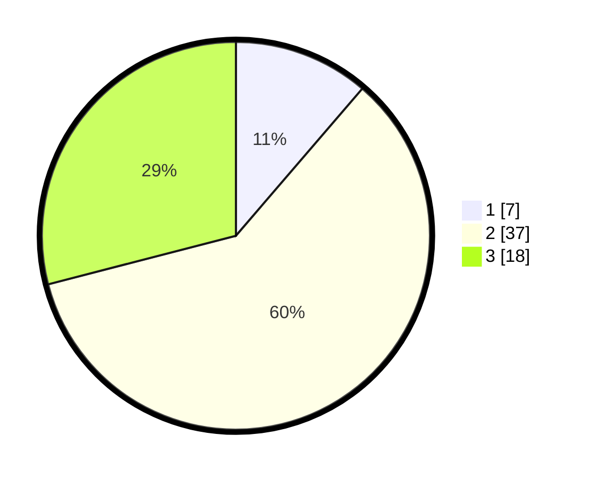

# Hasil

## Grafik

## Tabel

| No. | Nama Paslon    | Suara | Suara (raw) | Persentase |
|:--- |:-------------- | -----:| -----------:| ----------:|
| 1   | ANIES MUHAIMIN | 7     | [7][p-1]    | 11,29      |
| 2   | PRABOWO GIBRAN | 37    | [37][p-2]   | 59,68      |
| 3   | GANJAR MAHFUD  | 18    | [18][p-3]   | 29,03      |

[p-1]: https://github.com/gigit-pemilu/pemilu-2024-61-kalimantan-barat/blob/main/pilpres/hitung-suara/sub/61-kalimantan-barat/sub/04-ketapang/sub/04-kendawangan/sub/2006-air-hitam-besar/sub/011-tps/sub/paslon-1.txt
[p-2]: https://github.com/gigit-pemilu/pemilu-2024-61-kalimantan-barat/blob/main/pilpres/hitung-suara/sub/61-kalimantan-barat/sub/04-ketapang/sub/04-kendawangan/sub/2006-air-hitam-besar/sub/011-tps/sub/paslon-2.txt
[p-3]: https://github.com/gigit-pemilu/pemilu-2024-61-kalimantan-barat/blob/main/pilpres/hitung-suara/sub/61-kalimantan-barat/sub/04-ketapang/sub/04-kendawangan/sub/2006-air-hitam-besar/sub/011-tps/sub/paslon-3.txt

## Foto C Plano

https://sirekap-obj-formc.kpu.go.id/0671/pemilu/ppwp/61/04/04/20/06/6104042006011-20240218-113854--e784f2c2-c4cd-4dac-bf05-73ec247dd27b.jpg

https://sirekap-obj-formc.kpu.go.id/0671/pemilu/ppwp/61/04/04/20/06/6104042006011-20240218-113927--d85821f7-8e56-41ba-8b99-8b21475e988b.jpg

https://sirekap-obj-formc.kpu.go.id/0671/pemilu/ppwp/61/04/04/20/06/6104042006011-20240218-114010--95888c06-fc36-4030-b9b8-5f35ccaa609d.jpg

## Metadata

| Key        | Value               |
| ---------- | ------------------- |
| Time Stamp | 2024-02-25 23:00:00 |

