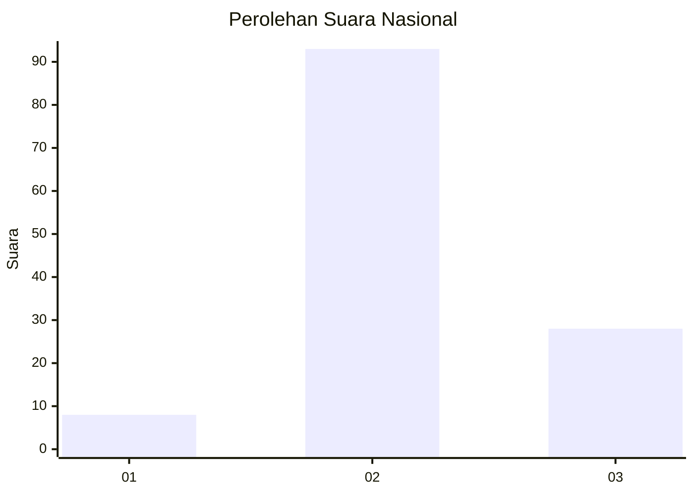

# Hasil

## Grafik

## Tabel

| No. | Nama Paslon    | Suara | Suara (raw) | Persentase |
|:--- |:-------------- | -----:| -----------:| ----------:|
| 1   | ANIES MUHAIMIN | 8     | [8][p-1]    | 6,20       |
| 2   | PRABOWO GIBRAN | 93    | [93][p-2]   | 72,09      |
| 3   | GANJAR MAHFUD  | 28    | [28][p-3]   | 21,71      |

[p-1]: https://github.com/gigit-pemilu/pemilu-2024/blob/main/pilpres/hitung-suara/sub/61-kalimantan-barat/sub/04-ketapang/sub/04-kendawangan/sub/2007-suka-harapan/sub/004-tps/sub/paslon-1.txt
[p-2]: https://github.com/gigit-pemilu/pemilu-2024/blob/main/pilpres/hitung-suara/sub/61-kalimantan-barat/sub/04-ketapang/sub/04-kendawangan/sub/2007-suka-harapan/sub/004-tps/sub/paslon-2.txt
[p-3]: https://github.com/gigit-pemilu/pemilu-2024/blob/main/pilpres/hitung-suara/sub/61-kalimantan-barat/sub/04-ketapang/sub/04-kendawangan/sub/2007-suka-harapan/sub/004-tps/sub/paslon-3.txt

## Foto C Plano

https://sirekap-obj-formc.kpu.go.id/b96f/pemilu/ppwp/61/04/04/20/07/6104042007004-20240214-225111--8cb879c8-c1ae-4fb5-bbe8-45c91587c13b.jpg

https://sirekap-obj-formc.kpu.go.id/b96f/pemilu/ppwp/61/04/04/20/07/6104042007004-20240214-225216--7c000e50-ac30-475e-ac44-b65888b099a4.jpg

https://sirekap-obj-formc.kpu.go.id/b96f/pemilu/ppwp/61/04/04/20/07/6104042007004-20240214-225338--776f81db-65d7-4e9e-a478-4f6fbc499ae8.jpg

## Metadata

| Key        | Value               |
| ---------- | ------------------- |
| Time Stamp | 2024-02-22 13:00:00 |

