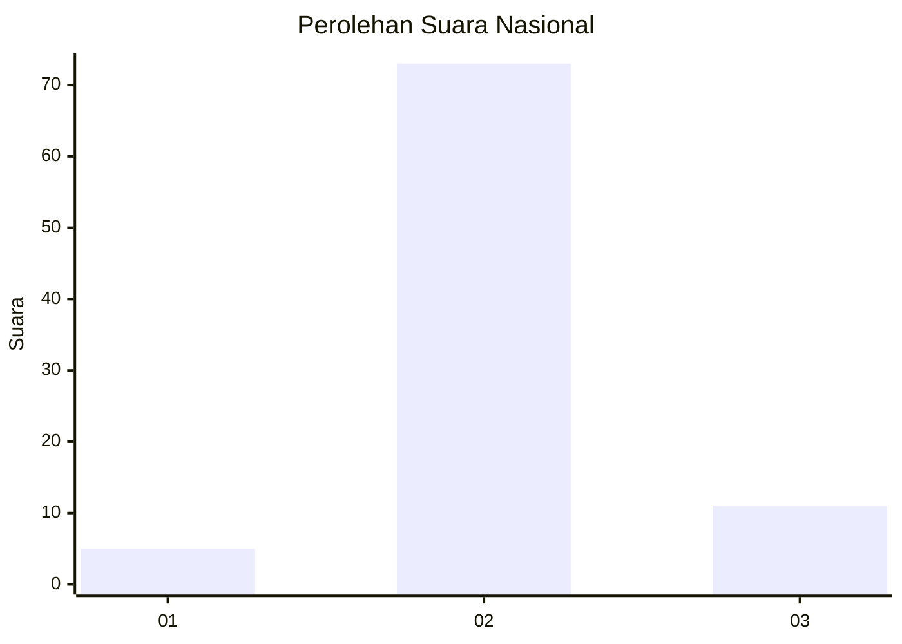
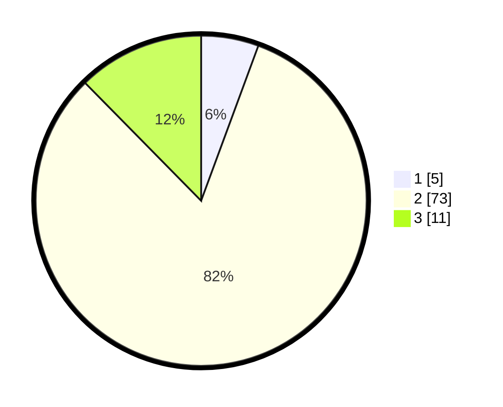

# Hasil

## Grafik

## Tabel

| No. | Nama Paslon    | Suara | Suara (raw) | Persentase |
|:--- |:-------------- | -----:| -----------:| ----------:|
| 1   | ANIES MUHAIMIN | 5     | [5][p-1]    | 5,62       |
| 2   | PRABOWO GIBRAN | 73    | [73][p-2]   | 82,02      |
| 3   | GANJAR MAHFUD  | 11    | [11][p-3]   | 12,36      |

[p-1]: https://github.com/gigit-pemilu/pemilu-2024/blob/main/pilpres/hitung-suara/sub/61-kalimantan-barat/sub/04-ketapang/sub/04-kendawangan/sub/2010-danau-buntar/sub/002-tps/sub/paslon-1.txt
[p-2]: https://github.com/gigit-pemilu/pemilu-2024/blob/main/pilpres/hitung-suara/sub/61-kalimantan-barat/sub/04-ketapang/sub/04-kendawangan/sub/2010-danau-buntar/sub/002-tps/sub/paslon-2.txt
[p-3]: https://github.com/gigit-pemilu/pemilu-2024/blob/main/pilpres/hitung-suara/sub/61-kalimantan-barat/sub/04-ketapang/sub/04-kendawangan/sub/2010-danau-buntar/sub/002-tps/sub/paslon-3.txt

## Foto C Plano

https://sirekap-obj-formc.kpu.go.id/0069/pemilu/ppwp/61/04/04/20/10/6104042010002-20240214-233557--3e689b20-faaf-44cd-a636-e834cfb61d14.jpg

https://sirekap-obj-formc.kpu.go.id/0069/pemilu/ppwp/61/04/04/20/10/6104042010002-20240214-233646--49124796-b0c8-47c4-9038-83ad19abbf05.jpg

https://sirekap-obj-formc.kpu.go.id/0069/pemilu/ppwp/61/04/04/20/10/6104042010002-20240214-233742--b69dfad2-f05c-423c-b494-e33eaa5016f5.jpg

## Metadata

| Key        | Value               |
| ---------- | ------------------- |
| Time Stamp | 2024-02-22 13:00:00 |

