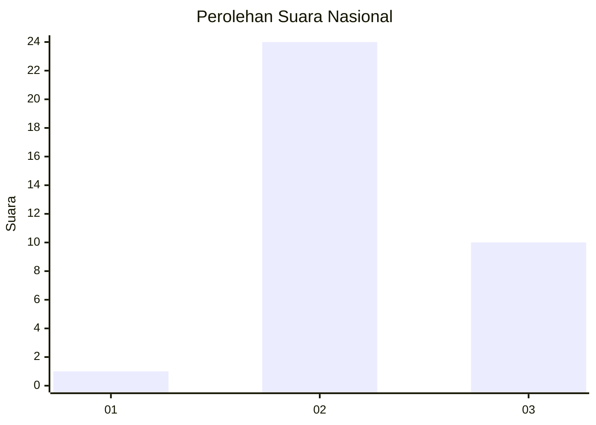
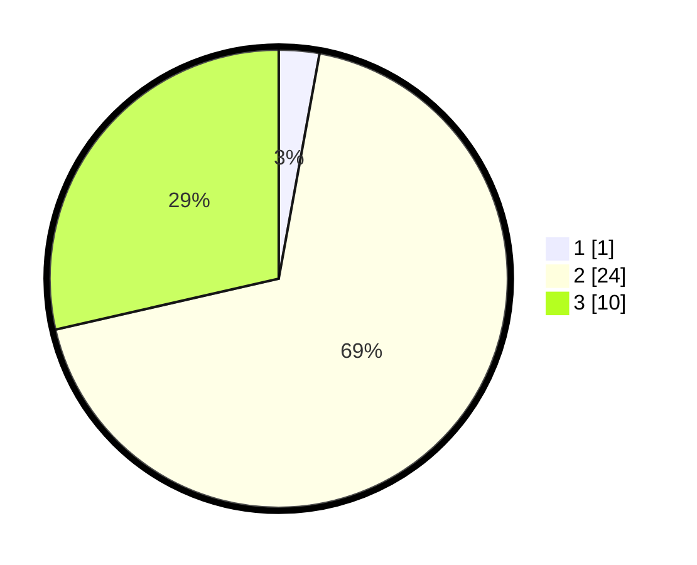

# Hasil

## Grafik

## Tabel

| No. | Nama Paslon    | Suara | Suara (raw) | Persentase |
|:--- |:-------------- | -----:| -----------:| ----------:|
| 1   | ANIES MUHAIMIN | 1     | [1][p-1]    | 2,86       |
| 2   | PRABOWO GIBRAN | 24    | [24][p-2]   | 68,57      |
| 3   | GANJAR MAHFUD  | 10    | [10][p-3]   | 28,57      |

[p-1]: https://github.com/gigit-pemilu/pemilu-2024/blob/main/pilpres/hitung-suara/sub/61-kalimantan-barat/sub/04-ketapang/sub/04-kendawangan/sub/2010-danau-buntar/sub/011-tps/sub/paslon-1.txt
[p-2]: https://github.com/gigit-pemilu/pemilu-2024/blob/main/pilpres/hitung-suara/sub/61-kalimantan-barat/sub/04-ketapang/sub/04-kendawangan/sub/2010-danau-buntar/sub/011-tps/sub/paslon-2.txt
[p-3]: https://github.com/gigit-pemilu/pemilu-2024/blob/main/pilpres/hitung-suara/sub/61-kalimantan-barat/sub/04-ketapang/sub/04-kendawangan/sub/2010-danau-buntar/sub/011-tps/sub/paslon-3.txt

## Foto C Plano

https://sirekap-obj-formc.kpu.go.id/24ae/pemilu/ppwp/61/04/04/20/10/6104042010011-20240214-223920--b36395c6-f57b-4eb4-ac91-6f0c72d4b661.jpg

https://sirekap-obj-formc.kpu.go.id/24ae/pemilu/ppwp/61/04/04/20/10/6104042010011-20240214-224228--e50bf14a-6d67-4bc1-92d6-5b5e0502c054.jpg

https://sirekap-obj-formc.kpu.go.id/24ae/pemilu/ppwp/61/04/04/20/10/6104042010011-20240214-224405--191cf930-73ff-4a06-a631-44093ce4bb2b.jpg

## Metadata

| Key        | Value               |
| ---------- | ------------------- |
| Time Stamp | 2024-02-22 13:00:00 |

