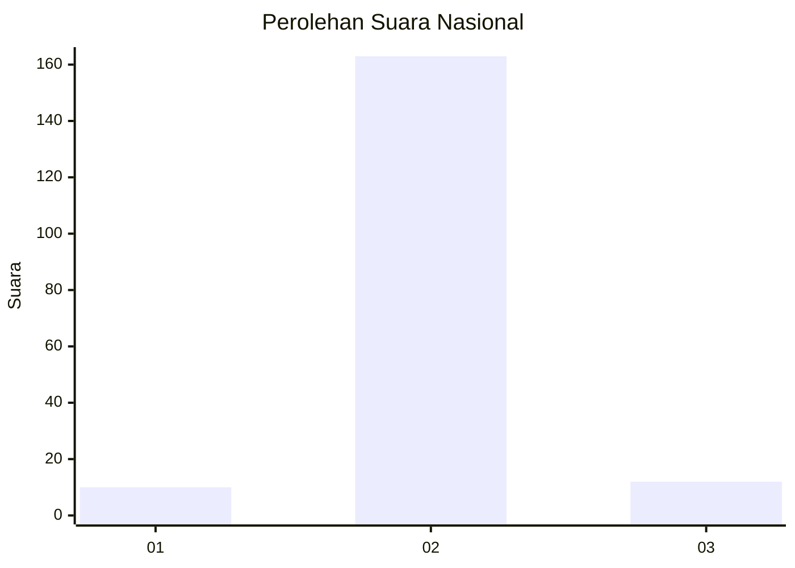
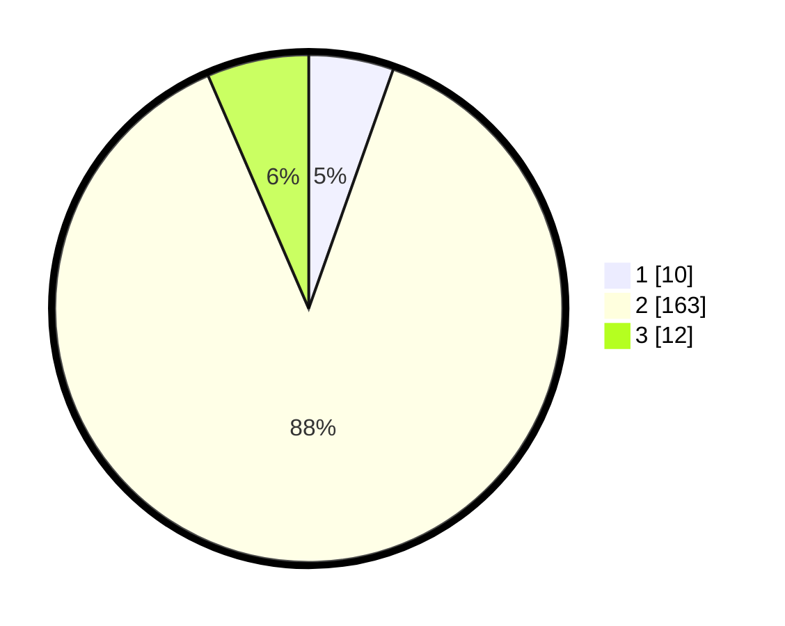

# Hasil

## Grafik

## Tabel

| No. | Nama Paslon    | Suara | Suara (raw) | Persentase |
|:--- |:-------------- | -----:| -----------:| ----------:|
| 1   | ANIES MUHAIMIN | 10    | [10][p-1]   | 5,41       |
| 2   | PRABOWO GIBRAN | 163   | [163][p-2]  | 88,11      |
| 3   | GANJAR MAHFUD  | 12    | [12][p-3]   | 6,49       |

[p-1]: https://github.com/gigit-pemilu/pemilu-2024/blob/main/pilpres/hitung-suara/sub/61-kalimantan-barat/sub/04-ketapang/sub/04-kendawangan/sub/2012-pembedilan/sub/004-tps/sub/paslon-1.txt
[p-2]: https://github.com/gigit-pemilu/pemilu-2024/blob/main/pilpres/hitung-suara/sub/61-kalimantan-barat/sub/04-ketapang/sub/04-kendawangan/sub/2012-pembedilan/sub/004-tps/sub/paslon-2.txt
[p-3]: https://github.com/gigit-pemilu/pemilu-2024/blob/main/pilpres/hitung-suara/sub/61-kalimantan-barat/sub/04-ketapang/sub/04-kendawangan/sub/2012-pembedilan/sub/004-tps/sub/paslon-3.txt

## Foto C Plano

https://sirekap-obj-formc.kpu.go.id/78f9/pemilu/ppwp/61/04/04/20/12/6104042012004-20240215-024039--fddf6029-cb38-4b0b-8704-2486e54ee7f3.jpg

https://sirekap-obj-formc.kpu.go.id/78f9/pemilu/ppwp/61/04/04/20/12/6104042012004-20240215-024443--331ae4b7-7b4a-46db-a77c-851ec65793f0.jpg

https://sirekap-obj-formc.kpu.go.id/78f9/pemilu/ppwp/61/04/04/20/12/6104042012004-20240215-024641--a415ac8d-b2b2-4e49-ac2c-9ba9531f77f1.jpg

## Metadata

| Key        | Value               |
| ---------- | ------------------- |
| Time Stamp | 2024-02-22 13:00:00 |

