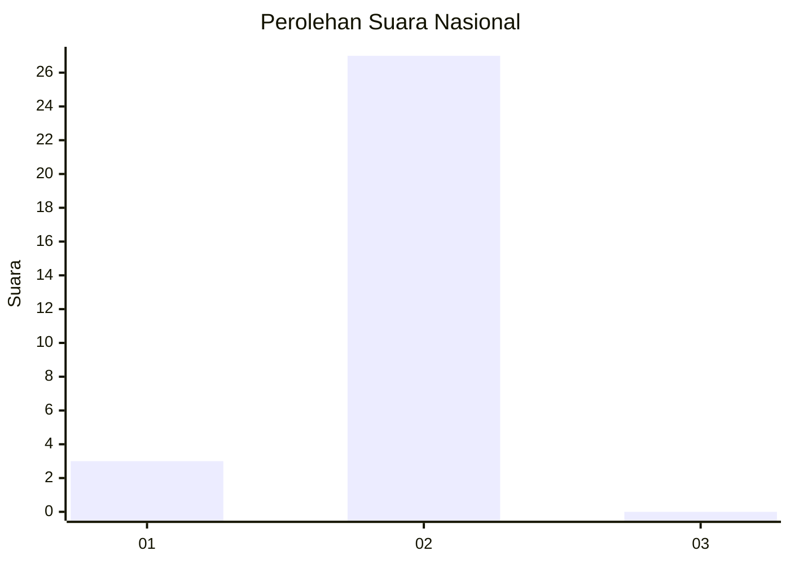
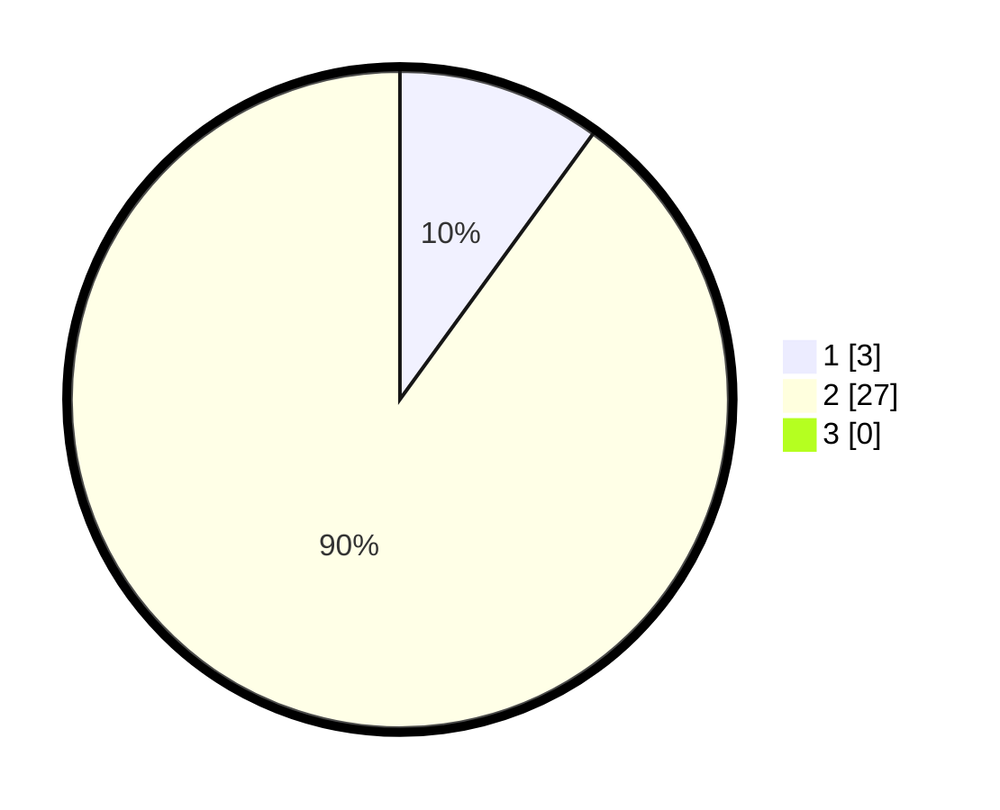

# Hasil

## Grafik

## Tabel

| No. | Nama Paslon    | Suara | Suara (raw) | Persentase |
|:--- |:-------------- | -----:| -----------:| ----------:|
| 1   | ANIES MUHAIMIN | 3     | [3][p-1]    | 10,00      |
| 2   | PRABOWO GIBRAN | 27    | [27][p-2]   | 90,00      |
| 3   | GANJAR MAHFUD  | 0     | [0][p-3]    | 0,00       |

[p-1]: https://github.com/gigit-pemilu/pemilu-2024/blob/main/pilpres/hitung-suara/sub/61-kalimantan-barat/sub/04-ketapang/sub/04-kendawangan/sub/2012-pembedilan/sub/008-tps/sub/paslon-1.txt
[p-2]: https://github.com/gigit-pemilu/pemilu-2024/blob/main/pilpres/hitung-suara/sub/61-kalimantan-barat/sub/04-ketapang/sub/04-kendawangan/sub/2012-pembedilan/sub/008-tps/sub/paslon-2.txt
[p-3]: https://github.com/gigit-pemilu/pemilu-2024/blob/main/pilpres/hitung-suara/sub/61-kalimantan-barat/sub/04-ketapang/sub/04-kendawangan/sub/2012-pembedilan/sub/008-tps/sub/paslon-3.txt

## Foto C Plano

https://sirekap-obj-formc.kpu.go.id/68b0/pemilu/ppwp/61/04/04/20/12/6104042012008-20240215-092845--ef37c36b-2fae-4f1c-be75-a8c9ab8cc7aa.jpg

https://sirekap-obj-formc.kpu.go.id/68b0/pemilu/ppwp/61/04/04/20/12/6104042012008-20240215-093313--7fba72bb-2c04-49db-b447-f2ed5bee6ea4.jpg

https://sirekap-obj-formc.kpu.go.id/68b0/pemilu/ppwp/61/04/04/20/12/6104042012008-20240215-093501--da28db8c-09b9-4f67-8fe9-d0d86da4d97e.jpg

## Metadata

| Key        | Value               |
| ---------- | ------------------- |
| Time Stamp | 2024-02-22 13:00:00 |

