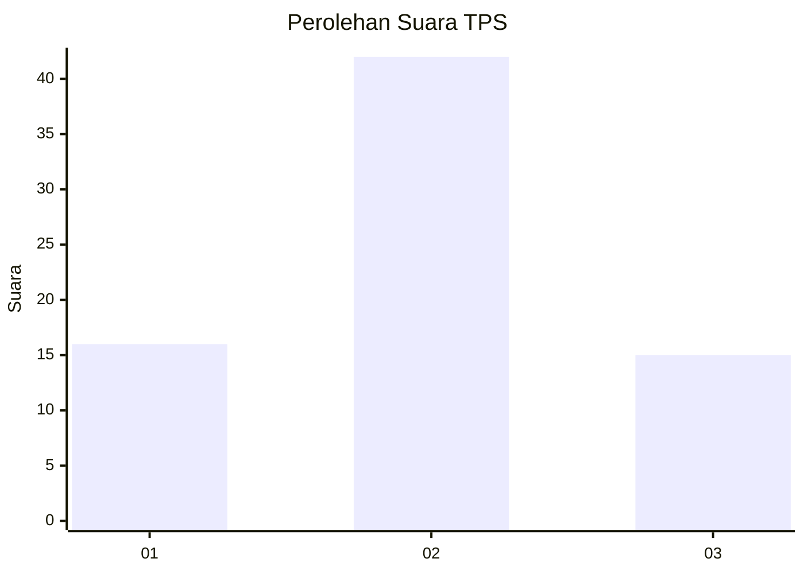
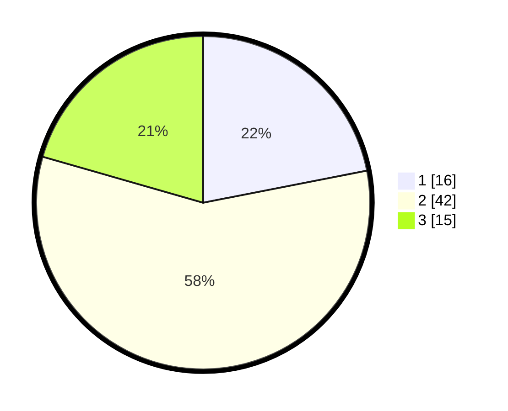

# Hasil

## Grafik

## Tabel

| No. | Nama Paslon    | Suara | Suara (raw) | Persentase |
|:--- |:-------------- | -----:| -----------:| ----------:|
| 1   | ANIES MUHAIMIN | 16    | [16][p-1]   | 21,92      |
| 2   | PRABOWO GIBRAN | 42    | [42][p-2]   | 57,53      |
| 3   | GANJAR MAHFUD  | 15    | [15][p-3]   | 20,55      |

[p-1]: https://github.com/gigit-pemilu/pemilu-2024-61-kalimantan-barat/blob/main/pilpres/hitung-suara/sub/61-kalimantan-barat/sub/04-ketapang/sub/04-kendawangan/sub/2014-natai-kuini/sub/001-tps/sub/paslon-1.txt
[p-2]: https://github.com/gigit-pemilu/pemilu-2024-61-kalimantan-barat/blob/main/pilpres/hitung-suara/sub/61-kalimantan-barat/sub/04-ketapang/sub/04-kendawangan/sub/2014-natai-kuini/sub/001-tps/sub/paslon-2.txt
[p-3]: https://github.com/gigit-pemilu/pemilu-2024-61-kalimantan-barat/blob/main/pilpres/hitung-suara/sub/61-kalimantan-barat/sub/04-ketapang/sub/04-kendawangan/sub/2014-natai-kuini/sub/001-tps/sub/paslon-3.txt

## Foto C Plano

https://sirekap-obj-formc.kpu.go.id/6d75/pemilu/ppwp/61/04/04/20/14/6104042014001-20240215-094939--eb0bb702-8cc7-4650-baab-4f682005ef50.jpg

https://sirekap-obj-formc.kpu.go.id/6d75/pemilu/ppwp/61/04/04/20/14/6104042014001-20240215-095428--56a10761-fc6e-4c69-9e39-7a2d59f89024.jpg

https://sirekap-obj-formc.kpu.go.id/6d75/pemilu/ppwp/61/04/04/20/14/6104042014001-20240215-095641--723278f6-b6a4-467c-b473-21263e5c4722.jpg

## Metadata

| Key        | Value               |
| ---------- | ------------------- |
| Time Stamp | 2024-02-22 13:00:00 |

