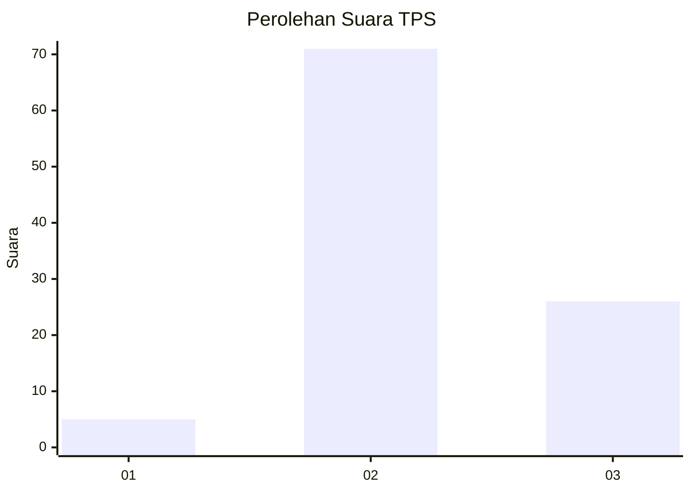
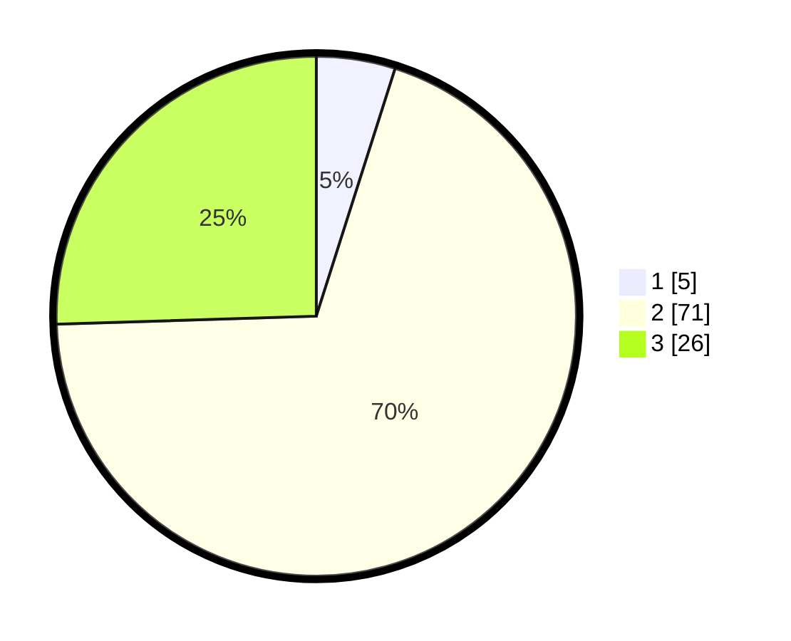

# Hasil

## Grafik

## Tabel

| No. | Nama Paslon    | Suara | Suara (raw) | Persentase |
|:--- |:-------------- | -----:| -----------:| ----------:|
| 1   | ANIES MUHAIMIN | 5     | [5][p-1]    | 4,90       |
| 2   | PRABOWO GIBRAN | 71    | [71][p-2]   | 69,61      |
| 3   | GANJAR MAHFUD  | 26    | [26][p-3]   | 25,49      |

[p-1]: https://github.com/gigit-pemilu/pemilu-2024-61-kalimantan-barat/blob/main/pilpres/hitung-suara/sub/61-kalimantan-barat/sub/04-ketapang/sub/04-kendawangan/sub/2017-kedondong/sub/001-tps/sub/paslon-1.txt
[p-2]: https://github.com/gigit-pemilu/pemilu-2024-61-kalimantan-barat/blob/main/pilpres/hitung-suara/sub/61-kalimantan-barat/sub/04-ketapang/sub/04-kendawangan/sub/2017-kedondong/sub/001-tps/sub/paslon-2.txt
[p-3]: https://github.com/gigit-pemilu/pemilu-2024-61-kalimantan-barat/blob/main/pilpres/hitung-suara/sub/61-kalimantan-barat/sub/04-ketapang/sub/04-kendawangan/sub/2017-kedondong/sub/001-tps/sub/paslon-3.txt

## Foto C Plano

https://sirekap-obj-formc.kpu.go.id/1027/pemilu/ppwp/61/04/04/20/17/6104042017001-20240214-210223--3df965eb-2e67-4164-b0c3-64c91ee968b4.jpg

https://sirekap-obj-formc.kpu.go.id/1027/pemilu/ppwp/61/04/04/20/17/6104042017001-20240214-210249--d09b1fbc-2d18-4efc-a4ab-75e3a124bf30.jpg

https://sirekap-obj-formc.kpu.go.id/1027/pemilu/ppwp/61/04/04/20/17/6104042017001-20240214-222430--1c802af6-0de7-41fd-b661-680e2da42806.jpg

## Metadata

| Key        | Value               |
| ---------- | ------------------- |
| Time Stamp | 2024-02-22 13:00:00 |

