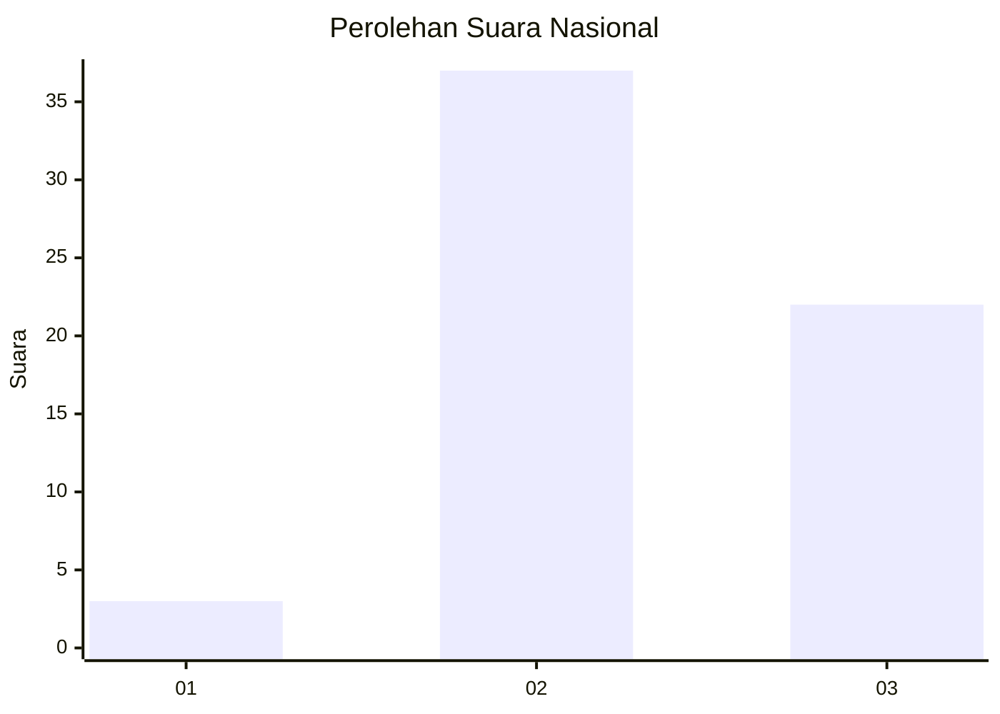
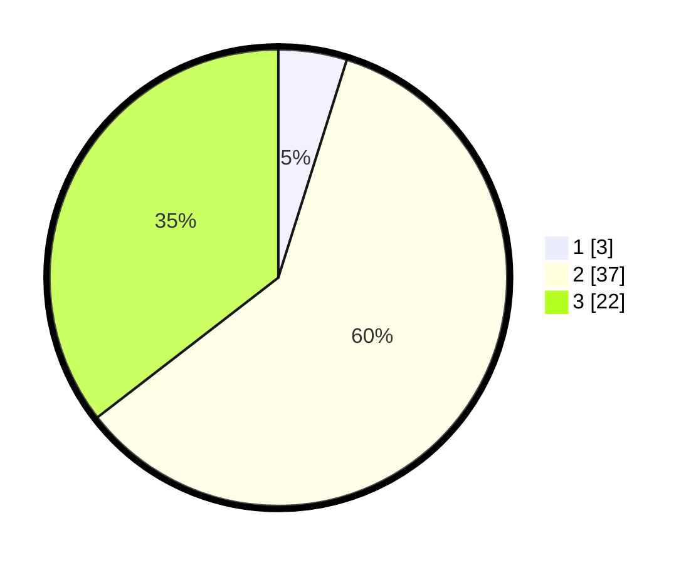

# Hasil

## Grafik

## Tabel

| No. | Nama Paslon    | Suara | Suara (raw) | Persentase |
|:--- |:-------------- | -----:| -----------:| ----------:|
| 1   | ANIES MUHAIMIN | 3     | [3][p-1]    | 4,84       |
| 2   | PRABOWO GIBRAN | 37    | [37][p-2]   | 59,68      |
| 3   | GANJAR MAHFUD  | 22    | [22][p-3]   | 35,48      |

[p-1]: https://github.com/gigit-pemilu/pemilu-2024/blob/main/pilpres/hitung-suara/sub/61-kalimantan-barat/sub/04-ketapang/sub/04-kendawangan/sub/2017-kedondong/sub/003-tps/sub/paslon-1.txt
[p-2]: https://github.com/gigit-pemilu/pemilu-2024/blob/main/pilpres/hitung-suara/sub/61-kalimantan-barat/sub/04-ketapang/sub/04-kendawangan/sub/2017-kedondong/sub/003-tps/sub/paslon-2.txt
[p-3]: https://github.com/gigit-pemilu/pemilu-2024/blob/main/pilpres/hitung-suara/sub/61-kalimantan-barat/sub/04-ketapang/sub/04-kendawangan/sub/2017-kedondong/sub/003-tps/sub/paslon-3.txt

## Foto C Plano

https://sirekap-obj-formc.kpu.go.id/3e6f/pemilu/ppwp/61/04/04/20/17/6104042017003-20240215-110025--171bae23-973b-4cf4-a2d3-c808294742ee.jpg

https://sirekap-obj-formc.kpu.go.id/3e6f/pemilu/ppwp/61/04/04/20/17/6104042017003-20240215-110121--702fbfa7-47af-4d80-8edd-f7eeab6498f5.jpg

https://sirekap-obj-formc.kpu.go.id/3e6f/pemilu/ppwp/61/04/04/20/17/6104042017003-20240215-110210--6873b4fa-300d-483d-8d80-bad2591d9136.jpg

## Metadata

| Key        | Value               |
| ---------- | ------------------- |
| Time Stamp | 2024-02-24 22:31:28 |

