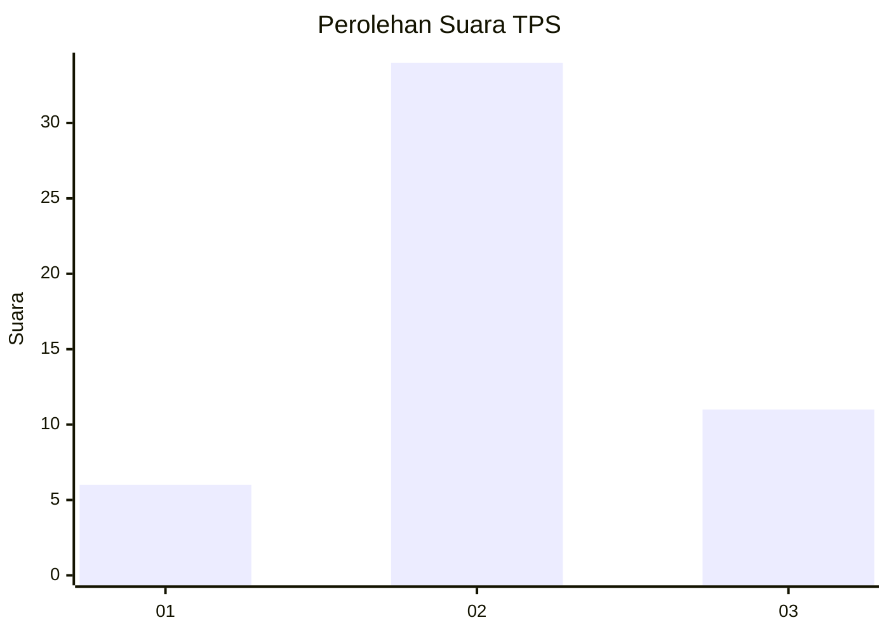
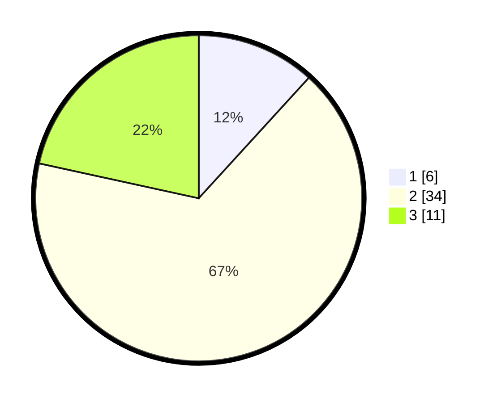

# Hasil

## Grafik

## Tabel

| No. | Nama Paslon    | Suara | Suara (raw) | Persentase |
|:--- |:-------------- | -----:| -----------:| ----------:|
| 1   | ANIES MUHAIMIN | 6     | [6][p-1]    | 11,76      |
| 2   | PRABOWO GIBRAN | 34    | [34][p-2]   | 66,67      |
| 3   | GANJAR MAHFUD  | 11    | [11][p-3]   | 21,57      |

[p-1]: https://github.com/gigit-pemilu/pemilu-2024-61-kalimantan-barat/blob/main/pilpres/hitung-suara/sub/61-kalimantan-barat/sub/04-ketapang/sub/04-kendawangan/sub/2017-kedondong/sub/004-tps/sub/paslon-1.txt
[p-2]: https://github.com/gigit-pemilu/pemilu-2024-61-kalimantan-barat/blob/main/pilpres/hitung-suara/sub/61-kalimantan-barat/sub/04-ketapang/sub/04-kendawangan/sub/2017-kedondong/sub/004-tps/sub/paslon-2.txt
[p-3]: https://github.com/gigit-pemilu/pemilu-2024-61-kalimantan-barat/blob/main/pilpres/hitung-suara/sub/61-kalimantan-barat/sub/04-ketapang/sub/04-kendawangan/sub/2017-kedondong/sub/004-tps/sub/paslon-3.txt

## Foto C Plano

https://sirekap-obj-formc.kpu.go.id/0afa/pemilu/ppwp/61/04/04/20/17/6104042017004-20240215-102619--db96f8ae-9428-4053-a44e-f21543d289c5.jpg

https://sirekap-obj-formc.kpu.go.id/0afa/pemilu/ppwp/61/04/04/20/17/6104042017004-20240215-102641--8fc38a34-1c64-44d2-be76-33a6f4ebef0b.jpg

https://sirekap-obj-formc.kpu.go.id/0afa/pemilu/ppwp/61/04/04/20/17/6104042017004-20240215-102657--1a2e6db3-b468-461b-b5b3-82c8df8e29ff.jpg

## Metadata

| Key        | Value               |
| ---------- | ------------------- |
| Time Stamp | 2024-02-22 13:00:00 |

