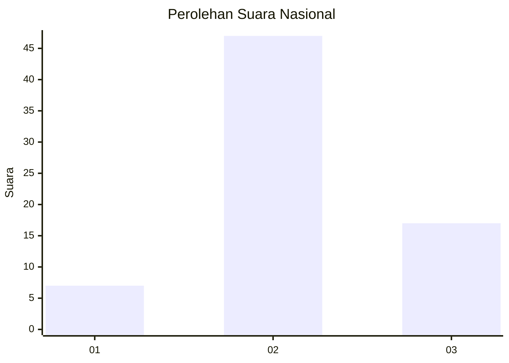
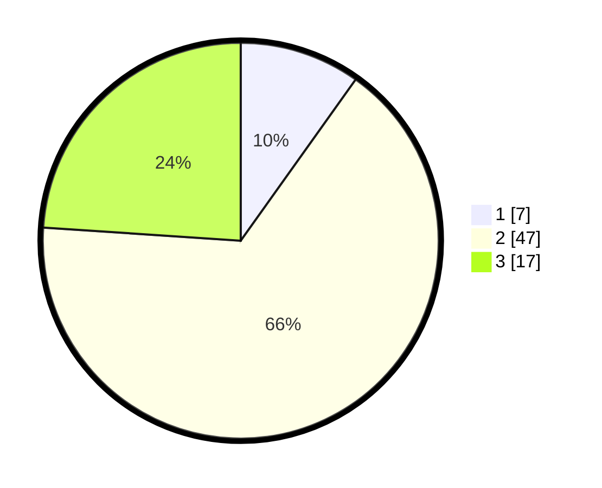

# Hasil

## Grafik

## Tabel

| No. | Nama Paslon    | Suara | Suara (raw) | Persentase |
|:--- |:-------------- | -----:| -----------:| ----------:|
| 1   | ANIES MUHAIMIN | 7     | [7][p-1]    | 9,86       |
| 2   | PRABOWO GIBRAN | 47    | [47][p-2]   | 66,20      |
| 3   | GANJAR MAHFUD  | 17    | [17][p-3]   | 23,94      |

[p-1]: https://github.com/gigit-pemilu/pemilu-2024/blob/main/pilpres/hitung-suara/sub/61-kalimantan-barat/sub/04-ketapang/sub/04-kendawangan/sub/2017-kedondong/sub/006-tps/sub/paslon-1.txt
[p-2]: https://github.com/gigit-pemilu/pemilu-2024/blob/main/pilpres/hitung-suara/sub/61-kalimantan-barat/sub/04-ketapang/sub/04-kendawangan/sub/2017-kedondong/sub/006-tps/sub/paslon-2.txt
[p-3]: https://github.com/gigit-pemilu/pemilu-2024/blob/main/pilpres/hitung-suara/sub/61-kalimantan-barat/sub/04-ketapang/sub/04-kendawangan/sub/2017-kedondong/sub/006-tps/sub/paslon-3.txt

## Foto C Plano

https://sirekap-obj-formc.kpu.go.id/43ec/pemilu/ppwp/61/04/04/20/17/6104042017006-20240214-195528--49ae56e5-845b-4b1a-8267-83dbf55f81ff.jpg

https://sirekap-obj-formc.kpu.go.id/43ec/pemilu/ppwp/61/04/04/20/17/6104042017006-20240214-195818--fd0a9e7b-6225-459c-ae82-e302a20bcdca.jpg

https://sirekap-obj-formc.kpu.go.id/43ec/pemilu/ppwp/61/04/04/20/17/6104042017006-20240214-200049--7b54b21d-1dd8-4fce-81cf-fdf6615881c1.jpg

## Metadata

| Key        | Value               |
| ---------- | ------------------- |
| Time Stamp | 2024-02-22 13:00:00 |

