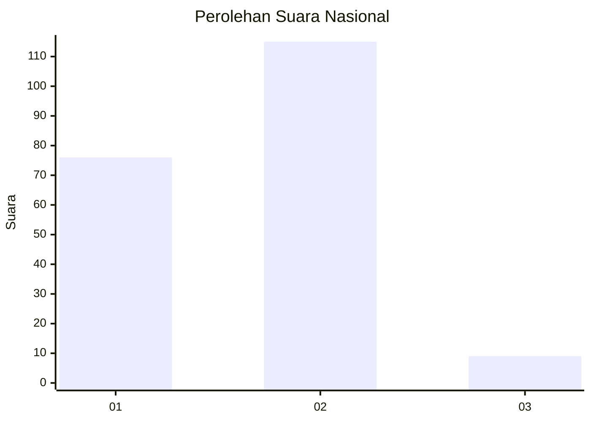
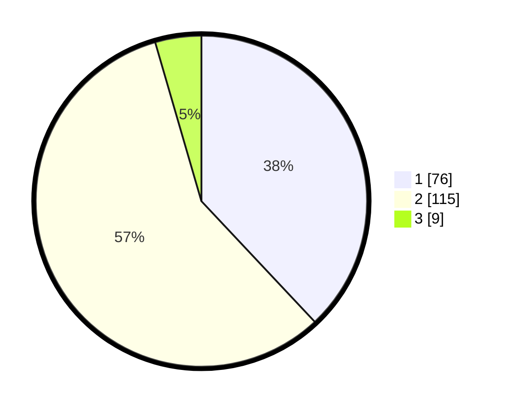

# Hasil

## Grafik

## Tabel

| No. | Nama Paslon    | Suara | Suara (raw) | Persentase |
|:--- |:-------------- | -----:| -----------:| ----------:|
| 1   | ANIES MUHAIMIN | 76    | [76][p-1]   | 38,00      |
| 2   | PRABOWO GIBRAN | 115   | [115][p-2]  | 57,50      |
| 3   | GANJAR MAHFUD  | 9     | [9][p-3]    | 4,50       |

[p-1]: https://github.com/gigit-pemilu/pemilu-2024/blob/main/pilpres/hitung-suara/sub/61-kalimantan-barat/sub/04-ketapang/sub/07-sungai-laur/sub/2001-riam-bunut/sub/001-tps/sub/paslon-1.txt
[p-2]: https://github.com/gigit-pemilu/pemilu-2024/blob/main/pilpres/hitung-suara/sub/61-kalimantan-barat/sub/04-ketapang/sub/07-sungai-laur/sub/2001-riam-bunut/sub/001-tps/sub/paslon-2.txt
[p-3]: https://github.com/gigit-pemilu/pemilu-2024/blob/main/pilpres/hitung-suara/sub/61-kalimantan-barat/sub/04-ketapang/sub/07-sungai-laur/sub/2001-riam-bunut/sub/001-tps/sub/paslon-3.txt

## Foto C Plano

https://sirekap-obj-formc.kpu.go.id/0b1b/pemilu/ppwp/61/04/07/20/01/6104072001001-20240220-202457--d5a32fec-3327-464e-b54c-4f424922a8cb.jpg

https://sirekap-obj-formc.kpu.go.id/0b1b/pemilu/ppwp/61/04/07/20/01/6104072001001-20240220-203123--71cee483-ac65-4408-88de-604c3f75e652.jpg

https://sirekap-obj-formc.kpu.go.id/0b1b/pemilu/ppwp/61/04/07/20/01/6104072001001-20240220-203012--7718567b-1120-48d6-8425-47f26ae78ac2.jpg

## Metadata

| Key        | Value               |
| ---------- | ------------------- |
| Time Stamp | 2024-02-25 18:00:00 |

