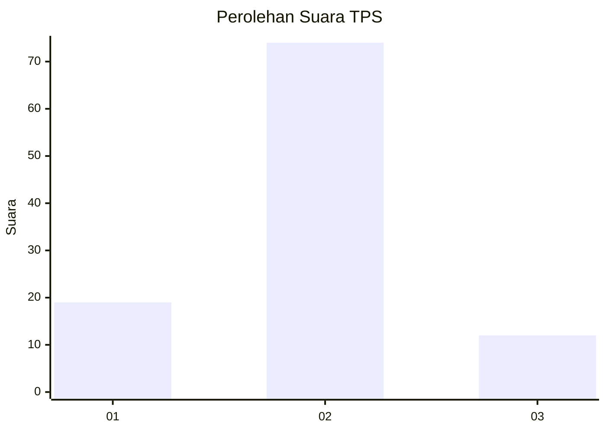
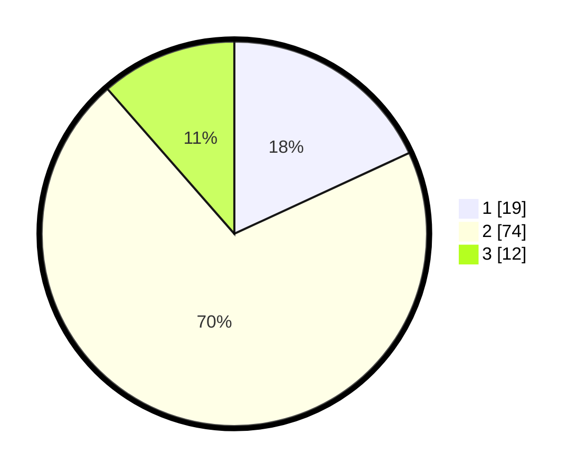

# Hasil

## Grafik

## Tabel

| No. | Nama Paslon    | Suara | Suara (raw) | Persentase |
|:--- |:-------------- | -----:| -----------:| ----------:|
| 1   | ANIES MUHAIMIN | 19    | [19][p-1]   | 18,10      |
| 2   | PRABOWO GIBRAN | 74    | [74][p-2]   | 70,48      |
| 3   | GANJAR MAHFUD  | 12    | [12][p-3]   | 11,43      |

[p-1]: https://github.com/gigit-pemilu/pemilu-2024-61-kalimantan-barat/blob/main/pilpres/hitung-suara/sub/61-kalimantan-barat/sub/04-ketapang/sub/07-sungai-laur/sub/2001-riam-bunut/sub/002-tps/sub/paslon-1.txt
[p-2]: https://github.com/gigit-pemilu/pemilu-2024-61-kalimantan-barat/blob/main/pilpres/hitung-suara/sub/61-kalimantan-barat/sub/04-ketapang/sub/07-sungai-laur/sub/2001-riam-bunut/sub/002-tps/sub/paslon-2.txt
[p-3]: https://github.com/gigit-pemilu/pemilu-2024-61-kalimantan-barat/blob/main/pilpres/hitung-suara/sub/61-kalimantan-barat/sub/04-ketapang/sub/07-sungai-laur/sub/2001-riam-bunut/sub/002-tps/sub/paslon-3.txt

## Foto C Plano

https://sirekap-obj-formc.kpu.go.id/84b8/pemilu/ppwp/61/04/07/20/01/6104072001002-20240222-092633--c34710ba-4128-4c1c-9ba0-0fb53688c043.jpg

https://sirekap-obj-formc.kpu.go.id/84b8/pemilu/ppwp/61/04/07/20/01/6104072001002-20240222-092631--ce80137b-3c08-4bc1-bddc-04c4fb870f85.jpg

https://sirekap-obj-formc.kpu.go.id/84b8/pemilu/ppwp/61/04/07/20/01/6104072001002-20240216-151413--adc6406d-bf6a-4506-9341-e260890f8c7d.jpg

## Metadata

| Key        | Value               |
| ---------- | ------------------- |
| Time Stamp | 2024-02-25 23:00:00 |

