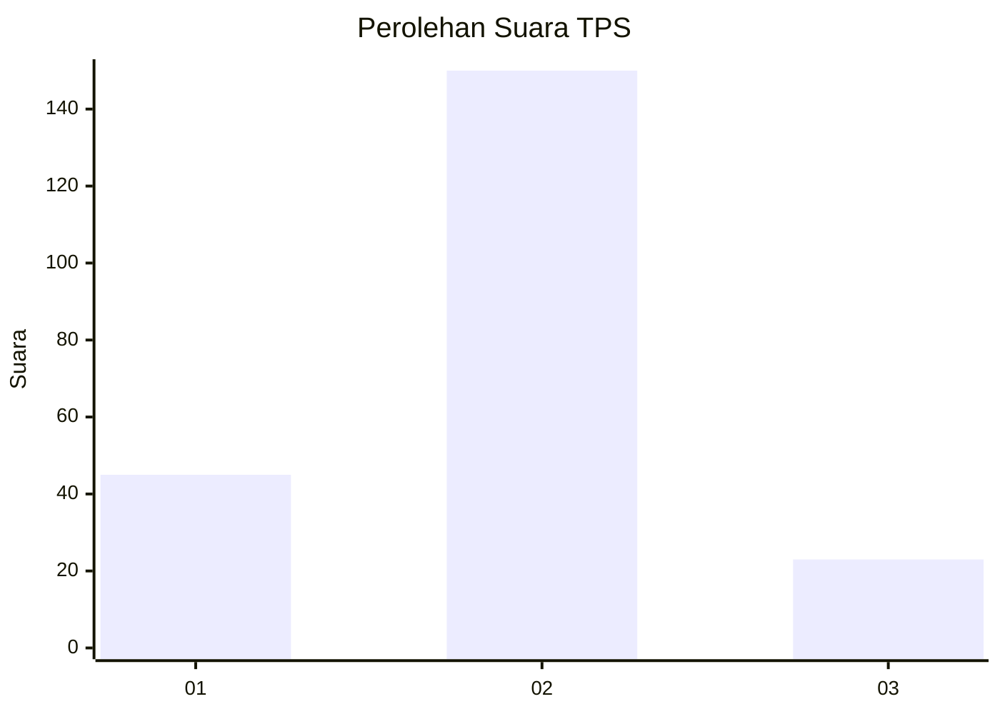
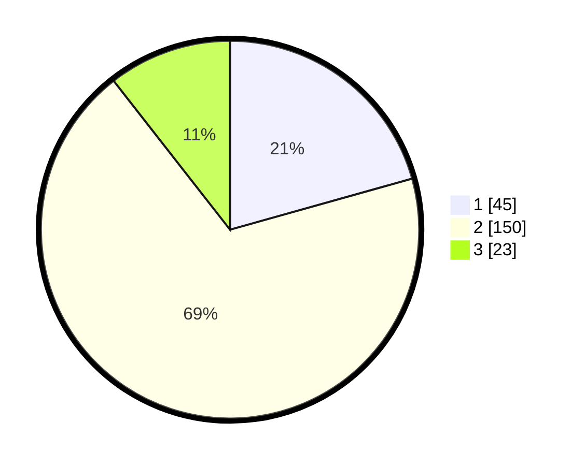

# Hasil

## Grafik

## Tabel

| No. | Nama Paslon    | Suara | Suara (raw) | Persentase |
|:--- |:-------------- | -----:| -----------:| ----------:|
| 1   | ANIES MUHAIMIN | 45    | [45][p-1]   | 20,64      |
| 2   | PRABOWO GIBRAN | 150   | [150][p-2]  | 68,81      |
| 3   | GANJAR MAHFUD  | 23    | [23][p-3]   | 10,55      |

[p-1]: https://github.com/gigit-pemilu/pemilu-2024-61-kalimantan-barat/blob/main/pilpres/hitung-suara/sub/61-kalimantan-barat/sub/04-ketapang/sub/07-sungai-laur/sub/2001-riam-bunut/sub/003-tps/sub/paslon-1.txt
[p-2]: https://github.com/gigit-pemilu/pemilu-2024-61-kalimantan-barat/blob/main/pilpres/hitung-suara/sub/61-kalimantan-barat/sub/04-ketapang/sub/07-sungai-laur/sub/2001-riam-bunut/sub/003-tps/sub/paslon-2.txt
[p-3]: https://github.com/gigit-pemilu/pemilu-2024-61-kalimantan-barat/blob/main/pilpres/hitung-suara/sub/61-kalimantan-barat/sub/04-ketapang/sub/07-sungai-laur/sub/2001-riam-bunut/sub/003-tps/sub/paslon-3.txt

## Foto C Plano

https://sirekap-obj-formc.kpu.go.id/a7d5/pemilu/ppwp/61/04/07/20/01/6104072001003-20240220-215104--6d4a7e6b-8651-49a6-ad7e-7945ee5955f1.jpg

https://sirekap-obj-formc.kpu.go.id/a7d5/pemilu/ppwp/61/04/07/20/01/6104072001003-20240220-215330--dfa484f7-938a-4bbb-9880-15484c65a4b5.jpg

https://sirekap-obj-formc.kpu.go.id/a7d5/pemilu/ppwp/61/04/07/20/01/6104072001003-20240220-215650--a161c023-c581-4641-8a88-5cfd7b06c254.jpg

## Metadata

| Key        | Value               |
| ---------- | ------------------- |
| Time Stamp | 2024-02-25 16:00:00 |

