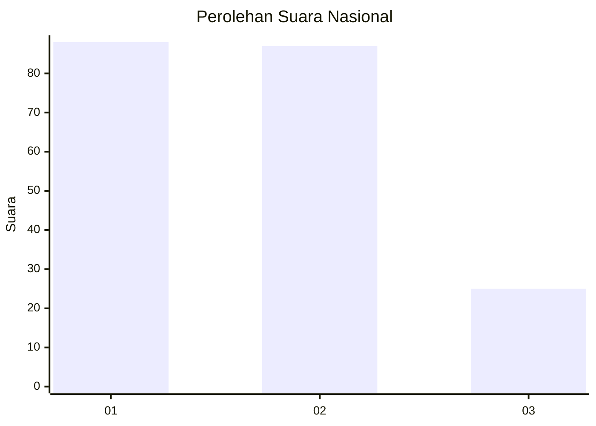
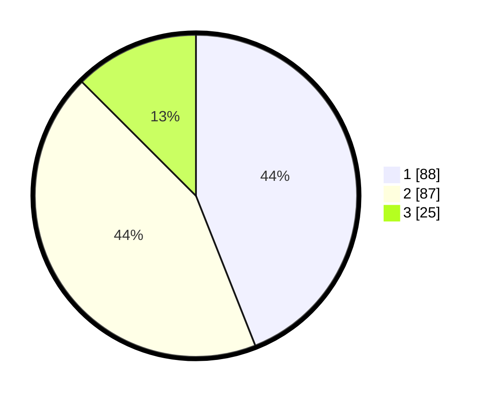

# Hasil

## Grafik

## Tabel

| No. | Nama Paslon    | Suara | Suara (raw) | Persentase |
|:--- |:-------------- | -----:| -----------:| ----------:|
| 1   | ANIES MUHAIMIN | 88    | [88][p-1]   | 44,00      |
| 2   | PRABOWO GIBRAN | 87    | [87][p-2]   | 43,50      |
| 3   | GANJAR MAHFUD  | 25    | [25][p-3]   | 12,50      |

[p-1]: https://github.com/gigit-pemilu/pemilu-2024/blob/main/pilpres/hitung-suara/sub/61-kalimantan-barat/sub/04-ketapang/sub/07-sungai-laur/sub/2001-riam-bunut/sub/004-tps/sub/paslon-1.txt
[p-2]: https://github.com/gigit-pemilu/pemilu-2024/blob/main/pilpres/hitung-suara/sub/61-kalimantan-barat/sub/04-ketapang/sub/07-sungai-laur/sub/2001-riam-bunut/sub/004-tps/sub/paslon-2.txt
[p-3]: https://github.com/gigit-pemilu/pemilu-2024/blob/main/pilpres/hitung-suara/sub/61-kalimantan-barat/sub/04-ketapang/sub/07-sungai-laur/sub/2001-riam-bunut/sub/004-tps/sub/paslon-3.txt

## Foto C Plano

https://sirekap-obj-formc.kpu.go.id/3d68/pemilu/ppwp/61/04/07/20/01/6104072001004-20240220-223347--bb2b662f-80a9-4b91-80ff-f651734170f6.jpg

https://sirekap-obj-formc.kpu.go.id/3d68/pemilu/ppwp/61/04/07/20/01/6104072001004-20240220-223434--5cd2ce21-d933-4df5-89f7-ff9637de2a51.jpg

https://sirekap-obj-formc.kpu.go.id/3d68/pemilu/ppwp/61/04/07/20/01/6104072001004-20240220-223515--2a18de12-4112-4565-b870-5708f4ddf22c.jpg

## Metadata

| Key        | Value               |
| ---------- | ------------------- |
| Time Stamp | 2024-02-24 22:31:28 |

