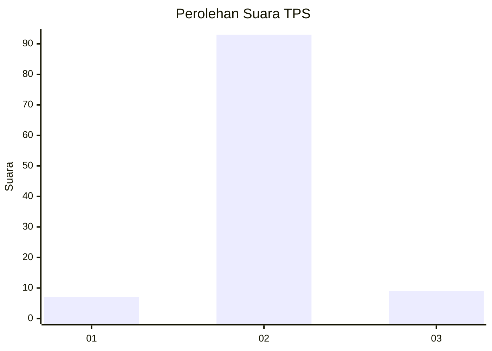
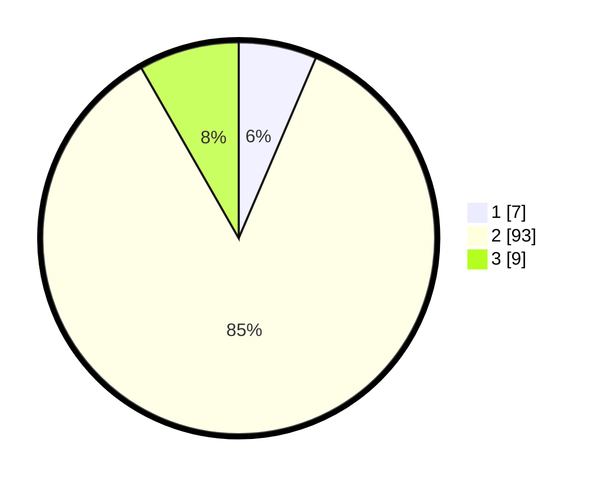

# Hasil

## Grafik

## Tabel

| No. | Nama Paslon    | Suara | Suara (raw) | Persentase |
|:--- |:-------------- | -----:| -----------:| ----------:|
| 1   | ANIES MUHAIMIN | 7     | [7][p-1]    | 6,42       |
| 2   | PRABOWO GIBRAN | 93    | [93][p-2]   | 85,32      |
| 3   | GANJAR MAHFUD  | 9     | [9][p-3]    | 8,26       |

[p-1]: https://github.com/gigit-pemilu/pemilu-2024-61-kalimantan-barat/blob/main/pilpres/hitung-suara/sub/61-kalimantan-barat/sub/04-ketapang/sub/07-sungai-laur/sub/2007-harapan-baru/sub/004-tps/sub/paslon-1.txt
[p-2]: https://github.com/gigit-pemilu/pemilu-2024-61-kalimantan-barat/blob/main/pilpres/hitung-suara/sub/61-kalimantan-barat/sub/04-ketapang/sub/07-sungai-laur/sub/2007-harapan-baru/sub/004-tps/sub/paslon-2.txt
[p-3]: https://github.com/gigit-pemilu/pemilu-2024-61-kalimantan-barat/blob/main/pilpres/hitung-suara/sub/61-kalimantan-barat/sub/04-ketapang/sub/07-sungai-laur/sub/2007-harapan-baru/sub/004-tps/sub/paslon-3.txt

## Foto C Plano

https://sirekap-obj-formc.kpu.go.id/7b2d/pemilu/ppwp/61/04/07/20/07/6104072007004-20240221-123440--80567b3f-11bc-46e6-af0b-874b0be345f3.jpg

https://sirekap-obj-formc.kpu.go.id/7b2d/pemilu/ppwp/61/04/07/20/07/6104072007004-20240221-123550--636fc049-ebbd-4e6c-b528-2be2e05f87c0.jpg

https://sirekap-obj-formc.kpu.go.id/7b2d/pemilu/ppwp/61/04/07/20/07/6104072007004-20240221-123656--51b83063-c857-4503-858a-722cc6c4d51c.jpg

## Metadata

| Key        | Value               |
| ---------- | ------------------- |
| Time Stamp | 2024-02-22 13:00:00 |

