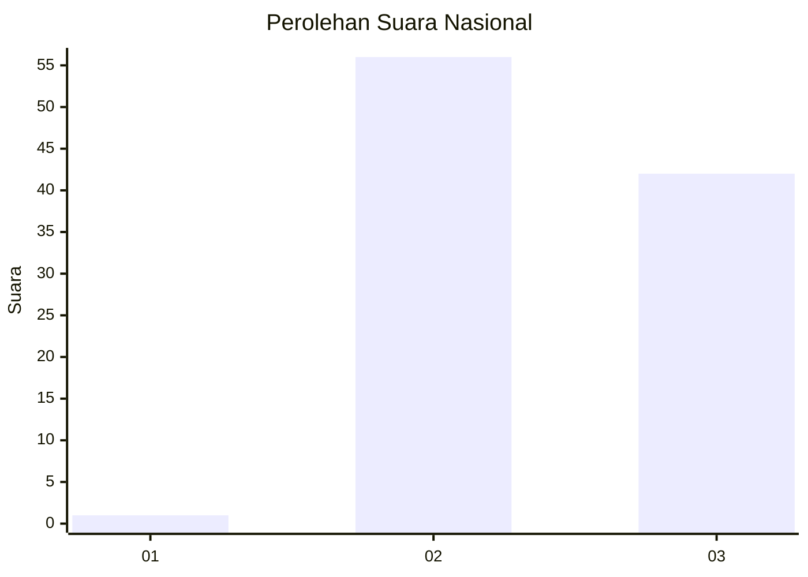
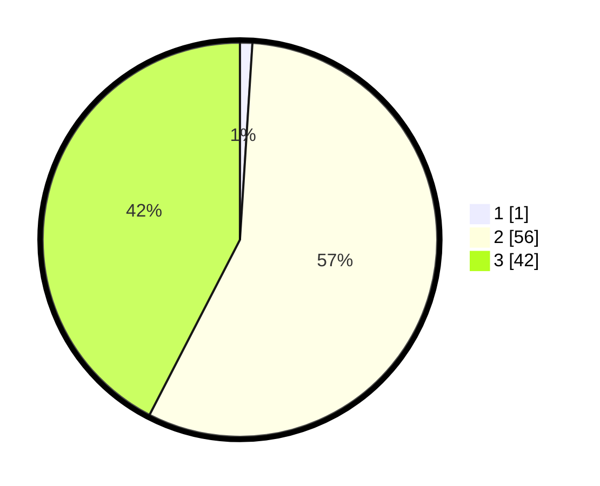

# Hasil

## Grafik

## Tabel

| No. | Nama Paslon    | Suara | Suara (raw) | Persentase |
|:--- |:-------------- | -----:| -----------:| ----------:|
| 1   | ANIES MUHAIMIN | 1     | [1][p-1]    | 1,01       |
| 2   | PRABOWO GIBRAN | 56    | [56][p-2]   | 56,57      |
| 3   | GANJAR MAHFUD  | 42    | [42][p-3]   | 42,42      |

[p-1]: https://github.com/gigit-pemilu/pemilu-2024/blob/main/pilpres/hitung-suara/sub/61-kalimantan-barat/sub/04-ketapang/sub/07-sungai-laur/sub/2012-sungai-daka/sub/003-tps/sub/paslon-1.txt
[p-2]: https://github.com/gigit-pemilu/pemilu-2024/blob/main/pilpres/hitung-suara/sub/61-kalimantan-barat/sub/04-ketapang/sub/07-sungai-laur/sub/2012-sungai-daka/sub/003-tps/sub/paslon-2.txt
[p-3]: https://github.com/gigit-pemilu/pemilu-2024/blob/main/pilpres/hitung-suara/sub/61-kalimantan-barat/sub/04-ketapang/sub/07-sungai-laur/sub/2012-sungai-daka/sub/003-tps/sub/paslon-3.txt

## Foto C Plano

https://sirekap-obj-formc.kpu.go.id/bb99/pemilu/ppwp/61/04/07/20/12/6104072012003-20240220-135030--7aa75723-af4e-4e3c-9054-af4b956b0b57.jpg

https://sirekap-obj-formc.kpu.go.id/bb99/pemilu/ppwp/61/04/07/20/12/6104072012003-20240220-135325--f4f5d455-0971-46f5-80d6-d4bc25dfa355.jpg

https://sirekap-obj-formc.kpu.go.id/bb99/pemilu/ppwp/61/04/07/20/12/6104072012003-20240220-135617--e97e84d0-f3c9-4e65-b676-b9a6286f60a6.jpg

## Metadata

| Key        | Value               |
| ---------- | ------------------- |
| Time Stamp | 2024-02-25 12:00:00 |

