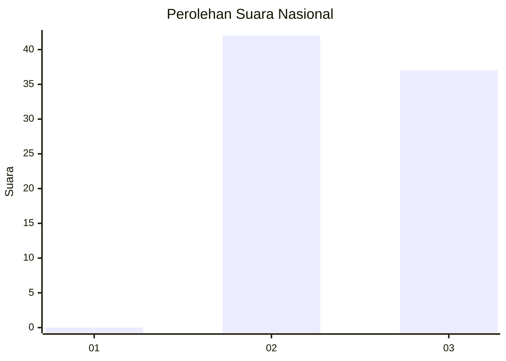
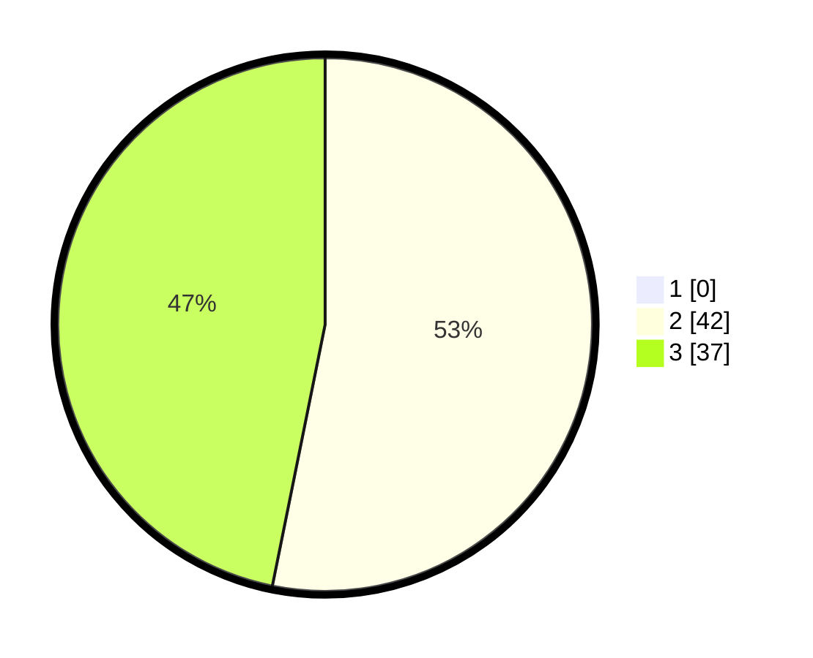

# Hasil

## Grafik

## Tabel

| No. | Nama Paslon    | Suara | Suara (raw) | Persentase |
|:--- |:-------------- | -----:| -----------:| ----------:|
| 1   | ANIES MUHAIMIN | 0     | [0][p-1]    | 0,00       |
| 2   | PRABOWO GIBRAN | 42    | [42][p-2]   | 53,16      |
| 3   | GANJAR MAHFUD  | 37    | [37][p-3]   | 46,84      |

[p-1]: https://github.com/gigit-pemilu/pemilu-2024/blob/main/pilpres/hitung-suara/sub/61-kalimantan-barat/sub/04-ketapang/sub/07-sungai-laur/sub/2012-sungai-daka/sub/005-tps/sub/paslon-1.txt
[p-2]: https://github.com/gigit-pemilu/pemilu-2024/blob/main/pilpres/hitung-suara/sub/61-kalimantan-barat/sub/04-ketapang/sub/07-sungai-laur/sub/2012-sungai-daka/sub/005-tps/sub/paslon-2.txt
[p-3]: https://github.com/gigit-pemilu/pemilu-2024/blob/main/pilpres/hitung-suara/sub/61-kalimantan-barat/sub/04-ketapang/sub/07-sungai-laur/sub/2012-sungai-daka/sub/005-tps/sub/paslon-3.txt

## Foto C Plano

https://sirekap-obj-formc.kpu.go.id/9794/pemilu/ppwp/61/04/07/20/12/6104072012005-20240220-162021--5f895404-48a0-44c8-99e2-50d7576d2af2.jpg

https://sirekap-obj-formc.kpu.go.id/9794/pemilu/ppwp/61/04/07/20/12/6104072012005-20240220-162143--71323a4f-9417-48a6-b573-676b531b2cbd.jpg

https://sirekap-obj-formc.kpu.go.id/9794/pemilu/ppwp/61/04/07/20/12/6104072012005-20240220-162417--fcadf695-7b86-4fe5-a9b4-c6d82879dcd4.jpg

## Metadata

| Key        | Value               |
| ---------- | ------------------- |
| Time Stamp | 2024-02-25 12:00:00 |

